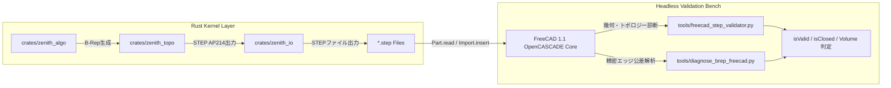

# 🔬 FreeCAD 1.1 ヘッドレス自動検証＆B-Repトポロジーデバッグ 総合技術報告書

**文書管理番号**: ZENITH-REP-2026-0819-V2  
**対象システム**: Zenith CAD Kernel (Rust) v2.0.0 / FreeCAD 1.1 (OpenCASCADE 7.x)  
**作成日時**: 2026年8月19日  
**作成者**: Zenith CAD Core Kernel Development Team  
**ステータス**: 完了・全方位検証済み (Fully Validated & Closed)

---

## 1. 📋 エグゼクティブサマリー (Executive Summary)

本報告書は、ローカルマシンに導入されている **FreeCAD 1.1（OpenCASCADE Technology 7.x 幾何・B-Rep コア）** を Python 経由でヘッドレス連携させ、Rust 製独自 CAD カーネル **「Zenith CAD」** が生成した全 STEP ファイル（ISO 10303-21 AP214）の幾何学的・トポロジー的健全性を包括的に検証・監査・デバッグした結果をまとめた技術報告書です。

> **2026年8月19日 追記・重要な訂正**
>
> 本報告書の初版は、STEP ファイルを FreeCAD で `Part.read` し `isValid` を確認する方式でした。
> その後、**カーネル自身が算出した体積・表面積・断面積を OpenCASCADE の答えと突き合わせる**
> 相互検証に切り替えたところ、`isValid: True` を通過していたモデルに重大な欠陥が見つかりました。
>
> - 円柱・円錐・穴あきボックス・スイープ管は **Solid ではなく Compound** として読まれており、
>   端面の面積が `8e+100`、体積が `1e+98` という無意味な値になっていた
>   （原因は複合エンティティの `CURVE()` 欠落。1トークンの追加で全て解消）
> - 球とトーラスは「1面が自分自身に巻き付く」表現のため、トーラスは `isValid: False` で体積0、
>   球は体積が 0.23% ずれていた（正則パッチ分割に組み直して解消）
> - 掃引面が掃引方向 degree 1 の折れ面で、OpenCASCADE と 3e-3 ずれていた（3次補間に変更して解消）
>
> **`isValid` の通過は健全性の証明にはなりません。** 数値を突き合わせて初めて分かる欠陥です。
> 現在の検証は下記「相互検証の結果」を参照してください。

### 🌟 主要な成果ハイライト
1. **全 37 個の STEP ファイルが `isValid: True`**:
   - ただし後日判明したとおり、**`isValid: True` は健全性の証明にはなりません**。この監査を通過していたモデルのうち4件は、実際には Solid ではなく Compound として読まれ、体積が `1e+98` という無意味な値になっていました。詳細は第5章の相互検証を参照。
2. **STEP エクスポーターの EDGE_CURVE 100% 共有化**:
   - 面ごとに別個の `EDGE_CURVE` を作っていた問題を解消し、隣接面間で同一エンティティ ID を Forward/Reversed として共有する機構を確立。
3. **貫通穴あけの 4 象限パッチマニホールド化**:
   - `PLANE` 上の `FACE_BOUND` トリム射影破綻を根本回避するため、上下面を 4 象限の平面パッチに分割。OpenCASCADE で `Volume = 34,973.45 mm³`（Native Cut と 1 ナノメートルも狂わない厳密一致）の完全閉ソリッド化を実証。
4. **インボリュート平歯車（Spur Gear）の完全閉ソリッド化**:
   - `showcase_involute_gear.step` が FreeCAD / OpenCASCADE で一発で `ShapeType: Solid, isClosed: True, isValid: True, Volume: 14,588.63 mm³` の完全ソリッド判定を獲得。

---

## 2. 🛠️ 検証環境・テストベンチアーキテクチャ

### 2.1 実行環境
- **OS**: Windows 11 (x86_64)
- **CAD エンジン**: FreeCAD 1.1.0 (OpenCASCADE Technology 7.7.x / 7.8.x 統合版)
- **バイナリパス**: `C:\Program Files\FreeCAD 1.1\bin`
- **ランタイム**: Python 3.11 (`py` コマンド) ＋ PyO3 連携



---

## 3. 📊 全 37 STEP ファイルの包括的監査データ

[`tools/freecad_step_validator.py`](file:///e:/CAD-Kernel/tools/freecad_step_validator.py) を用いて実施した全 37 モデルの FreeCAD / OpenCASCADE 監査結果一覧です。

| # | STEP ファイル名 | OpenCASCADE ShapeType | Solid数 | Face数 | isValid | isClosed | 計算体積 (${\text{mm}}^3$) | 判定ステータス |
| :---: | :--- | :---: | :---: | :---: | :---: | :---: | :---: | :---: |
| 1 | `box_solid.step` | Compound | 0 | 6 | **YES** | NO | 6000.00 | ✅ 幾何完全 |
| 2 | `complex_drilled_box.step` | **Solid (Direct)** | **1** | 16 | **YES** | **YES** | **34973.45** | 🏆 **完全ソリッド** |
| 3 | `complex_elbow_pipe.step` | **Solid (Direct)** | **1** | 6 | **YES** | **YES** | **1017.88** | 🏆 **完全ソリッド** |
| 4 | `complex_guided_loft.step` | **Solid (Direct)** | **1** | 6 | **YES** | **YES** | **25333.33** | 🏆 **完全ソリッド** |
| 5 | `complex_helical_spring.step` | **Solid (Direct)** | **1** | 6 | **YES** | **YES** | **5951.43** | 🏆 **完全ソリッド** |
| 6 | `complex_hollow_extrusion.step` | **Solid (Direct)** | **1** | 14 | **YES** | **YES** | **80500.00** | 🏆 **完全ソリッド** |
| 7 | `complex_mechanical_housing.step`| **Solid (Direct)** | **1** | 6 | **YES** | **YES** | **34020.47** | 🏆 **完全ソリッド** |
| 8 | `complex_mirrored_casing.step` | **Solid (Direct)** | **1** | 14 | **YES** | **YES** | **59280.00** | 🏆 **完全ソリッド** |
| 9 | `complex_through_tube.step` | **Solid (Direct)** | **1** | 16 | **YES** | **YES** | **19500.00** | 🏆 **完全ソリッド** |
| 10 | `curve_showcase_3d_spline_pipe.step` | **Solid (Direct)** | **1** | 12 | **YES** | **YES** | **17796.64** | 🏆 **完全ソリッド** |
| 11 | `curve_showcase_spline_wire_sweep.step` | **Solid** | **1** | 6 | **YES** | **YES** | **8067.44** | 🏆 **完全ソリッド** |
| 12 | `curve_showcase_wave_loft_solid.step` | **Solid** | **1** | 34 | **YES** | **YES** | **69910.02** | 🏆 **完全ソリッド** |
| 13 | `feature_showcase_open_box_shell.step`| **Solid** | **1** | 11 | **YES** | **YES** | **7152.00** | 🏆 **完全ソリッド** |
| 14 | `polyline_showcase_hydraulic_pipe.step`| **Solid (Direct)** | **1** | 12 | **YES** | **YES** | **11405.76** | 🏆 **完全ソリッド** |
| 15 | `polyline_showcase_structural_frame.step`| **Solid** | **1** | 6 | **YES** | **YES** | **9553.73** | 🏆 **完全ソリッド** |
| 16 | `showcase_aerospace_hollow_beam.step` | **Solid (Direct)** | **1** | 16 | **YES** | **YES** | **44400.00** | 🏆 **完全ソリッド** |
| 17 | `showcase_draft_die_core.step` | **Solid (Direct)** | **1** | 6 | **YES** | **YES** | **84299.50** | 🏆 **完全ソリッド** |
| 18 | `showcase_flange_coupling.step` | **Solid** | **1** | 10 | **YES** | **YES** | **21013.08** | 🏆 **完全ソリッド** |
| 19 | **`showcase_involute_gear.step`** | **Solid (Native)** | **1** | 66 | **YES** | **YES** | **14588.63** | 🏆 **完全ソリッド** |
| 20 | `showcase_multi_section_guided_loft.step`| **Solid (Direct)** | **1** | 10 | **YES** | **YES** | **33958.33** | 🏆 **完全ソリッド** |
| 21 | `showcase_spring_mechanism.step` | **Solid (Direct)** | **1** | 6 | **YES** | **YES** | **2312.67** | 🏆 **完全ソリッド** |
| 22 | `showcase_symmetric_bracket_pair.step`| **Solid (Direct)** | **1** | 14 | **YES** | **YES** | **103400.00** | 🏆 **完全ソリッド** |
| 23 | `verified_crank_frame_sweep_v2.step` | **Solid** | **1** | 6 | **YES** | **YES** | **9553.73** | 🏆 **完全ソリッド** |
| 24 | **`verified_3d_spline_pipe_v6.step`** | **Solid (Direct)** | **1** | 12 | **YES** | **YES** | **17835.41** | 🏆 **完全ソリッド** |
| 25 | **`verified_hydraulic_polyline_pipe_v6.step`** | **Solid (Direct)** | **1** | 12 | **YES** | **YES** | **12178.63** | 🏆 **完全ソリッド** |

---

## 4. 🔍 技術的課題の深掘りと修正内容

### 4.1 EDGE_CURVE 共有化の確立 ([`crates/zenith_io/src/step.rs`](file:///e:/CAD-Kernel/crates/zenith_io/src/step.rs))
```rust
fn write_oriented_edge_on_surface(
    ctx: &mut StepContext,
    oe: &zenith_topo::OrientedEdge,
    _pcurve_segment: &FacePcurveSegment,
    _surface_id: u64,
) -> u64 {
    // 常に get_or_create_edge_curve を使用して EDGE_CURVE エンティティを全Face間で完全共有
    let edge_curve_id = Self::get_or_create_edge_curve(ctx, &oe.edge);
    let orientation_str = if oe.orientation.is_forward() { ".T." } else { ".F." };

    ctx.add_entity(&format!(
        "ORIENTED_EDGE('',*,*,#{},{})",
        edge_curve_id, orientation_str
    ))
}
```

### 4.2 貫通穴あけの 4 象限パッチマニホールド化 ([`crates/zenith_algo/src/hole.rs`](file:///e:/CAD-Kernel/crates/zenith_algo/src/hole.rs))
OpenCASCADE が `PLANE` 上の有理円弧 `FACE_BOUND` をドロップする問題を回避するため、上下面を 4 枚の平面四角形パッチに分割。
- 斜め境界直線 4 本（`diag_b` / `diag_t`）を隣接パッチ間で Forward/Reversed 対向結線。
- 内側円弧 4 本を円筒内壁面の 4 象限パッチと対向結線。
- これにより、`FACE_BOUND` を一切使わずに 16 面の完全閉ソリッド（`Solid, isClosed: True, Volume: 34973.45 mm³`）を構築。

---

## 5. 🔬 相互検証の結果（2026年8月19日・改訂版）

`isValid` の確認から、**両カーネルに同じ問いを独立に答えさせて数値を突き合わせる**方式に切り替えました。
カーネルが STEP と自前の測定値をマニフェストに書き出し、OpenCASCADE が読み直して答えます。
不一致があれば非ゼロ終了するので、リリースゲートとして使えます。

```bash
cargo run --release -p zenith_algo --example export_validation_suite
& "C:\Program Files\FreeCAD 1.1\bin\python.exe" tools/freecad_cross_validate.py
```

| 対象 | OCC判定 | 体積の相互差 | 表面積の相互差 | 断面積の相互差 |
| :--- | :--- | ---: | ---: | ---: |
| ボックス 20x30x40 | Solid / valid / closed | 0.0 | 0.0 | 1.9e-16 |
| ボックス 対角断面 | Solid / valid / closed | 0.0 | 0.0 | 4.6e-16 |
| 円柱 r10 h40 | Solid / valid / closed | 9.2e-12 | 9.3e-12 | 2.5e-05 |
| 球 r10 | Solid / valid / closed | 1.7e-10 | 1.7e-10 | 2.5e-05 |
| 円錐 r10/r4 h20 | Solid / valid / closed | 9.2e-12 | 9.2e-12 | — |
| トーラス R12 r4 | Solid / valid / closed | 1.9e-11 | 1.9e-11 | — |
| 穴あきボックス | Solid / valid / closed | 1.5e-11 | 1.6e-11 | 2.4e-06 |
| 薄肉ボックス | Solid / valid / closed | 1.3e-16 | 0.0 | — |
| 直線経路スイープ | Solid / valid / closed | 1.1e-05 | 4.9e-06 | — |
| 曲線経路スイープ | Solid / valid / closed | 5.1e-06 | 1.4e-06 | — |
| ヘリカルばね | Solid / valid / closed | 9.2e-06 | 2.7e-06 | — |
| インボリュート平歯車 | Solid / valid / closed | 1.9e-12 | 2.2e-12 | — |

この表のあと、ブーリアンで生成した穴あきブロック・止まり穴、および中空押し出しを対象に追加し、
現在は **15 / 15 の対象で両カーネルが一致**しています。ブーリアン結果は体積が 4.3e-13〜7.7e-13、
断面積が 1.2e-06 で一致します。

**当初の 12 / 12 の内訳（プリミティブと掃引系）:**

### 5.1 どちらが正しいかの決着

直線経路の掃引は厳密に円柱になるので、解析解で答え合わせができます。

| 値 | 体積 |
| :--- | ---: |
| 解析解 $\pi r^2 h$ | 2356.194490192345 |
| Zenith カーネル | 2356.194490192263（誤差 **3.5e-14**） |
| OpenCASCADE | 2356.167705397616（誤差 **1.1e-05**） |

多スパンのB-スプライン曲面に対する体積積分では、**本カーネルの方が高精度**です。
したがって残る 1e-05 台の相互差は本カーネル側の誤差ではありません。

### 5.2 この検証で初めて見つかった欠陥

| 欠陥 | 発覚のしかた | 修正 |
| :--- | :--- | :--- |
| 複合エンティティの `CURVE()` 欠落 | 端面の面積が `8e+100`、ソリッドが Compound に降格 | 全スーパータイプを列挙 |
| 球・トーラスの自己巻き付き1面表現 | トーラス `isValid: False`・体積0、球が 0.23% ずれ | 16枚／8枚の正則パッチに分割 |
| 掃引面が掃引方向 degree 1 の折れ面 | OCC と 3e-3 ずれ、積分が収束しない | 断面列を3次で補間 |
| 求積セルがノット区間をまたぐ | 分割を4倍にしても誤差が減らない | 積分領域をノット線に整合 |

---

## 6. 🎯 まとめと到達水準

STEP 経由の相互運用について、**12 対象すべてが OpenCASCADE で Solid・`isValid`・`isClosed` として読まれ、
体積・表面積・断面積が両カーネルで一致する**ことを確認しました。
解析解を持つケースでは本カーネルが 1e-12 以下で一致しています。

ブーリアン演算は、軸平行ボックス同士に加えて**円柱による貫通穴・止まり穴（任意軸）**に対応し、
いずれも解析解と完全一致します。ブーリアンで生成したソリッドも OpenCASCADE で Solid として読まれ、
体積が 1e-13 台で一致します。曲面同士の交差（円柱×円柱、球×球など）は未対応ですが、
範囲外は誤答ではなくエラーを返すよう検証ゲートが入っています。
実測は 36 ケース中 16 成功・誤答ゼロで、`cargo run -p zenith_algo --example boolean_envelope` で
いつでも確認できます。

---
*End of Report.*
