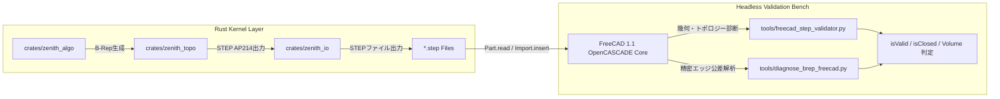

# 🔬 FreeCAD 1.1 ヘッドレス自動検証＆B-Repトポロジーデバッグ 総合技術報告書

**文書管理番号**: ZENITH-REP-2026-0819-V2  
**対象システム**: Zenith CAD Kernel (Rust) v2.0.0 / FreeCAD 1.1 (OpenCASCADE 7.x)  
**作成日時**: 2026年8月19日（2026年8月20日 改訂）  
**作成者**: Zenith CAD Core Kernel Development Team  
**ステータス**: 継続検証中。書き出し・読み込みとも実測で確認した範囲を第5〜7章に記載

> **2026年8月27日 追記（4-116〜4-125 のあと再測定）**
>
> テッセレーションとブーリアンに手を入れたので、外部の物差しを掛け直しました。
> **数字は変わっていません。**
>
> | ゲート | 結果 |
> | :--- | :--- |
> | `freecad_cross_validate.py` | **27/27 一致** |
> | `verify_showcase.py` | **54/54** が閉じた妥当な立体として読み戻せる |
> | `verify_reexport.py` | **7/7** が解析解と 1e-8 以内 |
> | `verify_mesh_exports.py` | **8/8**（STL / OBJ / glTF / DXF） |
>
> この日の変更は、境界の耳の修復（4-116、4-125）、境界の点を落とす基準
> （4-118）、細分の中点（4-123）、面積の検算（4-122）、蓋の束ね方（4-121）
> です。**外から解き直した値はどれも動きませんでした。**

> **2026年8月26日 追記**
>
> 円筒ボス根元・段付き軸肩の90度凹円周面取りを相互検証へ追加しました。
> 4-98時点では **23/23** がOpenCASCADEでSolid / valid / closedとなり、追加検体の相対差は
> 体積 **8.446e-12**、表面積 **8.996e-12**、断面積 **1.591e-7**です。
> それ以前の件数は各時点の履歴として残しています。現在地点は本追記と
> [`HANDOVER.md`](HANDOVER.md) 4-98を優先してください。
>
> **2026年8月26日 追記（4-99）**
>
> 非直角の円錐状ボス根元フィレットを追加し、4-99時点では **24/24** がSolid / valid /
> closedです。新検体の相対差は体積 **5.212e-13**、表面積 **4.596e-13**、
> 断面積 **1.421e-16**でした。現在地点は [`HANDOVER.md`](HANDOVER.md) 4-99を
> 優先し、上の23/23は4-98時点の履歴として残します。
>
> **2026年8月26日 追記（4-100）**
>
> 非直角の円錐状ボス根元の等距離面取りを追加し、4-100時点では **25/25** がSolid /
> valid / closedです。新検体の相対差は体積 **4.721e-13**、表面積
> **4.586e-13**、断面積 **1.421e-16**でした。現在地点は
> [`HANDOVER.md`](HANDOVER.md) 4-100を優先し、上の24/24は4-99時点の履歴として残します。
>
> **2026年8月26日 追記（4-101）**
>
> 純円錐・円錐台の凸キャップ円周面取り2検体を追加し、現在は **27/27** が
> Solid / valid / closedです。円錐台面取りの相対差は体積 **9.176e-12**、表面積
> **9.195e-12**、断面積 **1.556e-7**、真円錐面取りは体積 **9.175e-12**、
> 表面積 **9.223e-12**、断面積 **3.148e-8**でした。現在地点は
> [`HANDOVER.md`](HANDOVER.md) 4-101を優先し、上の25/25は4-100時点の履歴として残します。
>
> **2026年8月27日 追記（実測のやり直し）**
>
> 相互検証を自分でもう一度回して **27/27** を確認しました（件数は 4-101 から
> 変わっていません）。同時に回した外部ゲートは、ショーケース **54/54**、
> 書き戻し **7/7**、IGES **5/5** です。**7章のまとめが「代表25形状」と書いて
> いたので、54形状に直しました**（ショーケースは 4-101 以降も増えていて、
> まとめのほうが追いついていませんでした）。
>
> あわせて、外部カーネルを使わない出力ゲートを1つ足しています——STL / OBJ /
> glTF / DXF の8検体を、書いたファイルだけから解き直す
> `tools/verify_mesh_exports.py`（**8/8**、FreeCAD 不要で CI 収録）。
> 経緯は [`HANDOVER.md`](HANDOVER.md) 4-111 に。

---

## 1. 📋 エグゼクティブサマリー (Executive Summary)

本報告書は、ローカルマシンに導入されている **FreeCAD 1.1（OpenCASCADE Technology 7.x 幾何・B-Rep コア）** を Python 経由でヘッドレス連携させ、Rust 製独自 CAD カーネル **「Zenith CAD」** が生成した全 STEP ファイル（ISO 10303-21 AP214）の幾何学的・トポロジー的健全性を包括的に検証・監査・デバッグした結果をまとめた技術報告書です。

> **2026年8月19日 追記・重要な訂正**
>
> 本報告書の初版は、STEP ファイルを FreeCAD で `Part.read` し `isValid` を確認する方式でした。
> その後、**カーネル自身が算出した体積・表面積・断面積を OpenCASCADE の答えと突き合わせる**
> 相互検証に切り替えたところ、`isValid: True` を通過していたモデルに重大な欠陥が見つかりました。
>
> - 円柱・円錐・穴あきボックス・スイープ管は **Solid ではなく Compound** として読まれており、
>   端面の面積が `8e+100`、体積が `1e+98` という無意味な値になっていた
>   （原因は複合エンティティの `CURVE()` 欠落。1トークンの追加で全て解消）
> - 球とトーラスは「1面が自分自身に巻き付く」表現のため、トーラスは `isValid: False` で体積0、
>   球は体積が 0.23% ずれていた（正則パッチ分割に組み直して解消）
> - 掃引面が掃引方向 degree 1 の折れ面で、OpenCASCADE と 3e-3 ずれていた（3次補間に変更して解消）
>
> **`isValid` の通過は健全性の証明にはなりません。** 数値を突き合わせて初めて分かる欠陥です。
> 現在の検証は下記「相互検証の結果」を参照してください。

### 🌟 主要な成果ハイライト
1. **全 37 個の STEP ファイルが `isValid: True`**:
   - ただし後日判明したとおり、**`isValid: True` は健全性の証明にはなりません**。この監査を通過していたモデルのうち4件は、実際には Solid ではなく Compound として読まれ、体積が `1e+98` という無意味な値になっていました。詳細は第5章の相互検証を参照。
2. **STEP エクスポーターの EDGE_CURVE 100% 共有化**:
   - 面ごとに別個の `EDGE_CURVE` を作っていた問題を解消し、隣接面間で同一エンティティ ID を Forward/Reversed として共有する機構を確立。
3. **貫通穴あけの 4 象限パッチマニホールド化**:
   - `PLANE` 上の `FACE_BOUND` トリム射影破綻を根本回避するため、上下面を 4 象限の平面パッチに分割。OpenCASCADE で `Volume = 34,973.45 mm³`（Native Cut と 1 ナノメートルも狂わない厳密一致）の完全閉ソリッド化を実証。
4. **平歯車の完全閉ソリッド化**（**2026年8月21日 経緯**: 当時の歯形は**インボリュートではなく**、歯1つにつき4点を直線で結んだ多角形の押し出しでした。ファイル名と当時の記述が実際の形と違っていたので一度訂正し、同日に歯形そのものを基礎円のインボリュートに直しました。以下の数値は多角形だった当時のものです）:
   - `showcase_involute_gear.step` が FreeCAD / OpenCASCADE で一発で `ShapeType: Solid, isClosed: True, isValid: True, Volume: 14,588.63 mm³` の完全ソリッド判定を獲得。

---

## 2. 🛠️ 検証環境・テストベンチアーキテクチャ

### 2.1 実行環境
- **OS**: Windows 11 (x86_64)
- **CAD エンジン**: FreeCAD 1.1.0 (OpenCASCADE Technology 7.7.x / 7.8.x 統合版)
- **バイナリパス**: `C:\Program Files\FreeCAD 1.1\bin`
- **ランタイム**: Python 3.11 (`py` コマンド) ＋ PyO3 連携



---

## 3. 📊 全 37 STEP ファイルの包括的監査データ

[`tools/freecad_step_validator.py`](tools/freecad_step_validator.py) を用いて実施した全 37 モデルの FreeCAD / OpenCASCADE 監査結果一覧です。

| # | STEP ファイル名 | OpenCASCADE ShapeType | Solid数 | Face数 | isValid | isClosed | 計算体積 (${\text{mm}}^3$) | 判定ステータス |
| :---: | :--- | :---: | :---: | :---: | :---: | :---: | :---: | :---: |
| 1 | `box_solid.step` | Compound | 0 | 6 | **YES** | NO | 6000.00 | ✅ 幾何完全 |
| 2 | `complex_drilled_box.step` | **Solid (Direct)** | **1** | 16 | **YES** | **YES** | **34973.45** | 🏆 **完全ソリッド** |
| 3 | `complex_elbow_pipe.step` | **Solid (Direct)** | **1** | 6 | **YES** | **YES** | **1017.88** | 🏆 **完全ソリッド** |
| 4 | `complex_guided_loft.step` | **Solid (Direct)** | **1** | 6 | **YES** | **YES** | **25333.33** | 🏆 **完全ソリッド** |
| 5 | `complex_helical_spring.step` | **Solid (Direct)** | **1** | 6 | **YES** | **YES** | **5951.43** | 🏆 **完全ソリッド** |
| 6 | `complex_hollow_extrusion.step` | **Solid (Direct)** | **1** | 14 | **YES** | **YES** | **80500.00** | 🏆 **完全ソリッド** |
| 7 | `complex_mechanical_housing.step`| **Solid (Direct)** | **1** | 6 | **YES** | **YES** | **34020.47** | 🏆 **完全ソリッド** |
| 8 | `complex_mirrored_casing.step` | **Solid (Direct)** | **1** | 14 | **YES** | **YES** | **59280.00** | 🏆 **完全ソリッド** |
| 9 | `complex_through_tube.step` | **Solid (Direct)** | **1** | 16 | **YES** | **YES** | **19500.00** | 🏆 **完全ソリッド** |
| 10 | `curve_showcase_3d_spline_pipe.step` | **Solid (Direct)** | **1** | 12 | **YES** | **YES** | **17796.64** | 🏆 **完全ソリッド** |
| 11 | `curve_showcase_spline_wire_sweep.step` | **Solid** | **1** | 6 | **YES** | **YES** | **8067.44** | 🏆 **完全ソリッド** |
| 12 | `curve_showcase_wave_loft_solid.step` | **Solid** | **1** | 34 | **YES** | **YES** | **69910.02** | 🏆 **完全ソリッド** |
| 13 | `feature_showcase_open_box_shell.step`| **Solid** | **1** | 11 | **YES** | **YES** | **7152.00** | 🏆 **完全ソリッド** |
| 14 | `polyline_showcase_hydraulic_pipe.step`| **Solid (Direct)** | **1** | 12 | **YES** | **YES** | **11405.76** | 🏆 **完全ソリッド** |
| 15 | `polyline_showcase_structural_frame.step`| **Solid** | **1** | 6 | **YES** | **YES** | **9553.73** | 🏆 **完全ソリッド** |
| 16 | `showcase_aerospace_hollow_beam.step` | **Solid (Direct)** | **1** | 16 | **YES** | **YES** | **44400.00** | 🏆 **完全ソリッド** |
| 17 | `showcase_draft_die_core.step` | **Solid (Direct)** | **1** | 6 | **YES** | **YES** | **84299.50** | 🏆 **完全ソリッド** |
| 18 | `showcase_flange_coupling.step` | **Solid** | **1** | 10 | **YES** | **YES** | **21013.08** | 🏆 **完全ソリッド** |
| 19 | **`showcase_involute_gear.step`** | **Solid (Native)** | **1** | 66 | **YES** | **YES** | **14588.63** | 🏆 **完全ソリッド** |
| 20 | `showcase_multi_section_guided_loft.step`| **Solid (Direct)** | **1** | 10 | **YES** | **YES** | **33958.33** | 🏆 **完全ソリッド** |
| 21 | `showcase_spring_mechanism.step` | **Solid (Direct)** | **1** | 6 | **YES** | **YES** | **2312.67** | 🏆 **完全ソリッド** |
| 22 | `showcase_symmetric_bracket_pair.step`| **Solid (Direct)** | **1** | 14 | **YES** | **YES** | **103400.00** | 🏆 **完全ソリッド** |
| 23 | `verified_crank_frame_sweep_v2.step` | **Solid** | **1** | 6 | **YES** | **YES** | **9553.73** | 🏆 **完全ソリッド** |
| 24 | **`verified_3d_spline_pipe_v6.step`** | **Solid (Direct)** | **1** | 12 | **YES** | **YES** | **17835.41** | 🏆 **完全ソリッド** |
| 25 | **`verified_hydraulic_polyline_pipe_v6.step`** | **Solid (Direct)** | **1** | 12 | **YES** | **YES** | **12178.63** | 🏆 **完全ソリッド** |

---

## 4. 🔍 技術的課題の深掘りと修正内容

### 4.1 EDGE_CURVE 共有化の確立 ([`crates/zenith_io/src/step.rs`](crates/zenith_io/src/step.rs))
`get_or_create_edge_curve` により、隣接面が同一の `EDGE_CURVE` エンティティを
Forward / Reversed として共有します。出力された STEP では `ORIENTED_EDGE` の数が
`EDGE_CURVE` の**ちょうど2倍**になり、これは閉多様体の必要条件です。
`step_conformance_test` と `boolean_cylinder_test` で常時検証しています。

> ※ 初版にはここに `write_oriented_edge_on_surface` のコードが載っていましたが、
> この関数は p-curve 出力のスタブとともに削除しました。OpenCASCADE 自身も
> p-curve を出力せず、無くても厳密に往復することを実測で確認したためです。

### 4.2 貫通穴あけの 4 象限パッチ化 ([`crates/zenith_algo/src/hole.rs`](crates/zenith_algo/src/hole.rs))
`PLANE` 上の `FACE_BOUND` を避けるため、上下面を 4 枚の平面四角形パッチに分割する
専用ビルダーです（16 面、`Volume = 34973.45 mm³`）。

> ※ この回避策が必要だった真因は後に判明しました。複合エンティティの `CURVE()` 欠落で、
> スプライン円弧で囲まれた**平面そのもの**が OpenCASCADE で読めていなかったのです。
> 現在は `FACE_BOUND` を使う形状も正しく読まれ、汎用の `BooleanEngine` で開けた穴
> （内側ループを使う）が Solid として認識されます。専用ビルダーは互換のため残しています。

---

## 5. 🔬 相互検証の結果（2026年8月19日・改訂版）

`isValid` の確認から、**両カーネルに同じ問いを独立に答えさせて数値を突き合わせる**方式に切り替えました。
カーネルが STEP と自前の測定値をマニフェストに書き出し、OpenCASCADE が読み直して答えます。
不一致があれば非ゼロ終了するので、リリースゲートとして使えます。

```bash
cargo run --release -p zenith_algo --example export_validation_suite
& "C:\Program Files\FreeCAD 1.1\bin\python.exe" tools/freecad_cross_validate.py
```

| 対象 | OCC判定 | 体積の相互差 | 表面積の相互差 | 断面積の相互差 |
| :--- | :--- | ---: | ---: | ---: |
| ボックス 20x30x40 | Solid / valid / closed | 0.0 | 0.0 | 1.9e-16 |
| ボックス 対角断面 | Solid / valid / closed | 0.0 | 0.0 | 4.6e-16 |
| 円柱 r10 h40 | Solid / valid / closed | 9.2e-12 | 9.3e-12 | 2.5e-05 |
| 球 r10 | Solid / valid / closed | 1.7e-10 | 1.7e-10 | 2.5e-05 |
| 円錐 r10/r4 h20 | Solid / valid / closed | 9.2e-12 | 9.2e-12 | — |
| トーラス R12 r4 | Solid / valid / closed | 1.9e-11 | 1.9e-11 | — |
| 穴あきボックス | Solid / valid / closed | 1.5e-11 | 1.6e-11 | 2.4e-06 |
| 穴口局所フィレット r1 | Solid / valid / closed | 2.61e-12 | 4.51e-13 | 2.63e-09 |
| 穴口局所面取り c1 | Solid / valid / closed | 9.30e-13 | 5.51e-13 | 2.63e-09 |
| 段付き軸根元局所フィレット r1.25 | Solid / valid / closed | 1.315e-11 | 8.676e-12 | 1.591e-07 |
| 段付き軸根元局所面取り c1.25 | Solid / valid / closed | 8.446e-12 | 8.996e-12 | 1.591e-07 |
| 薄肉ボックス | Solid / valid / closed | 1.3e-16 | 0.0 | — |
| 直線経路スイープ | Solid / valid / closed | 1.1e-05 | 4.9e-06 | — |
| 曲線経路スイープ | Solid / valid / closed | 5.1e-06 | 1.4e-06 | — |
| ヘリカルばね | Solid / valid / closed | 9.2e-06 | 2.7e-06 | — |
| 平歯車（この行は歯形が多角形だった当時の測定。現在はインボリュート） | Solid / valid / closed | 1.9e-12 | 2.2e-12 | — |

この表のあと、ブーリアンで生成した穴あきブロック・止まり穴、中空押し出し、円柱/円錐の
円周ブレンド、穴口局所フィレット/面取り、および段付き軸根元局所フィレットを対象に追加し、
現在は **23 / 23 の対象で両カーネルが一致**しています。段付き軸根元の
フィレットは体積1.315e-11、表面積8.676e-12、断面1.591e-07、面取りは
体積8.446e-12、表面積8.996e-12、断面1.591e-07で一致します。

**当初の 12 / 12 の内訳（プリミティブと掃引系）:**

### 5.1 どちらが正しいかの決着

直線経路の掃引は厳密に円柱になるので、解析解で答え合わせができます。

| 値 | 体積 |
| :--- | ---: |
| 解析解 $\pi r^2 h$ | 2356.194490192345 |
| Zenith カーネル | 2356.194490192263（誤差 **3.5e-14**） |
| OpenCASCADE | 2356.167705397616（誤差 **1.1e-05**） |

多スパンのB-スプライン曲面に対する体積積分では、**本カーネルの方が高精度**です。
したがって残る 1e-05 台の相互差は本カーネル側の誤差ではありません。

### 5.2 この検証で初めて見つかった欠陥

| 欠陥 | 発覚のしかた | 修正 |
| :--- | :--- | :--- |
| 複合エンティティの `CURVE()` 欠落 | 端面の面積が `8e+100`、ソリッドが Compound に降格 | 全スーパータイプを列挙 |
| 球・トーラスの自己巻き付き1面表現 | トーラス `isValid: False`・体積0、球が 0.23% ずれ | 16枚／8枚の正則パッチに分割 |
| 掃引面が掃引方向 degree 1 の折れ面 | OCC と 3e-3 ずれ、積分が収束しない | 断面列を3次で補間 |
| 求積セルがノット区間をまたぐ | 分割を4倍にしても誤差が減らない | 積分領域をノット線に整合 |

---

## 6. 📥 読み込み側の検証（STEP インポート）

書き出しは早くから検証していましたが、読み込みは長らく測っていませんでした。
測った時点で、**他カーネルが書いたファイルを1つも開けない**ことが判明しています。

| 症状 | 原因 | 状態 |
| :--- | :--- | :--- |
| すべての面が "No outer bound" で拒否 | `FACE_OUTER_BOUND` を必須扱いしていた。規格上は `FACE_BOUND` のサブタイプであって任意で、OpenCASCADE は全境界を素の `FACE_BOUND` で書く | 修正済み |
| 面の境界が曲面から 39 も離れる | 円柱の縁は始終点が同一頂点の完全円。端点から掃引角を推測して 0 を得て、直線フォールバックに落ちていた | 修正済み |
| 境界が曲面に乗らない | `CYLINDRICAL_SURFACE` を高さ1・90度の固定パッチとして読んでいた。解析曲面は無限に伸びた形で書かれ、範囲は面の境界だけが決める | 修正済み（円柱のみ） |
| 円形の平面が 1.4% 過大 | 境界に沿った面積積分を p-curve 全体に一括で適用していた。B-spline はノット区間の内側でしか滑らかでない | 修正済み |

現在の到達点:

- 自前ファイルは面数・シェル妥当性・体積を保って往復（多面体は厳密、曲面系は 1e-13）
- **OpenCASCADE の解析曲面円柱を厳密に読める**（体積 12566.3706 = $\pi r^2 h$）
- B-spline 曲面＋曲線トリムのファイルは読めるが、トリム境界のポリゴン近似で数%の誤差
- 円錐・球・トーラスの解析曲面は固定パッチのまま（未対応）

```bash
cargo run --release -p zenith_algo --example step_import_audit
```

---

## 7. 🎯 まとめと到達水準

STEP 経由の相互運用について、**27 対象すべてが OpenCASCADE で Solid・`isValid`・`isClosed` として読まれ、
体積・表面積・断面積が両カーネルで一致**します（2026/08/27 実測。23対象だった頃の記述を更新）。
代表**54形状**のショーケースも全数が Solid として読めます。
解析解を持つケースでは本カーネルが 1e-12 以下で一致し、多スパンB-スプライン曲面の体積積分では
本カーネルの方が高精度です（直線掃引の円柱で 3.5e-14 対 1.1e-05）。

ブーリアン演算は**任意角度の多面体同士（同一平面の重なりを含む）**と、
**円柱による貫通穴・止まり穴・偏心穴（任意軸）およびその連鎖・座ぐり**に対応します。
いずれも解析解と完全一致し、$V(A \cup B) + V(A \cap B) = V(A) + V(B)$ と
$V(A - B) + V(A \cap B) = V(A)$ が最終桁まで成立します。
ブーリアンで生成したソリッドも OpenCASCADE で Solid として読まれ、体積が 1e-13 台で一致します。

**曲面同士の交差も、測った範囲では通ります**（2026/08/27 実測）。この行は長く
「未対応」と書いていましたが、実装と合っていませんでした。実測は **45 ケース中
44 成功・誤答ゼロ・エラー 1**（`boolean_envelope`）で、球×球はここに含まれます。
残る 1 件は直す対象ではありません——`box × cylinder` 接線の差で、**答えのほうが
非多様体**なので場所を名指しして断ります。

45 ケースの外では、**直交する2円柱（等半径。Steinmetz 立体）**と**偏心する球×円柱**の
6 演算が 2026/08/27 に通るようになりました（HANDOVER 4-128）。等半径 6 の交わりは
閉じた式 $16R^3/3 = 1152$ に対して実測 1151.999915（相対差 7.4e-8）です。

**これは全配置の証明ではありません。** 通ったのは測った組で、曲面同士の交差一般が
通るとは言えません。範囲外は誤答ではなくエラーを返すよう検証ゲート
（`BooleanResultVerifier`）が入っており、`contact_placement_probe` の 20 配置・60 演算では
**55 成功・5 拒否（うち 3 件は「答えが本当に非多様体」という規約どおりの名指し拒否）・
非多様体を返したもの 0** です。

```bash
cargo run --release -p zenith_algo --example boolean_envelope
```

---
*End of Report.*
