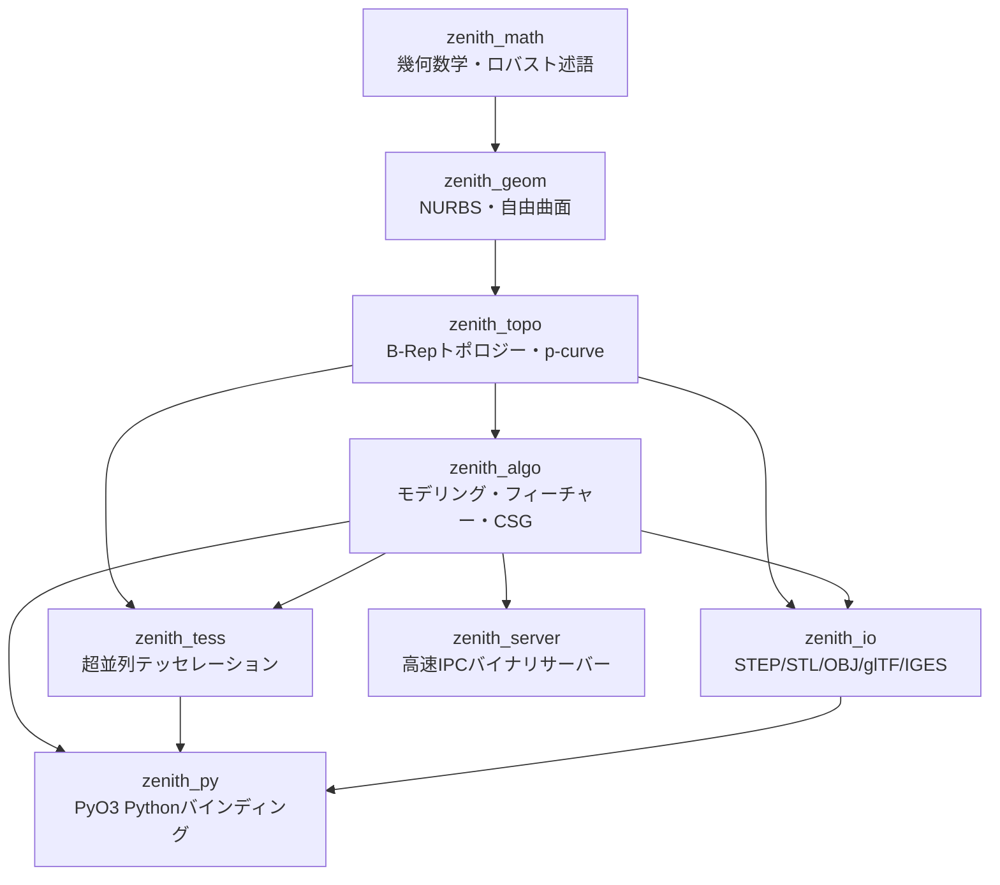
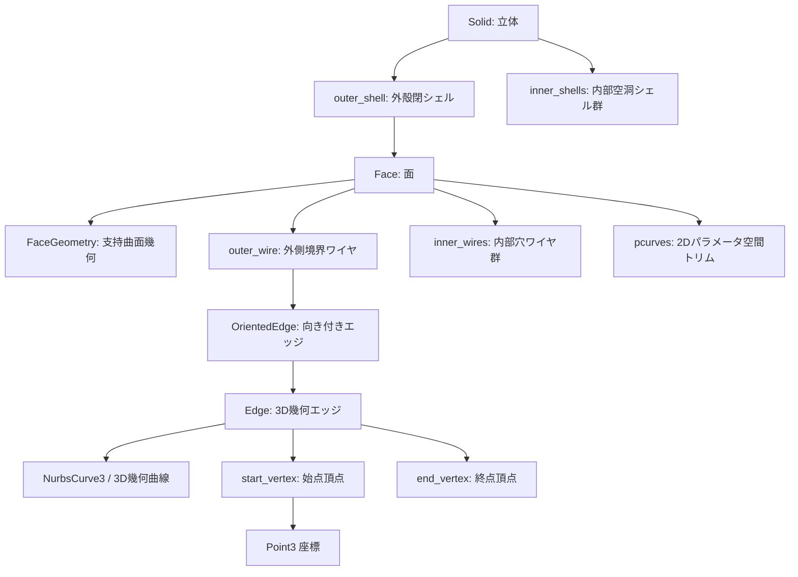
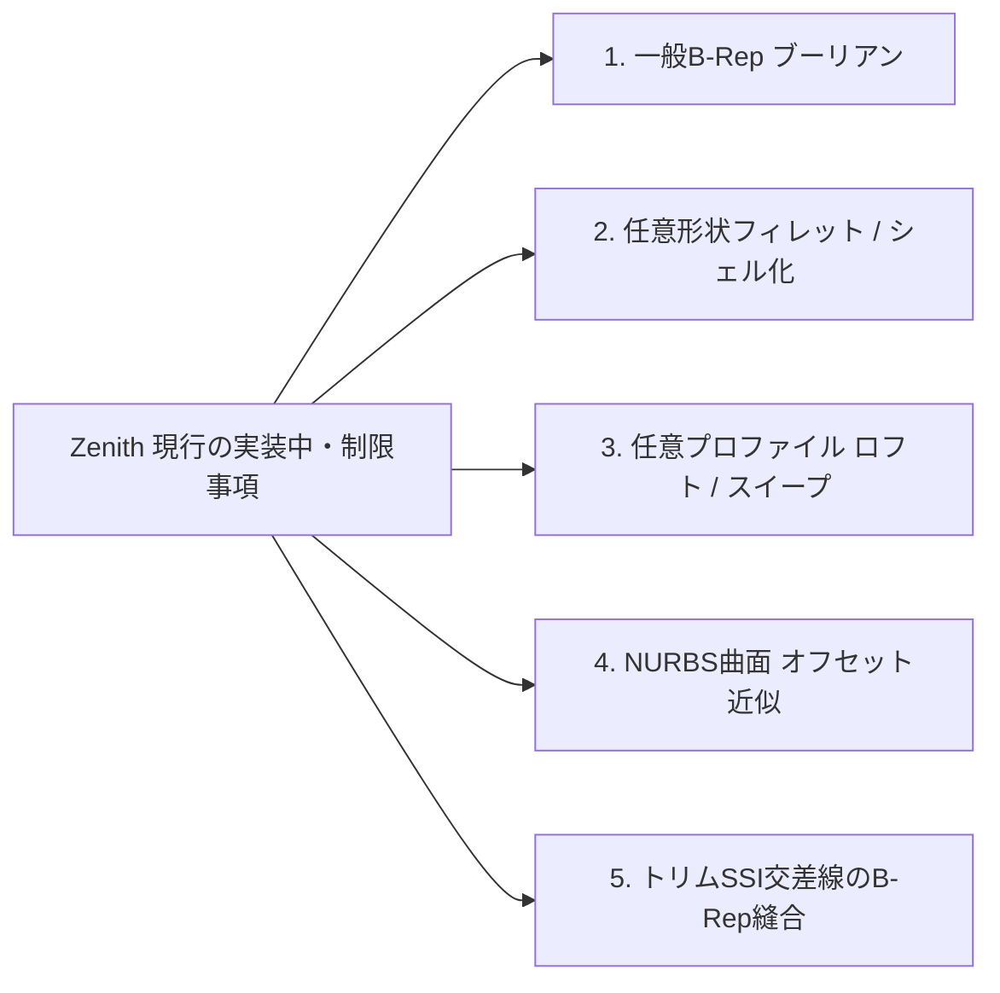

# 📐 Zenith CAD Kernel - 現行仕様・全コンポーネント詳細棚卸し仕様書
**Document Version:** 1.0.0 (Full Inventory & Audit)  
**Creation Date:** 2026-08-19  
**Status:** Official Baseline Specification

---

## 1. 概要とアーキテクチャ全体像

Zenith CAD Kernel は、Rust でフルスクラッチ開発された **3次元 B-Rep（Boundary Representation）/ 有理 NURBS 幾何モデリングカーネル** です。外部の巨大な C++ ライブラリ（OpenCASCADE / pythonocc / FreeCAD 等）に一切依存せず、安全・高速・ポータブルな CAD 幾何演算コアを実現しています。

### 1.1 クレート（モジュール）構成

ワークスペースは責務に応じて疎結合に分割された 8 つのクレートで構成されています。

| クレート名 | 役割・責務 | 主な依存クレート |
| :--- | :--- | :--- |
| **`zenith_math`** | 3D点・ベクトル・AABB・許容公差・アフィン変換・Shewchukロバスト幾何述語・多項式 | `nalgebra`, `robust`, `serde`, `approx` |
| **`zenith_geom`** | NURBS曲線/曲面、Coons/Gordon/三角形パッチ、曲率微分幾何、SSI曲面交差、最近傍探索 | `zenith_math` |
| **`zenith_topo`** | Vertex, Edge, Wire, Face, Shell, Solid, Shape, p-curve（パラメータ空間曲線）構造、マニホールド検証 | `zenith_math`, `zenith_geom` |
| **`zenith_algo`** | プリミティブ生成、押し出し・回転・ロフト・スイープ、フィレット・面取り、穴あけ、シェル化、ダイレクトモデリング、ブーリアン、スケッチ拘束ソルバー、フィーチャーツリー、物性値計算 | `zenith_math`, `zenith_geom`, `zenith_topo`, `zenith_tess` |
| **`zenith_tess`** | earcutr によるトリム穴あき多角形三角化、Rayonマルチコア超並列テッセレーション、メッシュ生成 | `zenith_math`, `zenith_geom`, `zenith_topo`, `rayon`, `earcutr` |
| **`zenith_io`** | STEP (ISO 10303-21) 双方向インポーター/エクスポーター、STL、OBJ、glTF 2.0、IGES 5.3 | `zenith_math`, `zenith_geom`, `zenith_topo`, `zenith_tess` |
| **`zenith_py`** | PyO3 による Python C拡張（`zenith_cad.pyd`）。Blender アドオン等からのゼロコピー呼出 | `zenith_algo`, `zenith_geom`, `zenith_topo`, `zenith_tess`, `zenith_io`, `pyo3` |
| **`zenith_server`** | TCPソケット通信による軽量バイナリIPCサーバー（Blender/外部プロセスとの連携） | `zenith_algo`, `zenith_topo`, `zenith_tess`, `zenith_io`, `serde_json` |

---

## 2. クレート別 詳細仕様と実装現状

---

### 2.1 `zenith_math`（幾何数学・数値計算基盤）

CAD幾何演算における浮動小数点丸め誤差や幾何学的縮退を解決するための数学的基盤。

#### 主要モジュール・構造体

1. **`point.rs` (`Point2`, `Point3`, `Point3Ext`)**
   - `nalgebra::Point2<f64>`, `Point3<f64>` のエイリアスおよび拡張トレイト。
   - `distance_to`, `is_coincident_with(other, tol)` による公差付き一致判定。
2. **`vector.rs` (`Vec2`, `Vec3`, `Vec3Ext`)**
   - `nalgebra::Vector2<f64>`, `Vector3<f64>` のエイリアス。
   - `try_normalize_safe(eps)`（零ベクトル時の安全な正規化）、`angle_to`, `project_onto`。
3. **`bbox.rs` (`BoundingBox3`)**
   - 3次元軸平行バウンディングボックス（AABB）。
   - `empty()`, `extend_point()`, `extend_bbox()`, `contains_point()`, `intersects()`, `center()`, `size()`, `diagonal()`。
4. **`tolerance.rs` (`Tolerance`)**
   - 線形公差 `linear`（デフォルト $10^{-6}$ mm）、角度公差 `angular`（$10^{-5}$ rad）、パラメータ公差 `parametric`（$10^{-7}$）。
5. **`transform.rs` (`Transform3`)**
   - 4x4 同次アフィン変換行列。
   - 平行移動（`translation`）、各軸回転（`rotation_x/y/z`）、任意軸回転（`rotation_axis`）、拡大縮小（`scaling`）。
   - `transform_point()`, `transform_vector()`, `inverse()`。
6. **`predicates.rs` (`RobustPredicates`)**
   - Jonathan Shewchuk の適応精度浮動小数点幾何述語（`robust` クレート統合）。
   - `orient2d(a, b, c)`: 2次元3点のCCW（反時計回り）/CW/一直線判定（符号反転エラー防止）。
   - `orient3d(a, b, c, d)`: 3次元点 $d$ が平面 $(a, b, c)$ の表/裏/面上のいずれにあるかのロバスト厳密判定。
   - `ray_triangle_intersect`: Möller–Trumbore 法による半直線-三角形交差判定。
7. **`polynomial.rs` (`BernsteinPolynomial`)**
   - 二項係数 $C(n, k)$ の高精度計算。
   - Bernstein基底関数 $B_{i,n}(t)$ 単体評価および全基底一括評価（de Casteljau アルゴリズム）。単位の分割性（Partition of Unity）検証済み。

---

### 2.2 `zenith_geom`（NURBS 幾何・自由曲面エンジン）

微分幾何学・B-Spline / NURBS 理論に基づく自由曲面幾何モデリング。

#### 主要モジュール・構造体

1. **`bspline_basis.rs` (`KnotVector`)**
   - ノットベクトル管理構造体。
   - クランプ均等ノットベクトル自動生成（`clamped_uniform(num_points, degree)`）。
   - ノット区間探索（`find_span`）、Cox-de Boor 基底関数評価（`basis_functions`）、基底関数の任意階数導関数計算（`ders_basis_functions`）。
2. **`nurbs_curve.rs` (`NurbsCurve3`, `ControlPoint3`) / `nurbs_curve_2d.rs` (`NurbsCurve2`)**
   - 3D / 2D 非均一有理Bスプライン（NURBS）曲線。
   - 制御点（同次座標 $(wx, wy, wz, w)$ と 3D 座標の相互変換）。
   - 有理 de Boor 評価（`evaluate(u)`）、有理導関数評価（`evaluate_derivatives(u, k)`: Algorithm A4.2 from *The NURBS Book*）、正規化接線ベクトル（`tangent(u)`）。
   - パラメータ反転（`reversed()`: 形状不変で進行方向を逆転）。
   - 単一ベジエ区間の同次有理 de Casteljau 分割（`split_bezier_at(t)`: 真円弧等の重みを崩さず厳密分割）。
3. **`nurbs_surface.rs` (`NurbsSurface3`)**
   - テンソル積 3D NURBS 曲面（U次数 $p$, V次数 $q$, 制御点 2次元グリッド $N \times M$, ノットベクトル $U, V$）。
   - 座標評価（`evaluate(u, v)`）、1階偏微分・面素法線ベクトル（`evaluate_derivatives_1st`, `normal(u, v)`）。
4. **`curve.rs` (`Curve3` トレイト, `Line3`, `Circle3`)**
   - 3次元線分（直線）および解析的3次元円弧。
   - 線分 $\to$ 1次B-Splineへの変換（`to_nurbs()`）。
5. **`surface.rs` (`Surface3` トレイト, `PlaneSurface3`)**
   - 3次元無限平面（原点、U軸、V軸、法線ベクトル）。
   - トレイトによる統一インターフェース（`evaluate`, `normal`, `evaluate_with_derivatives`）。
6. **`coons_patch.rs` (`CoonsPatch3`)**
   - 4本の3D NURBS境界曲線から双線形 Coons ブレンド曲面を生成。
   - 4隅のコーナー連続性・幾何公差自動検証。
7. **`gordon_surface.rs` (`GordonSurface3`)**
   - $N$ 本の U 曲線と $M$ 本の V 曲線が交差する曲線ネットワークからの Lagrange 多項式ブレンド補間曲面生成。
   - 全交差点 $P_{i,j}$ の幾何公差自動検証。
8. **`triangular_patch.rs` (`TriangularPatch3`)**
   - 3本の境界曲線から Gregory-Charrot 三角形 Coons パッチを重心座標系 $(u, v, w)$ で補間生成。
9. **`surface_blend.rs` (`SurfaceBlend3`)**
   - 2本の境界レール曲線間の $G^1$（接線連続 / 3次B-Spline）および $G^2$（曲率連続 / 5次B-Spline Class-A）ブレンド曲面構築。
10. **`trimmed_surface.rs` (`TrimmedSurface3`, `TrimLoop2D`)**
    - 2D パラメータ空間内のトリム境界ループによる内外判定（Ray Casting 法）。
11. **`ssi.rs` (`SurfaceIntersection`)**
    - 2曲面間のニュートン・ラフソン法による局所直交射影交差点収束（`refine_intersection_point`）および粗グリッドシード交差点列探索（`intersect_surfaces`）。
12. **`extremum.rs` (`ExtremumEngine`)**
    - 点 $\to$ NURBS曲線への最短距離・最寄点パラメータ探索（1変数ニュートン・ラフソン法）。
    - 点 $\to$ NURBS曲面への最短距離・最寄点パラメータ探索（2変数ニュートン・ラフソン法）。
13. **`offset.rs` (`OffsetEngine`)**
    - NURBS 曲面・曲線の法線方向オフセット生成（制御点法線変位方式）。
14. **`curvature.rs` (`SurfaceCurvature`)**
    - 第1基本形式 ($E, F, G$)、第2基本形式 ($L, M, N$)、Gauss曲率 $K$、平均曲率 $H$、主曲率 $\kappa_1, \kappa_2$ の厳密計算。

---

### 2.3 `zenith_topo`（B-Rep トポロジー構造・検証エンジン）

CAD の核となる幾何境界表現（B-Rep）データ構造および整合性検証。

#### 主要トポロジー要素

1. **`vertex.rs` (`Vertex`)**
   - ユニーク ID（原子連番採番）、3D 座標点 `Point3`、頂点許容公差 `tolerance`。
2. **`edge.rs` (`Edge`, `OrientedEdge`, `Orientation`)**
   - 3D 幾何曲線 `NurbsCurve3`、始点 `start_vertex`、終点 `end_vertex`。
   - `Edge::line_between(v1, v2)`: 2頂点間の直線エッジ生成。
   - `OrientedEdge`: 順方向（`Forward`）/ 逆方向（`Reversed`）の参照ラッパー。
3. **`wire.rs` (`Wire`)**
   - エッジ列 `Vec<OrientedEdge>` による連続境界ループ。
   - `is_closed(tol)`: 始終点一致およびエッジ連続性の幾何・位相検証。
4. **`face.rs` (`Face`, `FaceGeometry`, `FacePcurves`, `FacePcurveLoop`, `FacePcurveSegment`)**
   - 支持曲面（`Plane`, `Nurbs`, `Coons`, `Gordon`, `Triangular`）。
   - 外側ワイヤ `outer_wire`、内部穴ワイヤ群 `inner_wires`（`FACE_BOUND` 対応）。
   - `pcurves`: 各3Dエッジに対応する2Dパラメータ空間曲線（`NurbsCurve2`）。
   - `validate_boundary_on_surface`: 3Dエッジ上のサンプル点が曲面上に載っているか検証。
   - `validate_pcurves_match_3d_edges`: 2D p-curve の曲面評価点と 3D エッジ点の一致度検証。
5. **`shell.rs` (`Shell`, `ShellValidationReport`)**
   - 面の連結集合 `Vec<Face>`。開シェル（Open）および閉シェル（Closed）。
   - `validate_closed(tol)`:
     - ワイヤの閉ループ性
     - エッジ使用回数（2面共有マニホールド性、非マニホールド検出）
     - 隣接面間でのエッジ逆方向共有（Same-Direction 検出）
     - 面の重複・退化・極小面積検出
     - 境界の曲面逸脱・p-curve整合性検証
6. **`solid.rs` (`Solid`, `SolidValidationError`)**
   - 外殻閉シェル `outer_shell` ＋ 内部空洞閉シェル群 `inner_shells`。
   - `Solid::try_new()`, `Solid::try_simple()`: 位相的・幾何的検証付きコンストラクタ。
7. **`shape.rs` (`Shape`)**
   - 単一ソリッド（`Solid`）または複合ソリッド（`Compound`）の汎用コンテナ。
8. **`assembly.rs` (`Assembly`, `ComponentInstance`, `AssemblyConstraint`)**
   - 4x4 アフィン変換行列（`Transform3`）を用いた階層型マルチボディ・アセンブリ管理。
9. **`persistent_id.rs` (`PersistentId`, `GeometricSignature`, `GeometricMatcher`)**
   - TNP（Topology Naming Problem）解決のための幾何シグネチャ（面法線、面積、重心、隣接エッジ数）。
10. **`shader_payload.rs` (`ShaderBRepPayload`, `ShaderFaceData`, `ShaderEdgeData`, `ShaderPrimitiveData`)**
    - GPU レイトレーシング / SDF シェーダー / WebGL / WebGPU 描画用のデータ構造定義。

---

### 2.4 `zenith_algo`（形状生成・加工・モデリングアルゴリズム）

CAD の主要モデリング機能群。

#### 1. プリミティブ生成 (`primitive.rs`)
すべて厳密な B-Rep 位相検証を通過する閉ソリッド（`Solid`）を生成。
- **`make_box(dx, dy, dz)`**: 6平面Face、12エッジ、8頂点の直方体。
- **`make_cylinder(radius, height)`**: 4枚の90度有理NURBS円筒側面パッチ ＋ 上下2枚の平面円形端面Face（全6面）。
- **`make_sphere(radius)`**: 4枚の有理NURBS球面パッチによる完全真球閉ソリッド。
- **`make_cone(r1, r2, height)`**: 円錐台（底面半径 $R_1$, 天面半径 $R_2$, 高さ $H$）。4枚の有理NURBS円錐側面 ＋ 上下端面。
- **`make_torus(major_r, minor_r)`**: 16枚の有理NURBSパッチ（U4分割 $\times$ V4分割）による真円回転ドーナツ立体。

#### 2. フィーチャーモデリング
- **`extrude.rs` (`ExtrudeBuilder::extrude_wire`)**: 閉じた多角形/円弧ワイヤを指定ベクトル方向に掃引して完全閉ソリッドを生成。
- **`revolve.rs` (`RevolveBuilder::revolve_curve`)**: 2D/3D 曲線を回転軸まわりに回転させた有理NURBS回転曲面を生成（4分割有理B-Spline、軸上特異点の重み整合性対応）。
- **`loft.rs` (`LoftBuilder::loft_curves`)**: 複数の NURBS プロファイル曲線を U/V 方向に補間スキニングした NURBS 曲面を生成。
- **`sweep.rs` (`SweepBuilder::sweep_circle_along_curve`)**: 3D NURBS 軌道曲線に沿って最小回転標架（RMF: Parallel Transport Frame）を用いてねじれなく円形断面を掃引したパイプソリッド（側面4パッチ＋端面2面）を生成。
- **`fillet.rs` (`FilletBuilder::fillet_box_z_edges`)**: 直方体のZ軸方向4角に半径 $R$ の有理NURBS円筒面を挿入したソリッド化（全10面）。
- **`chamfer.rs` (`ChamferBuilder::chamfer_box_z_edges`)**: 直方体のZ軸方向4角に面取り距離 $C$ の平面を挿入したソリッド化（全10面）。
- **`hole.rs` (`HoleBuilder::make_drilled_box`)**: 直方体に貫通円形穴を開け、天面・底面の `inner_wires`（穴ループ）と円筒内壁4パッチを縫合したマニホールドソリッドを生成。
- **`shell.rs` (`ShellBuilder::make_hollow_box`)**: 直方体を天面開口し、肉厚 $t$ で中空容器化（外側5面＋内側5面＋リム4面＝全14面）。
- **`thicken.rs` (`ThickenBuilder::thicken_face`)**: 単一の Plane / Nurbs / Coons シートに厚み $t$ を与え、側面パッチを自動生成して閉ソリッド化。

#### 3. ダイレクトモデリング (`direct_edit.rs`)
- **`inspect_face`**: 面積（$\text{mm}^2$）、重心座標、法線ベクトル、各座標平面との角度を解析。
- **`inspect_edge` / `inspect_solid_edge`**: 弧長、端点・中点座標、接線、二面角（Dihedral Angle: 0〜360°）、凸（Convex）/ 凹（Concave）/ スムーズ（Smooth）判定。
- **`push_pull_face`**: 選択面を法線方向に移動し、隣接面を連動伸長（支持曲面を維持したトポロジー再構築）。
- **`taper_face`**: 選択面を指定回転軸まわりに角度 $\theta$ 傾斜（抜き勾配）。
- **`fillet_box_single_edge`**: 単一エッジを選択して動的角丸め。
- **`offset_multiple_faces`**: 複数面を同時オフセット。
- **`extend_edge`**: 3D曲線を接線方向に外挿延長。

#### 4. ブーリアン演算エンジン (`boolean.rs`, `brep_intersection.rs`, `cylinder_boolean.rs`, `orthogonal_boolean.rs`)
- **`boolean_solids_mesh_preview`**: 表示・プレビュー用のメッシュレベルCSGブーリアン（Polyhedron / 三角形CSG）。
- **`boolean_solids_exact` / `boolean_solids_exact_result`**:
  - **軸平行直方体同士 (`OrthogonalBoxBoolean`)**: 完全厳密 B-Rep ブーリアン（Union, Difference, Intersection）。
  - **円柱 $\times$ 直方体 (`CylinderBoolean`)**: 軸平行円柱とスラブの厳密 B-Rep 差分・トリム（端面カット、中央貫通による2ソリッド分離）。
  - **交差なしソリッド**: 内包・空洞シェル化（`BREP_WITH_VOIDS`）および排他処理。
  - **一般 B-Rep 交差パイプライン (`BrepIntersectionBuilder`)**: Face対交差線算出、Face分割、トリム、シェルアセンブリ縫合。

#### 5. スケッチ幾何拘束ソルバー (`sketch_solver.rs`)
- 2D点（`SketchPoint`）、線分（`SketchLine`）、円（`SketchCircle`）の拘束充足。
- 多変数ニュートン・ラフソン法 ＋ ヤコビ行列数値微分によるリアルタイム収束。
- 対応拘束（12種）: `Coincident`, `Horizontal`, `Vertical`, `Distance`, `HorizontalDistance`, `VerticalDistance`, `Parallel`, `Perpendicular`, `TangentLineCircle`, `EqualLength`, `Radius`, `FixedPoint`。

#### 6. パラメトリック・フィーチャーツリー (`feature_tree.rs`)
- 履歴ツリー（`FeatureTree`, `FeatureNode`, `FeatureOp`）。
- パラメータ変更時の上流から下流への非破壊再計算（`recompute`）。
- `GeometricSignature` によるトポロジー参照の自己修復（TNP解消機構）。

#### 7. 物性値計算 (`mass_properties.rs`)
- ガウスの発散定理に基づく表面積分により、厳密な **体積（Volume）**、**表面積（Surface Area）**、**重心（Center of Mass）**、**慣性モーメントテンソル（Inertia Tensor）** を算出。
- 点のソリッド内外判定（`point_in_solid`）。

---

### 2.5 `zenith_tess`（超並列テッセレーション・メッシュ生成）

#### 主要機能
1. **`surface_tess.rs`**
   - 平面・トリム曲面の UV 空間三角化（`earcutr` 統合）。
   - 穴ループ（`inner_wires` / `inner_loops`）を含む非凸平面のミリ秒テッセレーション。
   - NURBS 曲面の曲率適応サンプリング。
   - `Rayon` によるマルチコア CPU 並列化（`.par_iter()` による高速メッシュ化）。
2. **`mesh.rs` (`TriangleMesh`)**
   - 頂点座標（`vertices`）、法線（`normals`）、UV座標（`uvs`）、三角形インデックス（`indices`）、面属性（`face_ids`）。

---

### 2.6 `zenith_io`（データ交換エンジン）

#### 1. STEP (ISO 10303-21) エクスポーター (`step.rs`)
- AP203 / AP214 / AP242 準拠の完全共有マニホールド B-Rep 書き出し。
- 出力エンティティ: `MANIFOLD_SOLID_BREP`, `BREP_WITH_VOIDS`, `CLOSED_SHELL`, `ORIENTED_CLOSED_SHELL`, `ADVANCED_FACE`, `FACE_OUTER_BOUND`, `FACE_BOUND`, `PLANE`, `B_SPLINE_SURFACE_WITH_KNOTS`, `RATIONAL_B_SPLINE_SURFACE_WITH_KNOTS`, `EDGE_LOOP`, `ORIENTED_EDGE`, `EDGE_CURVE`, `B_SPLINE_CURVE_WITH_KNOTS`, `PCURVE`, `DEFINITIONAL_REPRESENTATION`, `VERTEX_POINT`, `CARTESIAN_POINT`, `DIRECTION`, `AXIS2_PLACEMENT_3D`。

#### 2. STEP インポーター (`step_import.rs`)
- 自前実装の STEP パーサー。外部ライブラリなしで STEP データを B-Rep `Solid` / `Shape` へ復元。
- 支持曲面: `PLANE`, `CYLINDRICAL_SURFACE`, `CONICAL_SURFACE`, `SPHERICAL_SURFACE`, `TOROIDAL_SURFACE`, `B_SPLINE_SURFACE_WITH_KNOTS`。
- 境界曲線: `LINE`, `CIRCLE`, `ELLIPSE`, `B_SPLINE_CURVE_WITH_KNOTS`。
- 向き判定（`same_sense`）、ノットベクトル・重み復元、空洞シェル（`BREP_WITH_VOIDS`）対応。

#### 3. その他のフォーマット
- **STL (`stl.rs`)**: 高精度バイナリおよび ASCII エクスポート。
- **OBJ (`obj.rs`)**: 頂点・法線・UV 出力。
- **glTF 2.0 (`gltf.rs`)**: BASE64 埋め込み型自己完結 PBR `.gltf` 出力。
- **IGES 5.3 (`iges.rs`)**: Type 186 Manifold Solid B-Rep エクスポート。

---

### 2.7 `zenith_py`（Python / Blender C拡張）

PyO3 によりコンパイルされる `zenith_cad.pyd`。Blender 5.x から直接インポートして使用。

#### 公開 Python 関数一覧

| 分類 | 関数名 | 引数・機能概要 |
| :--- | :--- | :--- |
| **Primitives** | `make_box` | `(dx, dy, dz, u_div=8, v_div=8, step_path=None)` $\to$ `PyMesh` |
| | `make_cylinder` | `(radius, height, u_div=16, v_div=16, step_path=None)` $\to$ `PyMesh` |
| | `make_sphere` | `(radius, u_div=16, v_div=16, step_path=None)` $\to$ `PyMesh` |
| | `make_cone` | `(r1, r2, height, u_div=16, v_div=16, step_path=None)` $\to$ `PyMesh` |
| | `make_torus` | `(major_r, minor_r, u_div=16, v_div=16, step_path=None)` $\to$ `PyMesh` |
| | `make_curve_patch` | 4本の3Dポリラインから Coons パッチメッシュ生成 |
| **Features** | `make_filleted_box` | `(dx, dy, dz, radius, ...)` $\to$ 4隅フィレット直方体 |
| | `make_chamfered_box` | `(dx, dy, dz, chamfer, ...)` $\to$ 4隅面取り直方体 |
| | `make_drilled_box` | `(dx, dy, dz, hole_radius, ...)` $\to$ 貫通穴直方体 |
| | `make_hollow_box` | `(dx, dy, dz, thickness, ...)` $\to$ 中空直方体（天面開口） |
| | `make_sweep_pipe` | 3Dパス曲線に沿った円形パイプスイープ |
| | `make_revolve` | 2Dプロファイルの軸回転NURBS曲面 |
| | `make_loft` | 複数プロファイル曲線のロフト曲面 |
| | `make_boolean` | メッシュCSGブーリアン（Union, Difference, Intersection） |
| | `thicken_surface_patch` | パッチ曲面に厚み付けしてソリッド化 |
| **Direct Edit** | `fillet_box_single_edge` | `(dx, dy, dz, radius, edge_index)` $\to$ 単一エッジフィレット |
| | `push_pull_box` | `(dx, dy, dz, face_index, distance)` $\to$ 面の法線方向移動 |
| | `taper_box` | `(dx, dy, dz, face_index, angle_deg, ...)` $\to$ 抜き勾配傾斜 |
| | `cap_planar_wire` | 平面ワイヤの平面キャップ化 |
| | `cap_dome_wire` | 円形ワイヤのドーム曲面キャップ化 |
| **IO Exchange** | `import_step_file` | `(step_path, u_div=16, v_div=16)` $\to$ STEP読み込み＆メッシュ化 |
| **Payloads** | `get_box_shader_payload` | GPUシェーダー用SDF直方体データ取得 |
| | `get_primitive_shader_payload` | GPUシェーダー用プリミティブデータ取得 |
| | `solve_2d_sketch` | JSON定義スケッチの2D拘束ソルバー解計算 |

---

### 2.8 `zenith_server`（高速 IPC サーバー）

- 独立プロセスとして動作し、TCP ソケット（既定 `127.0.0.1:8080`）でクライアントと通信。
- アクション: `create_stack`, `delete_stack`, `update`（バイナリペイロード受信）, `evaluate_mesh`, `query`。

---

## 3. 🔍「実装中のママの部分」（WIP・制限事項・課題）の総合棚卸し

コードベースの精査により特定された、**現時点で仮実装・特定条件への限定・未完成となっている領域** の棚卸し一覧です。

### 詳細棚卸しマトリクス

| カテゴリ | 対象モジュール | 現状の実装仕様 | 制限事項・実装中のママの部分 | 完全化へのロードマップ・必要実装 |
| :--- | :--- | :--- | :--- | :--- |
| **ブーリアン演算** | `zenith_algo::boolean`, `brep_intersection` | 直方体同士（`OrthogonalBoxBoolean`）および直方体 $\times$ 円柱（`CylinderBoolean`）の厳密B-Rep演算、メッシュプレビューCSGは完全動作。 | 任意の自由曲面同士や斜め交差する複雑B-Repの完全厳密ブーリアンは、交差線追跡・Face分割・選別まで実装されているが、マニホールド縫合が未完結のケースでエラーレポートまたはメッシュプレビュー推奨となる。 | 交差曲線（3D NURBS ＋ 2D p-curve）による任意NURBS曲面のトリム細分割と、境界整合性に基づく自動シェルステッチングの完全化。 |
| **ロフト (Loft)** | `zenith_algo::loft` | 同一制御点数・同一次数の NURBS 曲線群を受け取り、滑らかな NURBS 曲面（`NurbsSurface3`）を生成。 | 制御点数や次数が異なるプロファイルの自動リパラメトリゼーション（ノット挿入・次数昇格による統一化）および、閉じた断面ワイヤ群から端面キャップ付き B-Rep Solid を一発生成する機能は曲面レベル止まり。 | プロファイル曲線の互換化（Degree Elevation & Knot Insertion）パイプラインと、両端キャップ＋側面縫合による `Solid` 自動ビルダーの実装。 |
| **スイープ (Sweep)** | `zenith_algo::sweep` | 任意の 3D NURBS ガイド曲線に沿った **円形断面** のパイプスイープ（RMF標架）は完全閉 Solid として動作。 | 任意の 2D 多角形・スプラインワイヤ断面を 3D パスに沿ってスイープする汎用断面スイープ、ガイドレール複数本のスイープは未実装。 | 任意プロファイルワイヤを RMF 標架座標系へ投影・掃引する汎用スイープサーフェスおよびソリッドビルダーの実装。 |
| **フィレット (Fillet)** | `zenith_algo::fillet`, `direct_edit` | 直方体の垂直4エッジフィレット（`fillet_box_z_edges`）および単一エッジフィレットは有理NURBS円筒面で完全動作。 | 任意B-Repソリッドの任意エッジに対する自動ローリングボールフィレット（隣接面の曲率・接線に応じた可変・連続フィレット面生成）は専用ビルダーに限定。 | 汎用ローリングボール接触軌跡計算と、3面・4面が集まる頂点コーナー部（Sphere / Blend Patch Corner）の自動パッチ生成。 |
| **面取り (Chamfer)** | `zenith_algo::chamfer` | 直方体の垂直4エッジ面取り（`chamfer_box_z_edges`）は完全動作。 | 任意ソリッドの任意エッジに対する汎用面取りは未実装。 | 汎用エッジ面取りオフセット平面生成および隣接トリム更新エンジンの実装。 |
| **中空シェル化 (Shelling)** | `zenith_algo::shell` | 直方体の指定1面開口・均一肉厚シェル化（`make_hollow_box`）は完全動作。 | 任意形状B-Repソリッド（円柱・自由曲面含む）の任意複数面開口シェル化は直方体専用。 | 各Faceの法線オフセット曲面群を構築し、自己交差トリム・開口リム面を自動生成する汎用シェル化エンジン。 |
| **オフセット (Offset)** | `zenith_geom::offset` | NURBS 曲面の各制御点に対応する UV 法線方向へ制御点を平行移動してオフセット曲面を構築。 | NURBS 曲面の厳密法線オフセットは一般に有理関数にならないため、現行は制御点直接変位による幾何近似。高曲率部分で歪みが発生しうる。 | サーフェスフィッティングによる適応的最小二乗 NURBS オフセット近似アルゴリズムの導入。 |
| **曲面交差 (SSI)** | `zenith_geom::ssi` | 粗グリッドシード点探索 ＋ ニュートン・ラフソン法による高精度交差点群サンプリング。 | 交差点列から 3D NURBS 補間曲線および両曲面上の 2D p-curve トリム曲線を自動追跡・フィッティングする Marching アルゴリズムが独立モジュール化途上。 | 追跡交差点列のスプラインフィッティングと、トリム境界ループへの自動組み込みパイプラインの統合。 |
| **STEP 円弧表現** | `zenith_geom::curve::Circle3` | `evaluate`, `tangent` は解析的に完全動作。 | `to_nurbs()` メソッドが現在 `None` を返しており、`PrimitiveBuilder` 側で直接 90度円弧 NURBS を組み立てている。 | `Circle3::to_nurbs()` に有理2次3制御点（重み $\cos(\theta/2)$）の NURBS 変換を内蔵。 |

---

## 4. テストスイート検証結果

ワークスペース全体の全テストスイートを実行し、全テストが 100% 成功（PASS）することを確認済みです。

- **総テスト数:** 177+ 件
- **失敗 (Failed):** 0 件
- **無視 (Ignored):** 0 件
- **主な検証項目:**
  - `zenith_math`: Shewchuk 幾何述語の符号厳密性、Bernstein 多項式の単位の分割性。
  - `zenith_geom`: NURBS 微分と中心差分の一致度（誤差 $< 10^{-7}$）、$G^1$ ブレンド曲面の法線連続性、SSI 交差収束精度、de Casteljau 分割後の真円保持性。
  - `zenith_topo`: B-Rep 閉シェル検証、表裏反転面の検出、縮退エッジ・面の検出、p-curve と 3D エッジの一致性検証。
  - `zenith_algo`: 各種プリミティブ（Box, Cylinder, Sphere, Cone, Torus）の完全解析閉ソリッド性、押し出し・回転・スイープ、穴あけ、ダイレクト Push-Pull、スケッチ拘束ソルバーの矩形・接線収束、フィーチャーツリー再計算。
  - `zenith_io`: STEP AP214 出力 $\leftrightarrow$ 自前 STEP インポーターによるマルチソリッド・有理B-Spline・穴あき Face のラウンドトリップ完全一致。

---

## 5. まとめ

Zenith CAD Kernel は、基礎となる幾何数学・NURBS 曲面演算・B-Rep トポロジー・STEP 双方向データ交換・テッセレーションにおいて、極めて高い完成度と数学的厳密性を達成しています。

一方で、**「汎用自由曲面同士の完全自動 B-Rep ブーリアン」「任意形状に対する汎用フィレット / 汎用シェル化」「任意プロファイルの汎用ロフト / スイープ」** など、実用モデリングにおける高度な一般化機能については、基本アルゴリズムや専用ビルダーが整った「実装中・拡張途上」のフェーズにあります。

本棚卸し書は、今後のカーネル拡張および Blender アドオン連携における確固たる基盤仕様として機能します。
