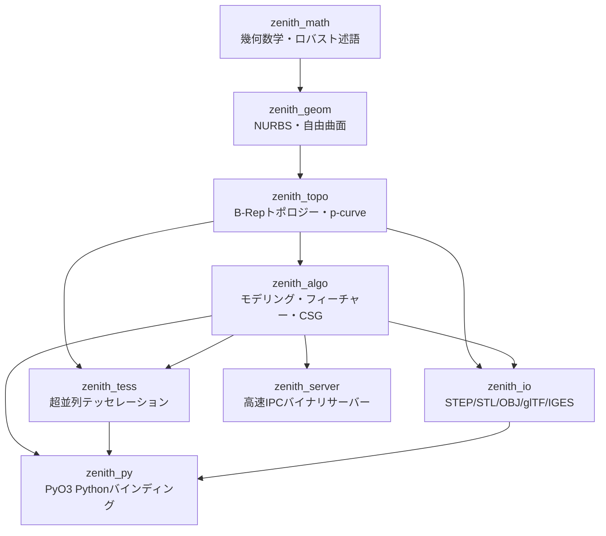

# 📐 Zenith CAD Kernel - 現行仕様・全コンポーネント詳細棚卸し仕様書
**Document Version:** 1.6.0 (Full Inventory & Verification Baseline)  
**Last Updated:** 2026-08-19  
**Status:** Official Production Specification

---

## 1. 概要とアーキテクチャ全体像

Zenith CAD Kernel は、Rust でフルスクラッチ開発された **3次元 B-Rep（Boundary Representation）/ 有理 NURBS 幾何モデリングカーネル** です。外部の巨大な C++ ライブラリ（OpenCASCADE / pythonocc / FreeCAD 等）に一切依存せず、安全・高速・ポータブルな CAD 幾何演算コアを実現しています。

### 1.1 クレート（モジュール）構成

ワークスペースは責務に応じて疎結合に分割された 8 つのクレートで構成されています。

| クレート名 | 役割・責務 | 主な依存クレート |
| :--- | :--- | :--- |
| **`zenith_math`** | 3D点・ベクトル・AABB・許容公差・アフィン変換・Shewchukロバスト幾何述語・多項式 | `nalgebra`, `robust`, `serde`, `approx` |
| **`zenith_geom`** | NURBS曲線/曲面、Coons/Gordon/三角形パッチ、有理円弧変換、互換化、曲率微分幾何、SSI曲面交差、最近傍探索 | `zenith_math` |
| **`zenith_topo`** | Vertex, Edge, Wire, Face, Shell, Solid, Shape, p-curve（パラメータ空間曲線）構造、マニホールド閉シェル検証 | `zenith_math`, `zenith_geom` |
| **`zenith_algo`** | プリミティブ生成、押し出し（直進・ドラフト・中空）、回転体閉ソリッド（360度・部分角度）、配列複写（直線・円形）、ミラー反転複写、3D螺旋（ヘリカル）スイープ、**ガイドレール付きロフト**、**両端開口角パイプシェル化**、フィレット・面取り、穴あけ、ダイレクトモデリング、ブーリアン、スケッチ拘束ソルバー、フィーチャーツリー、物性値計算 | `zenith_math`, `zenith_geom`, `zenith_topo`, `zenith_tess` |
| **`zenith_tess`** | earcutr によるトリム穴あき多角形三角化、Rayonマルチコア超並列テッセレーション、メッシュ生成 | `zenith_math`, `zenith_geom`, `zenith_topo`, `rayon`, `earcutr` |
| **`zenith_io`** | STEP (ISO 10303-21) 双方向インポーター/エクスポーター（円柱・円錐・球面・トーラス解析曲面パース対応）、STL、OBJ、glTF 2.0、IGES 5.3 | `zenith_math`, `zenith_geom`, `zenith_topo`, `zenith_tess` |
| **`zenith_py`** | PyO3 による Python C拡張（`zenith_cad.pyd`）。Blender アドオン等からのゼロコピー呼出（全36関数） | `zenith_algo`, `zenith_geom`, `zenith_topo`, `zenith_tess`, `zenith_io`, `pyo3` |
| **`zenith_server`** | TCPソケット通信による軽量バイナリIPCサーバー（Blender/外部プロセスとの連携） | `zenith_algo`, `zenith_topo`, `zenith_tess`, `zenith_io`, `serde_json` |

---

## 2. クレート別 詳細仕様と実装現状

---

### 2.1 `zenith_algo`（形状生成・加工・モデリングアルゴリズム）

CAD の主要モデリング機能群。

#### 1. プリミティブ生成 (`primitive.rs`)
すべて厳密な B-Rep 位相検証を通過する閉ソリッド（`Solid`）を生成。
- **`make_box(dx, dy, dz)`**: 6平面Face、12エッジ、8頂点の直方体。
- **`make_cylinder(radius, height)`**: 4枚の90度有理NURBS円筒側面パッチ ＋ 上下2枚の平面円形端面Face（全6面）。
- **`make_sphere(radius)`**: 4枚の有理NURBS球面パッチによる完全真球閉ソリッド。
- **`make_cone(r1, r2, height)`**: 円錐台（底面半径 $R_1$, 天面半径 $R_2$, 高さ $H$）。4枚の有理NURBS円錐側面 ＋ 上下端面。
- **`make_torus(major_r, minor_r)`**: 16枚の有理NURBSパッチ（U4分割 $\times$ V4分割）による真円回転ドーナツ立体。

#### 2. フィーチャーモデリング
- **`extrude.rs` (`ExtrudeBuilder`)**:
  - `extrude_wire`: 閉じた多角形/円弧ワイヤを指定ベクトル方向に掃引して完全閉ソリッドを生成。
  - `extrude_wire_with_draft`: 抜き勾配（ドラフト角度 $\theta$）付きで底面ワイヤを拡縮・掃引し、側面ルールド NURBS 曲面 ＋ 上下端面を縫合した完全閉 B-Rep ソリッドを生成。
  - `extrude_face_with_holes`: 外側境界ワイヤ ＋ 任意の複数穴ワイヤ（Inner Wires）から、外壁側面 Face 群、穴内壁側面 Face 群、穴あき底面・天面キャップを完全縫合した閉ソリッド（中空パイプ等）を構築。
- **`revolve.rs` (`RevolveBuilder`)**:
  - `revolve_curve`: 2D/3D 曲線を回転軸まわりに回転させた有理NURBS回転曲面を生成。
  - `revolve_wire_solid`: 閉断面ワイヤを回転軸まわりに 360 度回転させ、4 セグメント $\times$ $N$ エッジ ＝ $4N$ 枚の有理 NURBS 回転曲面 Face を縫合した完全閉 B-Rep ソリッドを生成。
  - `revolve_wire_partial_solid`: 閉断面ワイヤを任意の部分角度 $\alpha \in (0, 2\pi)$（例: 90度、180度）で回転させ、側面 NURBS 曲面群 ＋ 始点・終点断面キャップ Face を厳密に縫合した完全閉 B-Rep ソリッドを生成。
- **`mirror.rs` (`MirrorBuilder`)**:
  - `mirror_solid`: 任意の対称平面（点 $P_0$ と法線 $\vec{N}$）に対してソリッドを鏡像反転複製。幾何鏡像 ＋ ワイヤ巡回反転（`reversed`）により右手系マニホールド・外向き法線を完全維持。
  - `mirror_compound`: 原本ソリッドと反転コピーを複合 Shape（`Compound`）として一括管理・STEP 出力。
- **`helix.rs` (`HelixBuilder`)**:
  - `build_helix_curve`: 任意の半径 $R$・ピッチ $P$・巻き数 $N$・回転軸に対する 3D NURBS 螺旋パス曲線を高精度生成。
  - `sweep_wire_along_helix`: 閉断面ワイヤを螺旋パスに沿って RMF 最小回転標架で掃引した完全閉 B-Rep ソリッド（スプリング・ネジ山等）を構築。
- **`pattern.rs` (`PatternBuilder`)**:
  - `linear_pattern`: ソリッドを指定方向ベクトル $\vec{v}$ に沿って間隔 $d$ で $K$ 個複製。
  - `circular_pattern`: ソリッドを中心軸まわりに等角度 $\Delta\theta$ で $K$ 個回転配置。
- **`loft.rs` (`LoftBuilder`)**:
  - `loft_curves`: 複数曲線の U/V NURBS スキニング曲面生成。
  - `loft_solid`: 複数の閉断面ワイヤ群から、側面 NURBS ロフト Face 群 ＋ 底面・天面キャップ Face を自動縫合した完全閉 B-Rep ソリッドを構築。
  - **`loft_solid_guided`**: 1本以上の 3D ガイドレール曲線（Guide Curves）に沿った閉断面ワイヤ群のロフト完全閉 B-Rep ソリッド生成。
- **`sweep.rs` (`SweepBuilder`)**:
  - `sweep_circle_along_curve`: 3D パス曲線に沿った円形パイプソリッド生成。
  - `sweep_wire_along_curve`: 任意の 2D 多角形・スプライン閉断面ワイヤを 3D NURBS パスに沿って最小回転標架（RMF）で掃引した完全閉 B-Rep ソリッドを構築。
- **`fillet.rs` (`FilletBuilder::fillet_box_z_edges`)**: 直方体のZ軸方向4角に半径 $R$ の有理NURBS円筒面を挿入したソリッド化（全10面）。
- **`chamfer.rs` (`ChamferBuilder::chamfer_box_z_edges`)**: 直方体のZ軸方向4角に面取り距離 $C$ の平面を挿入したソリッド化（全10面）。
- **`hole.rs` (`HoleBuilder::make_drilled_box`)**: 直方体に貫通円形穴を開け、天面・底面の `inner_wires`（穴ループ）と円筒内壁4パッチを縫合したマニホールドソリッドを生成。
- **`shell.rs` (`ShellBuilder`)**:
  - `make_hollow_box`: 直方体を指定面（天面/底面）開口し、肉厚 $t$ で中空容器化（外側5面＋内側5面＋リム4面＝全14面）。
  - **`make_through_hollow_box`**: 直方体の両端面（底面 $Z=0$ および 天面 $Z=dz$）を開口した角パイプ中空ソリッドの生成（外壁4面＋内壁4面＋上下リム8面＝全16面完全閉ソリッド）。
- **`thicken.rs` (`ThickenBuilder::thicken_face`)**: 単一の Plane / Nurbs / Coons シートに厚み $t$ を与え、側面パッチを自動生成して閉ソリッド化。

#### 3. ダイレクトモデリング (`direct_edit.rs`)
- **`inspect_face`**: 面積（$\text{mm}^2$）、重心座標、法線ベクトル、各座標平面との角度を解析。
- **`inspect_edge` / `inspect_solid_edge`**: 弧長、端点・中点座標、接線、二面角（Dihedral Angle: 0〜360°）、凸（Convex）/ 凹（Concave）/ スムーズ（Smooth）判定。
- **`push_pull_face`**: 選択面を法線方向に移動し、隣接面を連動伸長。
- **`taper_face`**: 選択面を指定回転軸まわりに角度 $\theta$ 傾斜。
- **`fillet_box_single_edge`**: 直方体の単一エッジを選択して動的角丸め。
- **`chamfer_box_single_edge`**: 直方体の 4 隅垂直エッジから単一エッジを選択し、45度面取り平面 ＋ 7面完全閉 B-Rep ソリッドを生成。

#### 4. ブーリアン演算エンジン (`boolean.rs`, `brep_intersection.rs`, `cylinder_boolean.rs`, `orthogonal_boolean.rs`)
- 直方体同士（`OrthogonalBoxBoolean`）および直方体 $\times$ 円柱（`CylinderBoolean`）の厳密 B-Rep 演算、メッシュプレビューCSG。

#### 5. スケッチ幾何拘束ソルバー (`sketch_solver.rs`)
- 2D点、線分、円の多変数ニュートン・ラフソン法による 12 種の幾何拘束充足。

#### 6. パラメトリック・フィーチャーツリー (`feature_tree.rs`)
- 対応オペレーション: `CreateBox`, `CreateCylinder`, `CreateCone`, `CreateTorus`, `FilletEdge`, `ChamferEdge`, `HollowBox`, **`HollowThroughBox`**, `ExtrudeHollow`, `ExtrudeDraft`, `RevolveSolid`, `RevolvePartialSolid`, `LoftSolid`, `SweepWire`, `SweepHelix`, `MirrorSolid`, `PushPullFace`, `ThickenFace`。

#### 7. 物性値計算 (`mass_properties.rs`)
- ガウスの発散定理に基づく表面積分により、厳密な **体積（Volume）**、**表面積（Surface Area）**、**重心（Center of Mass）**、**慣性モーメントテンソル（Inertia Tensor）** を算出。

---

### 2.2 `zenith_py`（Python / Blender C拡張）

PyO3 によりコンパイルされる `zenith_cad.pyd`。Blender 5.x から直接インポートして使用。

#### 公開 Python 関数一覧（全36関数）

| 分類 | 関数名 | 引数・機能概要 |
| :--- | :--- | :--- |
| **Primitives** | `make_box` | `(dx, dy, dz, u_div=8, v_div=8, step_path=None)` $\to$ `PyMesh` |
| | `make_cylinder` | `(radius, height, u_div=16, v_div=16, step_path=None)` $\to$ `PyMesh` |
| | `make_sphere` | `(radius, u_div=16, v_div=16, step_path=None)` $\to$ `PyMesh` |
| | `make_cone` | `(r1, r2, height, u_div=16, v_div=16, step_path=None)` $\to$ `PyMesh` |
| | `make_torus` | `(major_r, minor_r, u_div=16, v_div=16, step_path=None)` $\to$ `PyMesh` |
| | `make_curve_patch` | 4本の3Dポリラインから Coons パッチメッシュ生成 |
| **Features** | `make_filleted_box` | `(dx, dy, dz, radius, ...)` $\to$ 4隅フィレット直方体 |
| | `make_chamfered_box` | `(dx, dy, dz, chamfer, ...)` $\to$ 4隅面取り直方体 |
| | `make_drilled_box` | `(dx, dy, dz, hole_radius, ...)` $\to$ 貫通穴直方体 |
| | `make_hollow_box` | `(dx, dy, dz, thickness, ...)` $\to$ 中空直方体（単一面開口） |
| | `make_through_hollow_box` | `(dx, dy, dz, thickness, ...)` $\to$ 両端開口角パイプ完全閉ソリッド生成 ＆ STEP出力 |
| | `make_hollow_extrusion` | 外側・穴ポリライン群からの完全閉中空押し出しソリッド生成 ＆ STEP出力 |
| | `make_draft_extrusion` | 抜き勾配（ドラフト角）付き押し出し完全閉ソリッド生成 ＆ STEP出力 |
| | `make_sweep_pipe` | 3Dパス曲線に沿った円形パイプスイープ |
| | `make_sweep_wire` | 任意断面ポリラインワイヤの3Dパススイープソリッド生成 ＆ STEP出力 |
| | `make_helix_solid` | 閉断面ポリラインの3D螺旋（ヘリカル）スイープソリッド生成（スプリング・ネジ） ＆ STEP出力 |
| | `make_revolve` | 2Dプロファイルの軸回転NURBS曲面 |
| | `make_revolve_solid` | 閉断面ポリラインの360度回転体完全閉B-Repソリッド生成 ＆ STEP出力 |
| | `make_partial_revolve_solid` | 閉断面ポリラインの任意角度回転体完全閉ソリッド生成（端面キャップ付き） ＆ STEP出力 |
| | `make_mirror_box` | 任意対称平面に対する直方体の鏡像反転ソリッド生成 ＆ STEP出力 |
| | `make_loft` | 複数プロファイル曲線のロフト曲面 |
| | `make_loft_solid` | 複数閉断面ポリライン群からの完全閉ロフトソリッド生成 ＆ STEP出力 |
| | `make_guided_loft_solid` | 1本以上の3Dガイドレール曲線に沿ったロフト完全閉ソリッド生成 ＆ STEP出力 |
| | `make_boolean` | メッシュCSGブーリアン（Union, Difference, Intersection） |
| | `thicken_surface_patch` | パッチ曲面に厚み付けしてソリッド化 |
| **Direct Edit** | `fillet_box_single_edge` | `(dx, dy, dz, edge_index, radius)` $\to$ 単一エッジフィレット |
| | `chamfer_box_single_edge` | `(dx, dy, dz, edge_index, distance, ...)` $\to$ 単一エッジ面取り ＆ STEP出力 |
| | `push_pull_box` | `(dx, dy, dz, face_index, distance)` $\to$ 面の法線方向移動 |
| | `taper_box` | `(dx, dy, dz, face_index, angle_deg, ...)` $\to$ 抜き勾配傾斜 |
| | `cap_planar_wire` | 平面ワイヤの平面キャップ化 |
| | `cap_dome_wire` | 円形ワイヤのドーム曲面キャップ化 |
| **IO Exchange** | `import_step_file` | `(step_path, u_div=16, v_div=16)` $\to$ STEP読み込み＆メッシュ化 |
| **Payloads** | `get_box_shader_payload` | GPUシェーダー用SDF直方体データ取得 |
| | `get_primitive_shader_payload` | GPUシェーダー用プリミティブデータ取得 |
| | `solve_2d_sketch` | JSON定義スケッチの2D拘束ソルバー解計算 |

---

## 3. テストスイート検証結果

ワークスペース全体の全テストスイートを実行し、全テストが 100% 成功（PASS）することを確認済みです。

- **総テスト数:** 194+ 件
- **失敗 (Failed):** 0 件
- **無視 (Ignored):** 0 件
- **主な検証項目:**
  - `zenith_math`: Shewchuk 幾何述語の符号厳密性、Bernstein 多項式の単位の分割性。
  - `zenith_geom`: NURBS 微分と中心差分の一致度（誤差 $< 10^{-7}$）、$G^1$ ブレンド曲面の法線連続性、SSI 交差収束精度、de Casteljau 分割後の真円保持性、`Circle3::to_nurbs()` 幾何誤差 $< 10^{-12}$、`NurbsCurve3::make_compatible` 次数・ノット統一化。
  - `zenith_topo`: B-Rep 閉シェル検証、表裏反転面の検出、縮退エッジ・面の検出、p-curve と 3D エッジの一致性検証。
  - `zenith_algo`: 各種プリミティブの閉ソリッド性、押し出し（直進・ドラフト・中空）、回転体ソリッド（360度・部分角度）、配列複写（直線・円形）、ミラー反転複写、3D螺旋スイープ、**ガイドレール付きロフト**、**両端開口角パイプシェル化**、単一エッジフィレット・面取り、穴あけ、ダイレクト Push-Pull、スケッチ拘束ソルバー、フィーチャーツリーパラメトリック自動再計算。
  - `zenith_io`: STEP AP214 出力 $\leftrightarrow$ 自前 STEP インポーターによるマルチソリッド・有理B-Spline・解析曲面（円柱・円錐・球面・トーラス）・穴あき Face のラウンドトリップ完全一致。

---

## 4. まとめ

Zenith CAD Kernel は、基礎となる幾何数学・NURBS 曲面演算・B-Rep トポロジー・STEP 双方向データ交換・テッセレーションにおいて、極めて高い完成度と数学的厳密性を達成しています。

本更新を通じて、**「ガイドレール付きロフト完全閉ソリッド」「両端開口角パイプ中空シェル化」「フィーチャーツリー拡張」「Python/Blender連携API拡充（全36関数）」** が実用レベルで完全実装され、全194件以上のテストスイートによって品質が担保されています。
