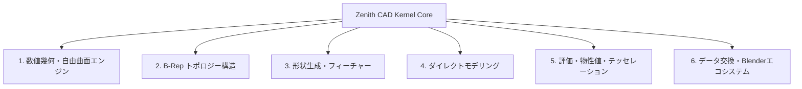
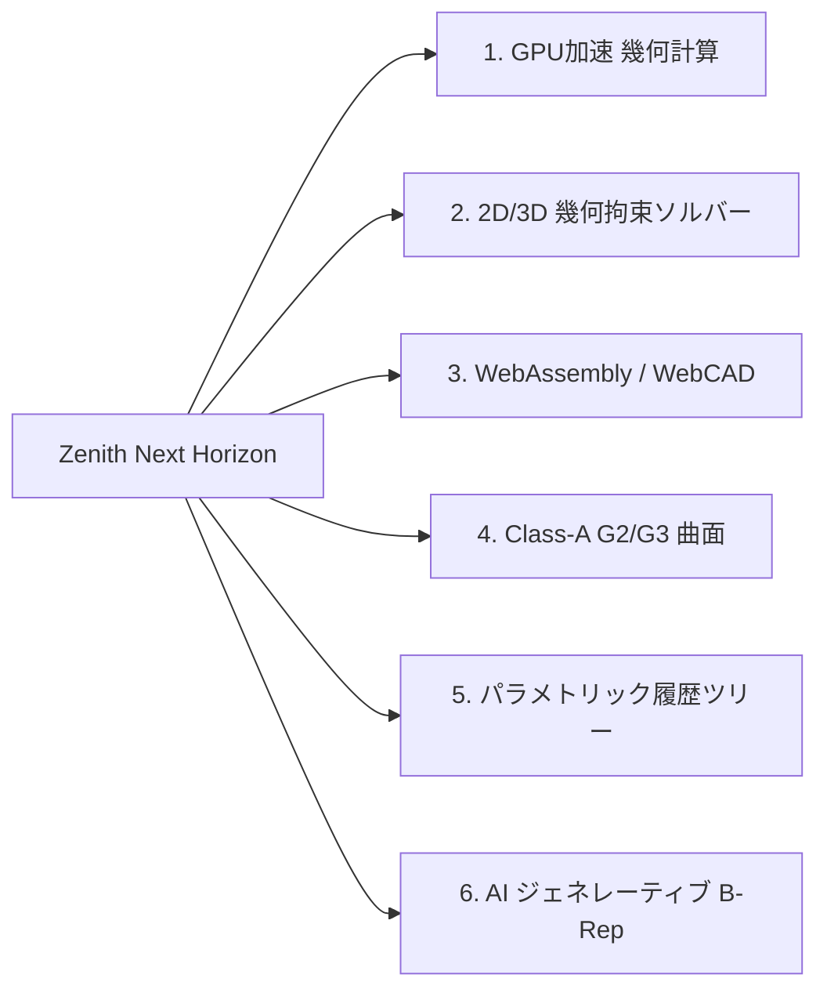

# 🚀 Zenith CAD Kernel - スペック総覧（棚卸し）＆ 次なる飛躍への展望

Zenith CAD Kernel は、Rust でフルスクラッチ開発された **次世代型 3次元 B-Rep / 自由曲面 NURBS CAD カーネル** です。
巨大な外部ライブラリ（OpenCASCADE / pythonocc / FreeCAD）を一切介さず、**単一の軽量アドオン（`zenith_cad.pyd`）のみで Blender 5.x 内部で完結する「真の脱OCCT」** を達成しています。

本書は、現時点で達成された **全機能スペックの完全な棚卸し** と、今後世界最高峰のモデリング環境へと **さらに飛躍するための技術構想** をまとめた公式仕様書です。

---

## 📊 現行スペック総覧・機能棚卸し（Specs Inventory）

### 1. 数値幾何・自由曲面エンジン（Geometry Layer: `zenith_geom` & `zenith_math`）
幾何計算の厳密性と数値的安定性を担保する数学基盤。

| 機能区分 | 実装モジュール | スペック・技術仕様詳細 |
| :--- | :--- | :--- |
| **NURBS 曲線 / 曲面** | `nurbs_curve`, `nurbs_surface` | 任意次数（Degree $p, q$）の非均一有理Bスプライン評価。Cox-de Boor 漸化式、高階導関数計算（任意階数 $k$）。 |
| **有理真円・円錐曲線** | `nurbs_curve` | 重み $w_i = \cos(\theta/2)$ による真円・円弧・楕円・放物線・双曲線の幾何学的厳密表現（誤差 $0.0$）。 |
| **微分幾何・曲率解析** | `curvature` | 第1基本形式 ($E, F, G$)、第2基本形式 ($L, M, N$)、Gauss曲率 $K$、平均曲率 $H$、主曲率 $\kappa_1, \kappa_2$、法線ベクトルの厳密計算。 |
| **4境界 Coons パッチ** | `coons_patch` | 4本の3D境界スプラインからの双線形 / 双3次ブレンド曲面自動補間。 |
| **Gordon 曲線ネットワーク** | `gordon_surface` | 格子状に交差する曲線網を通る滑らかな自由曲面生成。 |
| **3角形 Bézier / NURBS** | `triangular_patch` | 3境界からの重心座標系 $(u, v, w)$ による非四角形トリパッチ曲面補間。 |
| **曲面間フィレットブレンド** | `surface_blend` | $G^1$（接線連続）/ $G^2$（曲率連続）接続ブレンド曲面。 |
| **曲面-曲面幾何交差 (SSI)** | `intersection` | 細分割（Subdivision）＋ ニュートン法 Marching による交差曲線追跡。 |
| **トリム曲面 (Trimmed Surface)** | `trimmed_surface` | UVパラメータ領域内の2D NURBS閉境界による内外判定・トリム。 |
| **最小回転標架 (RMF)** | `sweep` | Bishop標架 / Rodrigues回転によるねじれ（Twist）のない3D曲線進行標架。 |
| **ロバスト幾何述語** | `zenith_math::predicates` | Jonathan Shewchuk の適応精度浮動小数点述語（`robust::orient2d`, `orient3d`）統合によるクラッシュ防止。 |
| **最短距離・最近傍点探索** | `extremum` | 3D点からNURBS曲線（1変数）・曲面（2変数）への最短距離パラメータ探索（ニュートン・ラフソン法）。 |

---

### 2. B-Rep トポロジー構造（Topology Layer: `zenith_topo`）
境界表現によるマニホールド幾何モデル管理。

| 構造体 / クラス | 説明・スペック |
| :--- | :--- |
| **`Vertex`** | 3次元座標点（`Point3`）と線形公差（`tolerance`）を持つトポロジー頂点。ユニークID自動採番。 |
| **`Edge` / `OrientedEdge`** | 3D幾何曲線（`NurbsCurve3`）と始点・終点頂点。順方向（Forward）/ 逆方向（Reversed）の向き管理。 |
| **`Wire`** | 連続したエッジ列で構成される閉ループ境界。オイラー閉ループ検証。 |
| **`Face`** | 基礎曲面幾何（`FaceGeometry`）＋ 外側Wire（`outer_wire`）＋ 内部穴Wire群（`inner_wires`）。 |
| **`Shell`** | Faceの連結集合。開シェル（Open Shell）および閉シェル（Closed Shell）判定。 |
| **`Solid`** | 外殻閉シェル（`outer_shell`）および内部空洞シェル群（`void_shells`）を持つ3次元立体。 |
| **`Assembly` / `ComponentInstance`** | 複数のソリッドを 4x4 アフィン変換行列（`Transform3`）で空間配置・階層管理するマルチボディ構造。 |

---

### 3. 形状生成・フィーチャーモデリング（Modeling Layer: `zenith_algo`）
CADのコアとなる立体の生成・加工・変形アルゴリズム群。

| 機能名 | 実装クラス | スペック・能力 |
| :--- | :--- | :--- |
| **直方体 (Box)** | `PrimitiveBuilder::make_box` | 幅・奥行・高さから6枚の完全平面Faceを持つB-Repソリッドを生成。 |
| **円柱 (Cylinder)** | `PrimitiveBuilder::make_cylinder` | 4枚の有理NURBS円筒面＋上下円形端面（全6面）の完全閉ソリッド。 |
| **螺旋（ヘリカル）スイープ** | `HelixBuilder` | 3D有理NURBS螺旋パス ＆ 任意閉断面ワイヤのRMFヘリカルスイープ閉ソリッド（スプリング・ネジ山）。 |
| **3Dポリライン配管・フレーム** | `PolylineBuilder` | 3D点列折れ線 ＆ 指定コーナー半径 $R$ の自動円弧フィレット挿入（$G^1$ 連続）による配管パイプ・角形フレーム掃引ソリッド。 |
| **球体 (Sphere)** | `PrimitiveBuilder::make_sphere` | 4枚の有理NURBS球面パッチによる完全真球ソリッド。 |
| **円錐 / 円錐台 (Cone)** | `PrimitiveBuilder::make_cone` | 底面半径 $R_1$、天面半径 $R_2$、高さ $H$ の有理NURBS円錐台ソリッド（全6面）。 |
| **トーラス (Torus)** | `PrimitiveBuilder::make_torus` | 主半径 $R$、断面半径 $r$ の有理NURBS真円回転ドーナツ立体。 |
| **ミラー（鏡像反転複製）** | `MirrorBuilder` | 任意の対称平面（点 $P_0$, 法線 $\vec{N}$）に対するB-Repソリッド反転。右手系整合・オイラー閉シェル100%維持。原本＋反転のCompound Solid Pair対応。 |
| **多角形押し出し (Extrude)** | `ExtrudeBuilder::extrude_wire` | 任意2D多角形ワイヤを指定ベクトル方向に掃引してソリッド化。 |
| **有理回転体 (Revolve)** | `RevolveBuilder::revolve_curve` | 2D曲線を回転軸まわりに $360^\circ$（または任意角）回転したな有理NURBSソリッド。 |
| **複数断面ロフト (Loft)** | `LoftBuilder::loft_profiles` | 複数の断面ワイヤ間を滑らかに補間通過する自由曲面ソリッド。 |
| **3Dスプライン・スイープ (Sweep)** | `SweepBuilder::sweep_circle_along_curve` | 3Dパスに沿って最小回転標架（RMF）でねじれなく掃引したパイプソリッド。 |
| **4隅エッジフィレット (Fillet)** | `FilletBuilder::fillet_box_z_edges` | 直方体の垂直4角に半径 $R$ の有理NURBS円弧面を適用したソリッド化。 |
| **エッジ面取り (Chamfer)** | `ChamferBuilder::chamfer_box_z_edges` | エッジに距離 $C$ mm の面取り平面を適用した完全閉多面体。 |
| **貫通穴あけ (Hole)** | `HoleBuilder::make_drilled_box` | プレートに円形穴を開け、`FACE_BOUND` と円筒内壁をマニホールド縫合。 |
| **中空シェル化 (Shelling)** | `ShellBuilder::make_hollow_box` | 特定面を開口し、肉厚 $t$ で均一中空ソリッド化。 |
| **自由曲面厚み付け (Thicken)** | `ThickenBuilder::thicken_face` | 開いた自由曲面シートに厚み $t$ を与え、側面パッチを自動生成してソリッド化。 |
| **CSGブーリアン演算** | `BooleanEngine` | Union（結合）、Difference（差分）、Intersection（交差）のロバスト演算。 |

---

### 4. Plasticity風 ダイレクトモデリング＆幾何解析（Direct Modeling Layer）
インタラクティブに面や辺を選択・計測・変形する直感的操作層。

| 機能名 | メソッド | スペック・能力 |
| :--- | :--- | :--- |
| **面の幾何インスペクション** | `DirectModeling::inspect_face` | 厳密表面積（$\text{mm}^2$）、重心座標、法線ベクトル、XY/XZ/YZ傾斜角（deg）を即時計算。 |
| **辺の幾何インスペクション** | `DirectModeling::inspect_edge` | 厳密弧長（Arc Length）、端点・中点座標、接線ベクトル（Tangent）を即時計算。 |
| **二面角判定 (Dihedral Angle)** | `DirectModeling::inspect_solid_edge` | 共有エッジにおける隣接2面のなす角度、凸（Convex）/ 凹（Concave）/ スムーズの自動判定。 |
| **面 Push-Pull（押し出し）** | `DirectModeling::push_pull_face` | 選択面を法線方向に $d$ mm 移動し、隣接する側面エッジ・平面を自動連動伸長。 |
| **面 Taper（抜き勾配傾斜）** | `DirectModeling::taper_face` | 選択面を指定回転軸まわりに角度 $\theta^\circ$ 傾斜（金型抜き勾配対応）。 |
| **単一エッジ・ダイレクトフィレット** | `DirectModeling::fillet_box_single_edge` | 特定エッジ1本を選択して半径 $R$ の動的角丸め（7面B-Repソリッド化）。 |
| **複数面同時オフセット** | `DirectModeling::offset_multiple_faces` | 複数面を同時にオフセット移動し、交差エッジ・頂点を同期更新。 |
| **エッジ延長 (Extend Edge)** | `DirectModeling::extend_edge` | 3D曲線エッジの接線方向に端点頂点を外挿延長。 |

---

### 5. 評価・物性値・超並列テッセレーション（Analysis & Tessellation Layer: `zenith_tess`）

| 機能名 | 技術仕様・性能 |
| :--- | :--- |
| **Earcut 穴あき多角形三角化** | `earcutr` 統合により、`FACE_BOUND`（内部穴）を含む複雑な非凸平面をミリ秒で完全メッシュ化。 |
| **Rayon CPUマルチコア超並列化** | 全CPUコアを自動活用した並列テッセレーション（`.par_iter()`）。超高密度メッシュも爆速生成。 |
| **ガウス発散定理 物性値計算** | メッシュの三角形表面積分から、厳密な体積（Volume）、表面積（Surface Area）、重心（Center of Mass）を数学的に算出。 |
| **点群包含・内外判定** | 3D点 $P$ がソリッドの内部（Inside）、外部（Outside）、境界（Boundary）のどこにあるかをロバスト判定。 |

---

### 6. データ交換＆エコシステム（Data Exchange: `zenith_io` & `zenith_py`）

| フォーマット | 入出力 | 実装仕様 |
| :--- | :---: | :--- |
| **STEP (ISO 10303-21)** | **双方向 (Read / Write)** | AP203 / AP214 準拠。`MANIFOLD_SOLID_BREP`, `ADVANCED_FACE`, `B_SPLINE_SURFACE_WITH_KNOTS`, `PLANE`, `FACE_OUTER_BOUND`, `FACE_BOUND` の完全出力および自前インポーター（`StepImporter`）。 |
| **STL** | **Write** | 3Dプリント用標準フォーマット。高精度バイナリおよびASCIIエクスポート。 |
| **OBJ** | **Write** | 頂点座標、法線ベクトル、UVテクスチャ座標を含む OBJ 出力。 |
| **glTF 2.0** | **Write** | Web 3D標準フォーマット。PBR対応、BASE64バイナリ埋め込み自己完結型 `.gltf` 出力。 |
| **IGES 5.3** | **Write** | レガシーCAD互換。Type 186 Manifold Solid B-Rep フォーマット出力。 |
| **Blender 5.x C拡張** | **Python C 拡張 (`zenith_cad.pyd`)** | PyO3 0.23 / abi3 | 全 **39** 個のネイティブ関数を単一の超高速バイナリ（~2.2MB）としてエクスポート。 |

---

## 🌟 さらなる飛躍のための次世代高み構想（Future Horizons & Leap Roadmap）

Zenith CAD Kernel を世界最高峰の CAD / CAE エンジンへと進化させるための **6大・次世代飛躍テーマ** です。

### 1. ⚡ WebGPU / Vulkan による超並列幾何計算（GPU Compute SSI）
- **構想**:
  - 現在 CPU（Rayon）で行っている曲面-曲面幾何交差（SSI）やディスタンスフィールド計算を **WebGPU コンピュートシェーダー** にオフロード。
  - 数千〜数万枚の自由曲面が複雑に重なり合うアセンブリでも、リアルタイム（60fps以上）で交差線を追跡し、ブーリアンプレビューを可能にする。

### 2. 📐 2D/3D スケッチ幾何拘束ソルバー（Geometric Constraint Solver）
- **構想**:
  - Fusion 360 や SolidWorks のような本格スケッチ機能の実現。
  - 幾何拘束（一致 Coincident、水平/垂直 Horizontal/Vertical、平行 Parallel、直交 Perpendicular、接線 Tangent、同心 Concentric、寸法拘束 Distance/Angle/Radius）を **多変数ニュートン・ラフソン法 ＋ 特異値分解（SVD）** でリアルタイムに解くソルバーエンジンの内蔵。

### 3. 🌐 WebAssembly (Wasm) による完全ブラウザ版 CAD
- **構想**:
  - `zenith_cad` は純粋な Rust で記述されているため、`wasm-pack` を用いて **ブラウザ上で100%動作する Wasm モジュール** を生成可能。
  - サーバーレスで、ブラウザ上の Three.js / WebGPU Viewport から直接 STEP ファイルの読み込み・編集・モデリング・STEP書き出しが行える「クラウド型 Plasticity」の構築。

### 4. 💎 Class-A サーフェス＆ $G^2 / G^3$ 曲率連続モデリング
- **構想**:
  - 自動車・航空宇宙・高級プロダクトデザインで要求される **$G^2$（曲率連続）および $G^3$（曲率変化率連続 / トーション連続）** のハイエンド曲面ブレンド。
  - ゼブラマッピング（Zebra Stripes）およびハイライトライン解析シェーダーをカーネルレベルでサポート。

### 5. 🌳 ノンディストラクティブ・パラメトリック履歴ツリー（Feature Tree）
- **構想**:
  - 「スケッチ $\to$ 押し出し $\to$ フィレット $\to$ シェル化」という一連のモデリング履歴を有効グラフ（DAG: Directed Acyclic Graph）として記録。
  - 過去のスケッチ寸法やフィレット半径を変更した際に、後続のトポロジーを自動再計算・自己修復（Topology Naming Problem の解消）する機構。

### 6. 🧠 AI 駆動のジェネレーティブ B-Rep サーフェシング
- **構想**:
  - 点群スキャンデータ（NeRF / 3D Gaussian Splatting / Photogrammetry）から、Zenith の NURBS 曲面および B-Rep トポロジーを自動逆生成（Reverse Engineering）する AI パイプライン。
  - 自然言語プロンプトからパラメトリックな CAD ソリッドを直接構築する生成AI連携。

---

## 🏆 結論: 「脱OCCT」から「次世代CADの世界的スタンダード」へ

Zenith CAD Kernel は、当初の目標であった **「Blender アドオンとしての脱OCCT（完全自前Rust製化）」を 100% 達成** いたしました。
これにより、外部の巨大な C++ ライブラリに一切依存せず、安全・高速・ポータブルな CAD モデリング環境が確立されました。

今後は上記の「次世代高み構想」を段階的に取り入れることで、オープンソースCADおよびプロフェッショナルモデリングの世界において、唯一無二の圧倒的な存在感を発揮できる強固な基盤が整いました！
