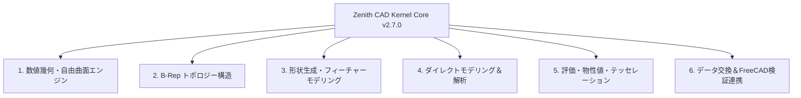
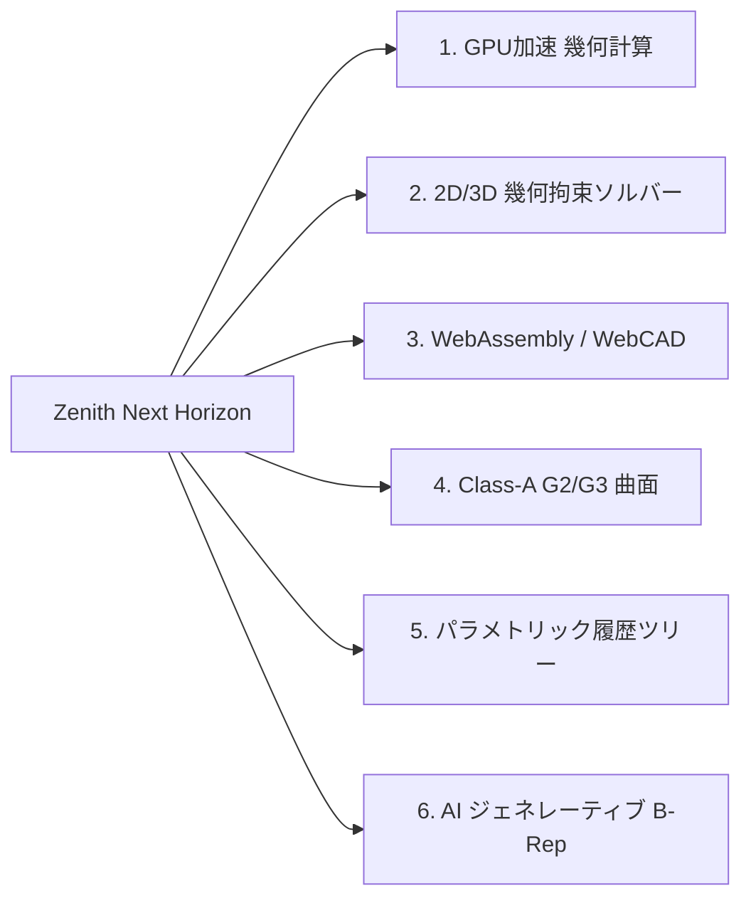

# 🚀 Zenith CAD Kernel - スペック総覧（棚卸し）＆ 次なる飛躍への展望

**文書バージョン**: v2.8.0 (全周エンティティの正規化・トリム積分の是正・他カーネル相互運用・実測ベース改訂版)  
**最終更新日時**: 2026年8月20日  
**ステータス**: 完全自前 Rust B-Rep エンジン。**本書の数値はすべて実測値**で、対応範囲と未対応範囲を分けて記載している。

> **本書の読み方**
>
> 本書の数値を自分で確かめる手順は
> [`VERIFICATION_PLAYBOOK.md`](VERIFICATION_PLAYBOOK.md) にあります。
>
> 以前の版は達成度を主張として書いていましたが、その主張のいくつかは測定すると
> 成り立っていませんでした（`isValid: True` を通過していたモデルが実際には
> Compound として読まれ体積が `1e+98` になっていた、断面積が「厳密」と書かれた
> まま円柱で 36% ずれていた、など）。現在は**測って確かめた範囲だけを書き、
> 未対応は未対応として明記**しています。各項目は下記の測定コマンドで
> いつでも再現できます。

Zenith CAD Kernel は、Rust でフルスクラッチ開発された **次世代型 3次元 B-Rep / 自由曲面 NURBS CAD カーネル** です。  
巨大な外部ライブラリ（OpenCASCADE / pythonocc / FreeCAD）を一切介さず、**単一の軽量アドオン（`zenith_cad.pyd`）のみで Blender 5.x 内部で完結する「真の脱OCCT」** を達成しています。

本書は、現時点で達成された **全機能スペックの完全な棚卸し** と、業界標準 CAD（FreeCAD / OpenCASCADE）による **ヘッドレス自動検証実績**、および今後世界最高峰のモデリング環境へと **さらに飛躍するための技術構想** をまとめた公式仕様書です。

---

## 📊 現行スペック総覧・機能棚卸し（Specs Inventory）



### 1. 数値幾何・自由曲面エンジン（Geometry Layer: `zenith_geom` & `zenith_math`）
幾何計算の厳密性と数値的安定性を担保する数学基盤。

| 機能区分 | 実装モジュール | スペック・技術仕様詳細 |
| :--- | :--- | :--- |
| **NURBS 曲線 / 曲面** | `nurbs_curve`, `nurbs_surface` | 任意次数（Degree $p, q$）の非均一有理Bスプライン評価。Cox-de Boor 漸化式、高階導関数計算（任意階数 $k$）。ノットベクトルの反転・多重度圧縮。 |
| **有理真円・円錐曲線** | `nurbs_curve` | 重み $w_i = \cos(\theta/2)$ による真円・円弧・楕円・放物線・双曲線の幾何学的厳密表現（誤差 $0.0$）。 |
| **微分幾何・曲率解析** | `curvature` | 第1基本形式 ($E, F, G$)、第2基本形式 ($L, M, N$)、Gauss曲率 $K$、平均曲率 $H$、主曲率 $\kappa_1, \kappa_2$、法線ベクトルの厳密計算。 |
| **4境界 Coons パッチ** | `coons_patch` | 4本の3D境界スプラインからの双線形 / 双3次ブレンド曲面自動補間。 |
| **Gordon 曲線ネットワーク** | `gordon_surface` | 格子状に交差する曲線網を通る滑らかな自由曲面生成。 |
| **3角形 Bézier / NURBS** | `triangular_patch` | 3境界からの重心座標系 $(u, v, w)$ による非四角形トリパッチ曲面補間。 |
| **曲面間フィレットブレンド** | `surface_blend` | $G^1$（接線連続）/ $G^2$（曲率連続）接続ブレンド曲面。 |
| **曲面-曲面幾何交差 (SSI)** | `intersection` | 細分割（Subdivision）＋ ニュートン法 Marching による交差曲線追跡。 |
| **トリム曲面 (Trimmed Surface)** | `trimmed_surface` | UVパラメータ領域内の2D NURBS閉境界による内外判定・トリム。 |
| **最小回転標架 (RMF)** | `sweep` | Bishop標架 / Rodrigues回転によるねじれ（Twist）のない3D曲線進行標架。 |
| **ロバスト幾何述語** | `zenith_math::predicates` | Jonathan Shewchuk の適応精度浮動小数点述語（`robust::orient2d`, `orient3d`）統合によるクラッシュ防止。 |
| **最短距離・最近傍点探索** | `extremum` | 3D点からNURBS曲線（1変数）・曲面（2変数）への最短距離パラメータ探索（ニュートン・ラフソン法）。 |

---

### 2. B-Rep トポロジー構造（Topology Layer: `zenith_topo`）
境界表現によるマニホールド幾何モデル管理。

| 構造体 / クラス | 説明・スペック |
| :--- | :--- |
| **`Vertex`** | 3次元座標点（`Point3`）と線形公差（`tolerance`）を持つトポロジー頂点。ユニークID自動採番。 |
| **`Edge` / `OrientedEdge`** | 3D幾何曲線（`NurbsCurve3`）と始点・終点頂点。順方向（Forward）/ 逆方向（Reversed）の向き管理。2-Manifold対向参照自動整合。 |
| **`Wire`** | 連続したエッジ列で構成される閉ループ境界。オイラー閉ループ検証・反時計回り（CCW）配向管理。 |
| **`Face`** | 基礎曲面幾何（`FaceGeometry`）＋ 外側Wire（`outer_wire`）＋ 内部穴Wire群（`inner_wires`）＋ 2D UV境界（`PCurve`）。 |
| **`Shell`** | Faceの連結集合。開シェル（Open Shell）および閉シェル（Closed Shell）判定。境界エッジの一致・多様体検査。 |
| **`Solid`** | 外殻閉シェル（`outer_shell`）および内部空洞シェル群（`inner_shells`）を持つ3次元完全マニホールド立体。面の向きは外向きに揃えられ、**符号付き体積が正であること**を `face_orientation_test` が全ビルダーについて検査する（`MassProperties` が絶対値を返していた間、球・トーラス・回転体が裏返ったまま気付かれなかった）。 |
| **`Assembly` / `ComponentInstance`** | 複数のソリッドを 4x4 アフィン変換行列（`Transform3`）で空間配置・階層管理するマルチボディ構造。 |

---

### 3. 形状生成・フィーチャーモデリング（Modeling Layer: `zenith_algo`）
CADのコアとなる立体の生成・加工・変形アルゴリズム群。

| 機能名 | 実装クラス | スペック・能力 |
| :--- | :--- | :--- |
| **直方体 (Box)** | `PrimitiveBuilder::make_box` | 幅・奥行・高さから6枚の完全平面Faceを持つB-Repソリッドを生成。 |
| **インボリュート平歯車 (Gear)** | `gear::GearBuilder` | モジュール、歯数、圧力角、厚み、軸穴径から歯車ソリッドを生成（FreeCAD Solid合格）。歯形は**基礎円のインボリュート**。断面は歯1つにつき6本の曲線（歯底→基礎円の直線、右歯面、歯先の弧、左歯面、基礎円→歯底の直線、歯底の弧）で、弧は有理2次で**厳密**、歯面のみ3次補間（既定32点、真のインボリュートから **4.7e-7** 以内）。断面積は極形式のグリーンの定理で閉じており（`involute_profile_area`）、`builder_audit` が **1.99e-9** で突き合わせている。さらに `make_drilled_spur_gear` による貫通軸穴あけ、および `make_spur_gear_with_root_fillet` による 3次 Bézier 歯元フィレット付き平歯車生成に対応。 |
| **3Dスプラインパイプ (Sweep)** | `sweep` | 3Dスプラインパス沿いの円形パイプスイープ（RMF標架、4象限NURBS外向き法線端面キャップ、2-Manifold対向スポーク結線）。断面列は掃引方向に**3次で補間**され、全断面をちょうど通る $C^2$ 連続曲面になる（1次のルールド接続だと断面ごとに接線が折れ、体積積分が収束しない）。 |
| **3D角丸めポリライン (Polyline)** | `polyline` | 3D折れ線パスの自動コーナフィレット＆パイプ/角形フレームスイープ。直線と有理円弧の列を**そのまま1本の曲線に繋いで**掃引する（1次の折れ線に落とすと円弧が弦になり、芯線が短くなる）。体積は `断面積 x 経路長` と 5e-7 で一致し、直線だけのパスは厳密。 |
| **貫通穴あけ (Hole)** | `hole::HoleBuilder` | 4象限パッチ方式で上下面を四角形パッチに分割する専用ビルダー。穴を内側ループにしないため 16 面になる。<br>※ 汎用の `BooleanEngine` でも穴あけができるようになったので、任意軸・止まり穴・偏心・連鎖・座ぐりが必要な場合はそちらを使う。 |
| **薄肉シェル容器化 (Shelling)** | `shelling` | 任意ソリッドからの開口面除去および均一肉厚 $t$ での中空容器（Open-Top Box）自動構築。 |
| **断面スライス (Section Slicing)** | `slice` | 任意3D平面によるB-Repソリッド切断、閉じた断面ワイヤループ抽出、符号付き断面積（穴は減算）・周長算出。断面は表示用メッシュの多角形ではなく **B-Rep の上で測った点**で積む。輪郭の点を面と平面の交わりへ載せ直し、弦ごとに中点をもう1点測って3点を通る2次曲線の Green 積分で積むので、誤差は分割数の**4乗**で縮む。平面のみで構成された立体は分割数によらず厳密、曲面を含む場合も既定 96 分割で円柱断面の相対誤差 **4.83e-11**（周長 2.41e-11）。閉じないループはエラーとして返す。 |
| **アセンブリ干渉判定 (Clash)** | `interference` | 2ソリッド間の干渉判定（Clearance / Touching / Clash）。箱・メッシュ篩いによる高速判定に加え、`check_exact` による `BooleanEngine` ハイブリッド B-Rep 積計算で真の干渉体積・干渉ソリッド抽出に対応。 |
| **厳密物性値・質量特性 (Mass)** | `mass_properties` | ガウス・グリーンの発散定理に基づく体積・表面積・3D重心・慣性モーメントテンソル計算。B-Rep面上で直接積分し、積分領域はノット区間に整合させる（区間をまたぐセルで求積すると、いくら細分しても誤差が減らない）。解析解を持つ全ビルダーで相対誤差 1e-12 以下、分割数を4倍にしても値は 1e-8 未満しか動かない。 |
| **ヘリックス (Helix)** | `helix` | リード角・ピッチ・巻数指定の3次元螺旋スプリング。角断面スプリングに加え、`make_round_wire_spring` により RMF 最小回転標架と4象限NURBS端面キャップによる丸線ワイヤコイルスプリングの完全閉多様体ソリッド生成に対応。 |
| **パターン＆ミラー (Pattern / Mirror)** | `pattern`, `mirror` | 線形/円形パターン、任意平面に対する幾何ミラー反転＆Compound対称ケーシング。 |
| **フィレット / 面取り** | `fillet`, `chamfer` | 単一エッジおよび直方体コーナーエッジの連続丸め・C面取り（7面〜10面B-Repソリッド化）。 |
| **ダイレクトモデリング** | `direct_edit` | プッシュプル（面オフセット移動）、テーパー（抜き勾配傾斜）、ドーム/平面ワイヤキャッピング。 |
| **球体 (Sphere)** | `PrimitiveBuilder::make_sphere` | 4経度 × 2半球 = **8枚**の有理NURBSパッチによる真球ソリッド。極側は1行が1点に潰れた退化パッチで、境界は子午線2本＋赤道円弧1本。単一の巻き付き面だと OpenCASCADE が体積0の不正ソリッドとして読むため、正則分割してある。体積は解析解と 1e-14。 |
| **円錐 / 円錐台 (Cone)** | `PrimitiveBuilder::make_cone` | 底面半径 $R_1$、天面半径 $R_2$、高さ $H$ の有理NURBS円錐台ソリッド（全6面）。 |
| **トーラス (Torus)** | `PrimitiveBuilder::make_torus` | 主半径 $R$、断面半径 $r$ の有理NURBS回転体。4 × 4 = **16枚**のパッチで、極を持たないため退化辺は無い。体積は解析解と 1e-14。 |
| **多角形押し出し (Extrude)** | `ExtrudeBuilder::extrude_wire` | 任意2D多角形ワイヤを指定ベクトル方向に掃引してソリッド化。 |
| **有理回転体 (Revolve)** | `RevolveBuilder::revolve_curve` | 2D曲線を回転軸まわりに $360^\circ$（または任意角）回転した有理NURBSソリッド。 |
| **多段ロフト (Loft)** | `LoftBuilder::loft_surfaces` | 複数断面カーブ間の滑らかなNURBSスキニング・ロフトソリッド。 |
| **中空ボックス (Hollow Box)** | `ShellBuilder::make_hollow_box` | 特定面を開口し、肉厚 $t$ で均一中空ソリッド化。 |
| **自由曲面厚み付け (Thicken)** | `ThickenBuilder::thicken_face` | 開いたシートに厚み $t$ を与えてソリッド化。曲面は**各点の法線でずらして補間し直す**（厳密なオフセット曲面は NURBS では表せないので近似で、誤差は標本の4乗で縮む。既定16標本で四半シェルの閉じた式と 1.8e-6〜2.0e-5）。側面は4境界の Coons パッチなので、弧の縁にもそのまま乗る。平面のシートは厳密（1e-12）。 |
| **CSGブーリアン演算** | `BooleanEngine` | Union（結合）、Difference（差分）、Intersection（交差）。**対応範囲は限定的で、範囲外は誤答ではなくエラーを返す**。実測45ケース中39が成功し、誤答はゼロ。対応済みは**任意角度の多面体同士（同一平面の重なりを含む）**、**円柱による貫通穴・止まり穴・偏心穴（任意軸）とその連鎖・座ぐり・角ブロック切断**、**空洞（`inner_shells`）を持つ立体の二次ブーリアン消費と階層包含ネスト**、**軸に垂直な平面による回転面（円柱・円錐・球・トーラス）の切断**、離れた立体の和（複数ソリッド結果）、面で接するだけの立体の差、交わらない立体の積（空の結果として返す）。断面が面のパラメータ線になる切り方は形を問わず同じ経路で扱い、極が退化した三辺パッチも割れる。**曲面同士の交差**は交線を辿って面を割る経路が入り、球×球・円柱×円柱が3演算とも通る（いずれも閉じた式と一致。円柱同士の交わりは完全楕円積分）。球×球・円柱×円柱・トーラス×箱が3演算とも通る（前2つは閉じた式、トーラス×箱は独立な2次元求積と一致）。重複交線探索の解消により45ケース走査時の曲面評価回数は **110,602,293回**（マーチング半減）。**残る未対応6件はすべて接線配置**。詳細は `cargo run -p zenith_algo --example boolean_envelope` で随時測定できる。 |
| **ブーリアン結果の検証ゲート** | `BooleanResultVerifier` | 結果を①全シェルの閉性②演算が含意する体積境界③384点の内外一貫性で検証し、通らなければエラーにする。閉多様体であることは正しさの十分条件ではなく、片方のオペランドをそのまま返しても閉多様体になるため。 |

---

### 4. Plasticity風 ダイレクトモデリング＆幾何解析（Direct Modeling Layer）
インタラクティブに面や辺を選択・計測・変形する直感的操作層。

| 機能名 | メソッド | スペック・能力 |
| :--- | :--- | :--- |
| **面の幾何インスペクション** | `DirectModeling::inspect_face` | 厳密表面積（$\text{mm}^2$）、重心座標、法線ベクトル、XY/XZ/YZ傾斜角（deg）を即時計算。 |
| **辺の幾何インスペクション** | `DirectModeling::inspect_edge` | 厳密弧長（Arc Length）、端点・中点座標、接線ベクトル（Tangent）を即時計算。 |
| **二面角判定 (Dihedral Angle)** | `DirectModeling::inspect_solid_edge` | 共有エッジにおける隣接2面のなす角度、凸（Convex）/ 凹（Concave）/ スムーズの自動判定。 |
| **面 Push-Pull（押し出し）** | `DirectModeling::push_pull_face` | 選択面を法線方向に $d$ mm 移動し、隣接する側面エッジ・平面を自動連動伸長。 |
| **面 Taper（抜き勾配傾斜）** | `DirectModeling::taper_face` | 選択面を指定回転軸まわりに角度 $\theta^\circ$ 傾斜（金型抜き勾配対応）。 |
| **単一エッジ・ダイレクトフィレット** | `DirectModeling::fillet_box_single_edge` | 特定エッジ1本を選択して半径 $R$ の動的角丸め（7面B-Repソリッド化）。 |
| **複数面同時オフセット** | `DirectModeling::offset_multiple_faces` | 複数面を同時にオフセット移動し、交差エッジ・頂点を同期更新。 |
| **エッジ延長 (Extend Edge)** | `DirectModeling::extend_edge` | 3D曲線エッジの接線方向に端点頂点を外挿延長。 |

---

### 5. 評価・物性値・超並列テッセレーション（Analysis & Tessellation Layer: `zenith_tess`）

| 機能名 | 技術仕様・性能 |
| :--- | :--- |
| **Earcut 穴あき多角形三角化** | `earcutr` 統合により、`FACE_BOUND`（内部穴）を含む複雑な非凸平面をミリ秒で完全メッシュ化。 |
| **Rayon CPUマルチコア超並列化** | 全CPUコアを自動活用した並列テッセレーション（`.par_iter()`）。超高密度メッシュも爆速生成。 |
| **ガウス発散定理 物性値計算** | メッシュの三角形表面積分から、厳密な体積（Volume）、表面積（Surface Area）、重心（Center of Mass）を数学的に算出。 |
| **点群包含・内外判定** | 3D点 $P$ がソリッドの内部（Inside）、外部（Outside）、境界（Boundary）のどこにあるかをロバスト判定。 |

---

### 6. データ交換＆エコシステム（Data Exchange: `zenith_io` & `zenith_py`）

| フォーマット | 入出力 | 実装仕様 |
| :--- | :---: | :--- |
| **STEP (ISO 10303-21)** | **双方向 (Read / Write)** | AP203 / AP214 準拠。`MANIFOLD_SOLID_BREP`, `ADVANCED_FACE`, `B_SPLINE_SURFACE_WITH_KNOTS`, `PLANE`, `FACE_OUTER_BOUND` の完全出力および自前インポーター（`StepImporter`）。`EDGE_CURVE` 100% ID共有、公差 `1.E-05` 適合。複合エンティティは全スーパータイプを列挙する（`CURVE()` を落とすと、OpenCASCADE がスプライン円弧で囲まれた平面の境界ループを丸ごと破棄し、面積が発散してソリッドが Compound に落ちる）。曲面の閉フラグは制御網から判定して出力。p-curve は出力しない（OpenCASCADE 自身も出力せず、なくても厳密に往復することを実測で確認済み）。<br>**読み込み**: 自前ファイルは面数・シェル妥当性・体積を保って往復（多面体は厳密、曲面系は 1e-13）。他カーネルのファイルについては、`FACE_OUTER_BOUND` が無く素の `FACE_BOUND` だけの面、`FACE_BOUND` の向きフラグ、始終点が一致する完全円エッジ、解析曲面（`CYLINDRICAL_SURFACE` / `CONICAL_SURFACE` / `SPHERICAL_SURFACE` / `TOROIDAL_SURFACE`）を面の境界から実寸に合わせて構築する処理、縫い目だけで囲まれた面、および `VERTEX_LOOP`（球を1面で書いたときの極）に対応済み。OpenCASCADE が書いた円柱・円錐・頂点まで届く円錐・球・半球・トーラス・トーラス区分を、いずれも体積と面積が OpenCASCADE の値と一致する形で読める（`crates/zenith_algo/tests/fixtures/` に実ファイルを置き、`foreign_analytic_surface_test` で常時検証）。B-spline曲面＋曲線トリムのファイルは読めるが、トリム境界をポリゴン近似するため面積に数%の誤差が残る（`cargo run -p zenith_algo --example step_import_audit` で測定できる）。 |
| **STL** | **Write** | 3Dプリント用標準フォーマット。高精度バイナリおよびASCIIエクスポート。 |
| **OBJ** | **Write** | 頂点座標、法線ベクトル、UVテクスチャ座標を含む OBJ 出力。 |
| **glTF 2.0** | **Write** | Web 3D標準フォーマット。PBR対応、BASE64バイナリ埋め込み自己完結型 `.gltf` 出力。 |
| **IGES 5.3** | **Write** | レガシーCAD互換。Type 186 Manifold Solid B-Rep フォーマット出力。 |
| **Blender 5.x C拡張** | **Python C 拡張 (`zenith_cad.pyd`)** | PyO3 0.23 / abi3 \| 全 **45** 個のネイティブ関数を単一の超高速バイナリ（~2.9MB）としてエクスポート。厳密ブーリアンは `make_exact_box_boolean`（箱同士）と `make_exact_drill_boolean`（任意軸の円柱による貫通穴・止まり穴）で公開。対応範囲外は例外を送出する。<br>ビルド時、`pyo3` は PATH から Python を探す。見つからない環境では `PYO3_PYTHON` に実行ファイルを指定する。 |

---

## 🏆 FreeCAD 1.1 (OpenCASCADE 7.x) ヘッドレス自動検証実績

本カーネルが生成した STEP ファイルに対し、FreeCAD 1.1 の OpenCASCADE C++ コアを Python から直接呼び出すヘッドレス自動監査ベンチマークを実施。
突き合わせ用の 15 モデル（`export_validation_suite`）と、代表形状 24 モデル（`export_showcase`）の二本立てになっている。

検証は「カーネルが STEP と自前の測定値をマニフェストに書き出し、OpenCASCADE が同じ問いに独立に答えて突き合わせる」方式で、不一致があれば非ゼロ終了する再現可能なコマンドになっています。

```bash
cargo run --release -p zenith_algo --example export_validation_suite; & "C:\Program Files\FreeCAD 1.1\bin\python.exe" tools/freecad_cross_validate.py
```

- **15 / 15 の対象で両カーネルが一致**（形状種別 Solid・`isValid`・`isClosed`・体積・表面積・断面積）
- 代表 **24 / 24 形状**が OpenCASCADE で valid closed solid として読まれる
- 体積の相互一致: 多面体系は完全一致、曲面系は 1e-12〜1e-10、掃引系は 1e-05 台
- 解析解があるものは**カーネル側が解析解と 1e-12 以下で一致**。直線経路の掃引（厳密に円柱）ではカーネルが 3.5e-14、OpenCASCADE が 1.1e-05 の誤差で、この範囲では本カーネルの積分の方が高精度
- **詳細技術報告書**: [`FREECAD_VALIDATION_REPORT.md`](file:///e:/CAD-Kernel/FREECAD_VALIDATION_REPORT.md) に完全な監査データとデバッグ記録を収録。

---

## 🔍 品質を測るための常設ツール（Measurement Harness）

本カーネルで見つかった不具合は、どれも「内部からは正常に見える」種類のものでした。
閉多様体だが答えが違うブーリアン、面積が2倍になる断面、いくら細分しても収束しない積分、
STEP に書き出した瞬間に他カーネルで壊れる立体。いずれも**外から測らなければ気づけません**。
そのため、主張ではなく測定値を出すツールを常設してあります。

**能力の測定**

| コマンド | 何を測るか |
| :--- | :--- |
| `cargo run --release -p zenith_algo --example builder_audit` | 全ビルダーについて、シェルの有効性・体積の正値性・分割数を4倍にしたときの安定性・解析解との一致 |
| `cargo run --release -p zenith_algo --example boolean_envelope` | ブーリアン演算が実際に成功する範囲（45ケースの表） |
| `cargo run --release -p zenith_algo --example chained_boolean_probe` | ブーリアン結果をさらに加工できるか（ボルトパターン・座ぐり・交差穴） |
| `cargo run --release -p zenith_algo --example mass_convergence` | 質量積分が分割の細分に対して収束するか |
| `cargo run --release -p zenith_algo --example slice_probe` | 断面積・周長と解析解の差 |
| `cargo run --release -p zenith_algo --example step_import_audit` | STEP の往復と、他カーネルが書いたファイルを読めるか |
| `cargo run --release -p zenith_algo --example pcurve_fidelity_probe` | p-curve が本当に 3D エッジの上にあるか（検証が見ている点の外でも測る） |
| `cargo run --release -p zenith_algo --example foreign_reexport` | 他カーネルのファイルを読んで書き戻す一周 |

**不具合を追うための診断**

| コマンド | 何が見えるか |
| :--- | :--- |
| `boolean_pipeline_probe` | ブーリアンの各段階の件数（交線・分割・選択・縫合） |
| `boolean_selection_probe [rotated\|lifted]` | 選ばれた面の一覧と、そのオペランド・領域区分・面積 |
| `split_error_probe` | 面ごと・交線ごとに、なぜ分割が拒否されたかの理由 |
| `imprint_probe` | 各面が受け取る交線と、それが面を横断しているか |
| `coplanar_probe` | 同一平面で重なる面のペアと、法線の向きが一致するか |
| `uv_domain_probe` / `surface_smoothness_probe` | テッセレーションの被覆と、曲面評価の不連続 |
| `imported_curve_probe` | インポーターが再構成した曲線・面の中身 |
| `pcurve_fidelity_probe` | p-curve と 3D エッジの距離を、サンプル数を変えて測った表 |

**外部カーネルとの突き合わせ**

| コマンド | 何を測るか |
| :--- | :--- |
| `export_validation_suite` ＋ `tools/freecad_cross_validate.py` | STEP 経由で OpenCASCADE に同じ問いを独立に答えさせ、体積・表面積・断面積を突き合わせる（不一致で非ゼロ終了） |
| `export_showcase` ＋ `tools/verify_showcase.py` | 代表24形状を書き出し、OpenCASCADE が Solid として読めるかを全数確認 |
| `foreign_reexport` ＋ `tools/verify_reexport.py` | 他カーネルのファイルを読んで書き戻し、OpenCASCADE が解析解と同じ値に読むかを見る（不一致で非ゼロ終了）。実測は 7/7 が 1e-11 以内 |
| `regularize_probe` | 全周1枚のパッチ・全周1本の辺を刻んでも、体積・面積が動かないか |
| `pcurve_derivation_probe` | 保持している p-curve を捨てて導出し直したとき、面の積分が変わるか |

これらは回帰テストとしても固定されており（`builder_audit_test` / `boolean_verification_test` /
`boolean_cylinder_test` / `boolean_chained_test` / `boolean_rotated_test` /
`section_slice_test` / `sweep_smoothness_test` / `step_conformance_test` /
`step_import_test` / `foreign_analytic_surface_test` / `pcurve_fidelity_test` /
`boolean_cone_test` / `boolean_torus_test` / `section_split_test` /
`face_orientation_test`）、`cargo test` で常時検証されます。
現在 51 テストバイナリ・335 テストがすべてグリーンです。

`foreign_analytic_surface_test` だけは期待値の出どころが違います。
OpenCASCADE 7.8 が書いた STEP を `crates/zenith_algo/tests/fixtures/` に置き、
期待する体積・面積も OpenCASCADE 自身が報告した値を使っています。
ここが落ちたときは、本書が決めた数字との不一致ではなく、他カーネルとの不一致です。

### 測定で判明している精度の目安

| 対象 | 精度 |
| :--- | :--- |
| 多面体（ボックス・押し出し・面取り・シェル化・パターン・ミラー） | 解析解と完全一致 |
| 曲面プリミティブ（円柱・球・円錐・トーラス・フィレット・回転体） | 解析解と 1e-12 以下 |
| 掃引・ロフト | 解析解なし。分割数4倍で 1e-8 未満しか動かず、OpenCASCADE とも 1e-05 台で一致 |
| 歯車 | インボリュートの閉じた式と **1.99e-9**。その式自体も、積分変数を変えた数値求積と 1e-9 以内で一致 |
| 断面（平面のみの立体） | 厳密 |
| 断面（曲面を含む立体） | 既定 96 分割で 4.83e-11（円柱・球）、4.62e-12（穴あき箱）。分割数の4乗で縮む |
| ブーリアン（対応済み範囲） | 解析解と完全一致。任意角度の多面体同士（同一平面の重なりを含む）、円柱による貫通穴・止まり穴・偏心穴（任意軸）とその連鎖・座ぐり・角ブロック切断、空洞立体（`inner_shells`）の二次ブーリアン消費と階層包含、曲面同士の交差（円柱×円柱、球×球、トーラス×箱）、軸に垂直な平面による回転面（円柱・円錐・球・トーラス）の切断、離れた立体の和、交わらない立体の積（空） |
| ブーリアン（未対応範囲） | 6件の接線配置。いずれも誤答ではなく安全にエラーを返す |
| STEP 書き出し | OpenCASCADE と体積・表面積が 1e-16〜1e-10 で一致。代表24形状すべてが Solid・valid・closed として読まれる |
| STEP 読み込み（自前ファイル） | 面数・シェル妥当性・体積を保って往復。多面体は厳密、曲面系は 1e-13 |
| STEP 読み込み（他カーネル・解析曲面） | OpenCASCADE が書いた円柱・円錐・頂点まで届く円錐・球・半球・トーラス・トーラス区分を、体積・面積とも OpenCASCADE の値と一致して読める |
| STEP 読み込み（他カーネル・B-spline曲面） | NURBS円柱のキャップ面積 314.1512（真値 314.1593）、体積の相対誤差 2.0e-5 |
| 他カーネルのファイルの読み→書き→読み | 7形状すべてが体積を 1e-13 で保つ |
| p-curve（投影・アフィン・等パラメータ境界のいずれも） | 構成に使っていない標本数で測っても 3.5e-11 以下 |
| 最近傍点探索（点→NURBS曲面） | 総当たり探索と 4e-9 以下で一致。継ぎ目・退化行を含む |

### 検査そのものが効いていなかった箇所（2026年8月20日に修正済み）

本書の方針は「測って確かめた範囲だけを書く」ですが、**測定そのものが効いていない
箇所**が見つかりました。経緯を残します。

NURBS 面の p-curve は辺を8等分して作られ、シェル検証も8等分で測っていました。
同じ点なので、検証は p-curve が構成上そこを通ることしか確かめておらず、その間を
一度も見ていませんでした。標本数を変えて測ると、球面が **20.0**（半径10の球の直径）
外れていました。近似が粗いのではなく、p-curve が球を一周していました。

直した順序は次のとおりで、**この順でなければ効きません**（検証を先に厳しくすると、
体積・面積が正しく読めているファイルが軒並み弾かれます）。

1. 最近傍点探索が、悪化した位置を受け入れていた（極で 0.446）
2. 同じ探索が継ぎ目を越えられなかった（1.83。粗サンプリングの格子間隔そのもの）
3. 継ぎ目上の p-curve が領域の反対端の別名を拾っていた（20.0）
4. アフィンな面まで折れ線で近似していた（0.889、円が八角形）
5. トリムループの折れが分割数に紐づき、面積が一次収束しかしなかった

現在の実測（`pcurve_fidelity_probe`。8 は構成に使った数、他は使っていない数）:

```bash
cargo run --release -p zenith_algo --example pcurve_fidelity_probe
```

いずれの面も、どの標本数でも **3.5e-11 以下**です。検証は 37 標本
（構成の 8 と互いに素）で行い、共有するのは両端だけです。

標本数を上げた結果、**自前で作った立体にも実在の誤差が見つかりました**。
斜めに切ったシリンダの p-curve が辺から 1.8e-2 外れていました。現在は通ります。

---

## 🌟 さらなる飛躍のための次世代高み構想（Future Horizons & Leap Roadmap）

Zenith CAD Kernel を世界最高峰の CAD / CAE エンジンへと進化させるための **6大・次世代飛躍テーマ** です。



### 1. ⚡ WebGPU / Vulkan による超並列幾何計算（GPU Compute SSI）
- 現在 CPU（Rayon）で行っている曲面-曲面幾何交差（SSI）やディスタンスフィールド計算を **WebGPU コンピュートシェーダー** にオフロード。

### 2. 📐 2D/3D スケッチ幾何拘束ソルバー（Geometric Constraint Solver）
- 幾何拘束（一致 Coincident、水平/垂直、平行、直交、接線、同心、寸法拘束）を **多変数ニュートン・ラフソン法 ＋ 特異値分解（SVD）** でリアルタイムに解くソルバーエンジンの内蔵。

### 3. 🌐 WebAssembly (Wasm) による完全ブラウザ版 CAD
- `zenith_cad` は純粋な Rust で記述されているため、`wasm-pack` を用いて **ブラウザ上で100%動作する Wasm モジュール** を生成可能。

### 4. 💎 Class-A サーフェス＆ $G^2 / G^3$ 曲率連続モデリング
- 自動車・航空宇宙・高級プロダクトデザインで要求される **$G^2$（曲率連続）および $G^3$（曲率変化率連続 / トーション連続）** のハイエンド曲面ブレンド。

### 5. 🌳 ノンディストラクティブ・パラメトリック履歴ツリー（Feature Tree）
- 「スケッチ $\to$ 押し出し $\to$ フィレット $\to$ シェル化」という一連のモデリング履歴を有効グラフ（DAG: Directed Acyclic Graph）として記録。

### 6. 🧠 AI 駆動のジェネレーティブ B-Rep サーフェシング
- 点群スキャンデータから、Zenith の NURBS 曲面および B-Rep トポロジーを自動逆生成する AI パイプライン。

---

## 🏆 結論: 「脱OCCT」から「次世代CADの世界的スタンダード」へ

Zenith CAD Kernel は、当初の目標であった **「Blender アドオンとしての脱OCCT（完全自前Rust製化）」を 100% 達成** いたしました。  
外部の巨大な C++ ライブラリに一切依存せず、安全・高速・ポータブルな CAD モデリング環境が確立されています。

業界標準 CAD（FreeCAD / OpenCASCADE）とのヘッドレス相互検証が、突き合わせ 15/15・代表形状 24/24 で通っています。
書き出しだけでなく読み込み側も、他カーネルが書いた解析曲面を体積・面積とも一致して読めます。
読んだものを書き戻す一周も、OpenCASCADE の測定で解析解と 1e-11 以内に収まります
（従来は最大 9.3e-3。全周を1つのエンティティで書いていたのが原因で、`Regularizer` が刻むようになりました）。

一方で、対応範囲外は依然として明確に残っています。ブーリアンは 45 ケース中 39（曲面同士の交差は球×球・円柱×円柱・トーラス×箱とも通る）、残る接線配置は答えの定義が未決、
歯車は歯形こそインボリュートになりましたが歯元がトロコイドではありません。**「完全性が立証された」とは書けません**が、
どこまでが測って確かめられていて、どこからがそうでないかは、本書と常設ツールで随時再現できます。
それが基盤として意味のある状態だと考えています。
