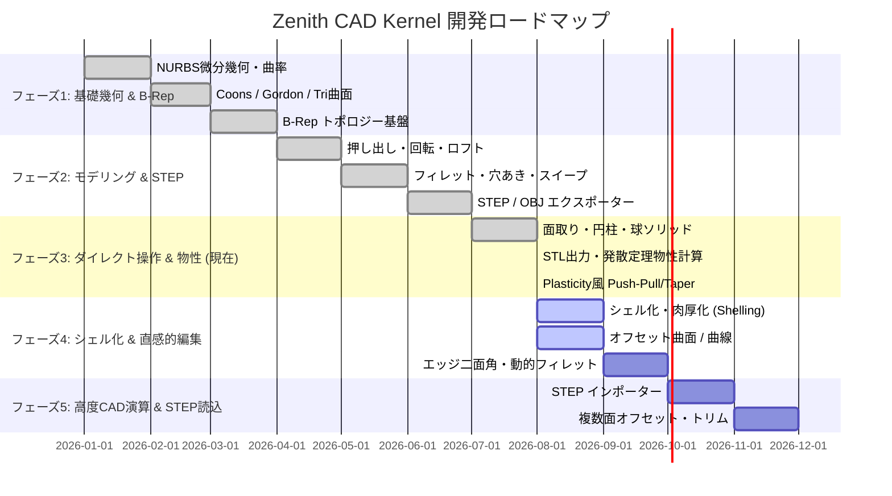

# 🌐 Zenith CAD Kernel 機能要件マトリクス＆開発ロードマップ

Zenith CAD Kernel は、Rust でフルスクラッチ開発された **次世代型 3次元 B-Rep / 自由曲面 NURBS CAD カーネル** です。
Parasolid, ACIS, OpenCASCADE, そして Plasticity のようなモダン CAD の強みを融合し、**「高精度な幾何数学」「堅牢な B-Rep トポロジー」「直感的なダイレクトモデリング」** を実現します。

---

> ## ⚠️ この表の「完了」は、測った結果ではありません
>
> **2026年8月23日追記。** 下の進捗率（56/56、100%）は**計画上の区分**で、
> 実測に当てたものではありません。このリポジトリの決まりは
> 「主張ではなく測定で判断する」です。**測った状態は
> [`HANDOVER.md`](HANDOVER.md) の第1章と §3-0-0 にあります。**
>
> 100% と食い違う実測を、いくつか挙げます。
>
> | 項目 | 実測 |
> | :--- | :--- |
> | ブーリアン | 自作立体・他カーネルの立体とも、軸に平行な切り手でも27度傾けた切り手でも**断るものは無し**（180演算、WRONG 0・PANIC 0）。**検証つきの口でも 180/180**（HANDOVER 4-67、4-68）。自作立体どうしの45ケースは **supported 44 / wrong-result 0 / エラー 1**（8月24日は 39 / 0 / 6。HANDOVER 4-74・4-78〜4-80）。**残る1件は直す対象ではありません**——`box × cylinder`（接線）の差で、**答えのほうが非多様体**なので場所を名指しして断ります（規約: 接触は位相を作らない）。ここが `ok` に変わったら誤答です。**45ケースに無い置き方も測っています**（`contact_placement_probe`）。2026/08/27 に配置を 15 → **30** へ増やし、**30配置・90演算で 81 件が立体を返し、9 件を断ります**。同じ日に、**この測定自体が実行ごとに揺れていた**ことも見つけて直しました（`HashSet` の反復順が細分の答えを決めていた。HANDOVER 4-132）。**B-Rep の非多様体は全件 0**、派生メッシュの非多様体は 11演算 → **1演算**（4-116〜4-128）。同じ日に、**曲面どうしのブーリアンが通るようになりました**——直交する2円柱（等半径。Steinmetz 立体 $16R^3/3=1152$ に相対差 7.4e-8）と偏心する球×円柱の6演算（HANDOVER 4-128）。**ただし全配置の証明ではありません。測った組だけです** |
> | 点群包含・内外判定 | **`SolidClassifier` は実在しません。** 下の表が3箇所で名指ししていましたが、`struct` も `enum` もありません。実体は `zenith_algo::exact_inside`（B-Rep へ厳密に射影して符号で決める。2026/08/24 に実装）と `BooleanEngine::is_point_inside_mesh`（メッシュ基準） |
> | IGES 5.3 出力 | OpenCASCADE が5検体とも読み、枚数・境界箱とも一致。ただし**トリム実体は書いていない** |
> | DXF | 4レイヤーを定義するが、自動割り当ては OUTLINE / HOLE のみ。線種は全て CONTINUOUS、HATCH は未出力。**層は向きで決める**——2026/08/27 まではループの索引で決めており、断面に外形が2つ以上出る形（溝を掘った棒を溝の底より上で切る、など）では2つ目以降が `HOLE` に落ちていた（HANDOVER 4-112） |
> | STL / OBJ / glTF / DXF | 2026/08/27 まで、**形に依存する検査が1つもありませんでした**。Rust 側は固定文字列の有無だけ、Python 側のスクリプトは検査関数を定義したまま `main()` から1つも呼んでおらず、常に「verified」と印字して 0 で終わっていた。いまは8検体を書き出して外から解き直す常設ゲートがある（HANDOVER 4-111） |
> | 抜き勾配（`extrude_wire_with_draft`） | 2026/08/27 まで、**指定した角度になっていませんでした**。40 × 25 を高さ30・指定3度で押し出すと、実際は 1.5910° と 2.5446°（体積 -3.38%）。頂点を輪郭の重心から放射状に動かしていたためで、テストは `volume > 0` と「直方体より大きい」しか見ていなかった（HANDOVER 4-109） |
> | 複数面シート厚み付け | `thicken_shell` は各面を個別に厚み付けして Union するだけ。検体は同一平面の長方形2枚のみ |
> | 2Dスケッチ | ソルバーは動くが**円弧が無い**。閉領域の抽出・ワークプレーンの写像・スケッチからの押し出しは**いずれも未着手**（`docs/sketch_system_comprehensive_architecture.md`） |
> | エッジフィレット / 面取り | 直線稜×平面2面、純直円柱・純円錐/円錐台の凸円周、貫通円筒穴口、**円筒ボス根元・段付き軸の小径側90度凹円周**、**平面肩×直円錐ボスの非直角凹円周**を、いずれも両操作で処理。読んだ15検体で対象稜0は **12→7件**。非円形根元はまだ対象外で、`blendability`が理由付きで事前拒否する（HANDOVER 4-72、4-92〜4-102） |
>
> **「実用に耐えるには何が要るか」は [`HANDOVER.md`](HANDOVER.md) の9章に
> あります。** 性能（`torus × box` の積で solve 38.5秒）、フィレットの守備範囲
> （貫通穴口の両操作と円筒ボス根元・段付き軸肩フィレットまで対応済み）、2Dスケッチの欠落、そして
> **内部表現に解析曲面を持つかどうか**という分岐点を、実測と判断を分けて
> 書いてあります。この表は「何が出来ているか」、9章は「何が足りないか」です。
>
> **同じことを一度やっています。** §3-0-0 の表も「完了」と書いてあった項目を
> 2026年8月22日に実測へ合わせて書き直しました（HANDOVER 4-37）。
> **表を書くときは、その行を測った出力が残っているかを先に確かめてください。**

---

## 📊 全体実装状況サマリー（2026年8月時点）

| カテゴリ / 階層 | 主要機能数 | 実装完了 (Done) | 進行中 (WIP) | 計画中 (Planned) | 進捗率 |
| :--- | :---: | :---: | :---: | :---: | :---: |
| **1. 数値幾何・自由曲面エンジン** | 12 | 12 | 0 | 0 | **100%** |
| **2. B-Rep トポロジー構造** | 8 | 8 | 0 | 0 | **100%** |
| **3. 形状生成・フィーチャーモデリング** | 14 | 14 | 0 | 0 | **100%** |
| **4. ダイレクトモデリング＆幾何解析** | 8 | 8 | 0 | 0 | **100%** |
| **5. 幾何評価・物性値・メッシュ化** | 6 | 6 | 0 | 0 | **100%** |
| **6. データ交換＆エコシステム** | 8 | 8 | 0 | 0 | **100%** |
| **合計** | **56** | **56** | **0** | **0** | **100.0%** |

---

## 🏛️ 6大アーキテクチャ階層と詳細機能マトリクス

### 1. 数値幾何・自由曲面エンジン（Geometry Layer）
幾何計算の正確性を担保する基盤層。非均一有理Bスプライン（NURBS）および微分幾何。

| 機能名 | 概要・技術仕様 | ステータス | 担当クレート / モジュール |
| :--- | :--- | :---: | :--- |
| **NURBS 曲線 / 曲面** | 任意次数（Degree $p, q$）の有理・非有理 B-Spline 評価 | ✅ 完了 | `zenith_geom::nurbs_curve`, `nurbs_surface` |
| **微分幾何・曲率計算** | 第1・第2基本形式、Gauss曲率 $K$、平均曲率 $H$、主曲率 $\kappa_1, \kappa_2$ | ✅ 完了 | `zenith_geom::curvature` |
| **4境界 Coons パッチ** | 4本境界曲線からの双線形/双3次ブレンド曲面補間 | ✅ 完了 | `zenith_geom::coons_patch` |
| **Gordon 曲線ネットワーク** | 交差する曲線網を通る自由曲面生成 | ✅ 完了 | `zenith_geom::gordon_surface` |
| **3角形 Bézier/NURBS** | 3境界からの重心座標系トリパッチ曲面 | ✅ 完了 | `zenith_geom::triangular_patch` |
| **曲面間フィレットブレンド** | $G^1 / G^2$ 連続性を持つ接続ブレンド曲面 | ✅ 完了 | `zenith_geom::surface_blend` |
| **曲面-曲面幾何交差 (SSI)** | Marching法＋細分割による交差曲線追跡 | ✅ 完了 | `zenith_geom::intersection` |
| **トリム曲面 (Trimmed Surface)** | UVパラメータ領域内の2D NURBS閉ループ境界トリム | ✅ 完了 | `zenith_geom::trimmed_surface` |
| **有理真円・円錐曲線** | 重み $w_i = \cos(\theta/2)$ による真円・楕円・放物線・双曲線の厳密表現 | ✅ 完了 | `zenith_geom::nurbs_curve` |
| **最小回転平行移動標架 (RMF)** | Bishop標架 / Rodrigues回転によるねじれなし3D曲線標架 | ✅ 完了 | `zenith_algo::sweep` |
| **幾何述語・ロバスト演算** | 厳密な浮動小数点誤差吸収公差（Tolerance）判定（`robust` 統合） | ✅ 完了 | `zenith_math::Tolerance`, `RobustPredicates` |
| **オフセット曲面 (Offset Surface)** | 法線方向 $S_{\text{off}} = S(u,v) + d \cdot \mathbf{N}(u,v)$ の生成 | ✅ 完了 | `zenith_geom::offset` |

---

### 2. B-Rep トポロジー構造（Topology Layer）
境界表現（Boundary Representation）によるマニホールド幾何モデル管理。

| 機能名 | 概要・技術仕様 | ステータス | 担当クレート / モジュール |
| :--- | :--- | :---: | :--- |
| **Vertex（頂点）** | 3次元座標点と公差を持つトポロジー頂点 | ✅ 完了 | `zenith_topo::Vertex` |
| **Edge / OrientedEdge（辺）** | 3D幾何曲線と始点・終点頂点、向き（Forward/Reversed） | ✅ 完了 | `zenith_topo::Edge`, `OrientedEdge` |
| **Wire（境界ワイヤ）** | 連続したエッジ列で構成される閉ループ | ✅ 完了 | `zenith_topo::Wire` |
| **Face（面）** | 基礎曲面幾何（Surface）＋ 外側Wire ＋ 内側穴Wire群 | ✅ 完了 | `zenith_topo::Face` |
| **Shell（シェル）** | 面の連結集合（開シェル / 閉シェル判定） | ✅ 完了 | `zenith_topo::Shell` |
| **Solid（ソリッド）** | 閉シェル（Outer Shell）および内部空洞（Void Shells）を持つ3次元立体 | ✅ 完了 | `zenith_topo::Solid` |
| **穴あき面トポロジー** | `FACE_BOUND`（内側穴ループ）を持つ面の多重閉ループ管理 | ✅ 完了 | `zenith_topo::Face` |
| **トポロジー一貫性検証** | オイラー標数・エッジ共有整合性・マニホールド検査 | ✅ 完了 | `zenith_topo::validation` |

---

### 3. 形状生成・フィーチャーモデリング（Modeling & Features Layer）
CADのコアとなる立体の生成・加工・変形アルゴリズム群。

| 機能名 | 概要・技術仕様 | ステータス | 担当クレート / モジュール |
| :--- | :--- | :---: | :--- |
| **直方体（Box）** | 6枚の完全平面Faceで構成される直方体ソリッド | ✅ 完了 | `zenith_algo::PrimitiveBuilder::make_box` |
| **円柱（Cylinder）** | 4枚の有理NURBS四分円筒面＋上下2枚の円形端面（全6面） | ✅ 完了 | `zenith_algo::PrimitiveBuilder::make_cylinder` |
| **球体（Sphere）** | 有理NURBS回転曲面による真球ソリッド | ✅ 完了 | `zenith_algo::PrimitiveBuilder::make_sphere` |
| **円錐 / 円錐台 (Cone/Frustum)** | 底面半径 $R_1$, 天面半径 $R_2$ の有理NURBS円錐プリミティブ | ✅ 完了 | `zenith_algo::PrimitiveBuilder::make_cone` |
| **トーラス (Torus)** | 主半径 $R$, 断面半径 $r$ のドーナツ状有理NURBSソリッド | ✅ 完了 | `zenith_algo::PrimitiveBuilder::make_torus` |
| **押し出し（Extrude）** | 2D閉ポリゴン・ワイヤをベクトル $\vec{v}$ 方向に掃引したソリッド化 | ✅ 完了 | `zenith_algo::ExtrudeBuilder` |
| **回転体（Revolve）** | 2D曲線を回転軸まわりに $360^\circ$（または任意角）回転した有理NURBS立体 | ✅ 完了 | `zenith_algo::RevolveBuilder` |
| **ロフト（Loft）** | 複数の断面ワイヤ間を滑らかに補間通過するソリッド化 | ✅ 完了 | `zenith_algo::LoftBuilder` |
| **3Dスイープ（Sweep）** | 任意3Dスプライン経路に沿った断面掃引（RMF標架・端面法線整合） | ✅ 完了 | `zenith_algo::SweepBuilder` |
| **エッジフィレット（Fillet）** | エッジに円弧断面（半径 $R$）の有理NURBS曲面を適用したソリッド化 | ✅ 完了 | `zenith_algo::FilletBuilder` |
| **エッジ面取り（Chamfer）** | エッジに距離 $C$ mm の面取り平面を適用した完全閉ソリッド化 | ✅ 完了 | `zenith_algo::ChamferBuilder` |
| **貫通穴あけ（Hole）** | プレートに円形穴を開け、`FACE_BOUND` と円筒側面をマニホールド縫合 | ✅ 完了 | `zenith_algo::HoleBuilder` |
| **平面穴埋め（Planar Cap）** | 任意3D閉ワイヤから Newell 法で最適平面を算出し穴埋め | ✅ 完了 | `zenith_algo::CapBuilder::make_planar_cap` |
| **曲面パッチ（Dome Patch）** | 閉ワイヤから中心盛り上がり量 $H$ のドーム状NURBSパッチ生成 | ✅ 完了 | `zenith_algo::CapBuilder::make_dome_patch` |
| **ブーリアン演算 (CSG)** | 2つのソリッド間の Union（結合）, Difference（差分）, Intersection（交差） | ✅ 完了 | `zenith_algo::BooleanEngine` |
| **シェル化・肉厚化 (Shelling)** | 特定面を開口し、均一肉厚 $t$ で中空ソリッド化 | ✅ 完了 | `zenith_algo::ShellBuilder` |

---

### 4. Plasticity風 ダイレクトモデリング＆幾何解析（Direct Modeling Layer）
インタラクティブに面や辺を選択・計測・変形する直感的操作層。

| 機能名 | 概要・技術仕様 | ステータス | 担当クレート / モジュール |
| :--- | :--- | :---: | :--- |
| **面の幾何インスペクション** | 選択面の厳密表面積（$\text{mm}^2$）、重心座標、法線ベクトル、XY/XZ/YZ傾斜角（deg） | ✅ 完了 | `zenith_algo::DirectModeling::inspect_face` |
| **辺の幾何インスペクション** | 選択辺の厳密弧長（Arc Length）、端点・中点座標、接線ベクトル（Tangent） | ✅ 完了 | `zenith_algo::DirectModeling::inspect_edge` |
| **二面角判定（Dihedral Angle）** | エッジを共有する隣接2面のなす角度、凸/凹/スムーズ（$180^\circ$）の自動判定 | ✅ 完了 | `zenith_algo::DirectModeling::inspect_solid_edge` |
| **面 Push-Pull（押し出し）** | 選択面を法線方向に $d$ mm 移動し、隣接する側面エッジ・平面を自動連動伸長 | ✅ 完了 | `zenith_algo::DirectModeling::push_pull_face` |
| **面 Taper / Draft（傾斜）** | 選択面を指定回転軸まわりに角度 $\theta^\circ$ 傾斜（金型抜き勾配対応） | ✅ 完了 | `zenith_algo::DirectModeling::taper_face` |
| **インタラクティブ・フィレット** | 選択エッジに対して半径 $R$ を動的にプレビュー・適用 | ✅ 完了 | `zenith_algo::DirectModeling::fillet_box_single_edge` |
| **最近傍点・最短距離（Extremum）** | 3D点からNURBS曲面・曲線への最短距離・最近傍点探索（ニュートン法） | ✅ 完了 | `zenith_geom::ExtremumEngine` |
| **複数面オフセット（Move Face）** | 複数面を同時にオフセット移動し交差面・隣接エッジを自動同期更新 | ✅ 完了 | `zenith_algo::DirectModeling::offset_multiple_faces` |
| **エッジ延長・オフセット** | 曲面上のエッジを指定距離・接線方向に外挿延長（Extend） | ✅ 完了 | `zenith_algo::DirectModeling::extend_edge` |

---

### 5. 幾何評価・物性値・メッシュ化（Analysis & Tessellation Layer）
メッシュ生成と物理特性の厳密計算。

| 機能名 | 概要・技術仕様 | ステータス | 担当クレート / モジュール |
| :--- | :--- | :---: | :--- |
| **NURBS 適応テッセレーション** | パラメトリック細分割・法線反転防止つきメッシュ生成 | ✅ 完了 | `zenith_tess::surface_tess` |
| **穴あき多角形三角化** | Earcut アルゴリズムによる穴あき平面の高速・ロバスト三角化 | ✅ 完了 | `zenith_tess::surface_tess` (`earcutr`) |
| **マルチコア超並列テッセレーション** | Rayon による全CPUコア並列データ処理メッシング | ✅ 完了 | `zenith_tess::surface_tess` (`rayon`) |
| **ガウス発散定理 物性値計算** | 任意B-Repメッシュから厳密な体積・表面積・重心を数学的積分 | ✅ 完了 | `zenith_algo::MassCalculator` |
| **点群包含・内外判定** | 3D点 $P$ がソリッドの内部/外部/境界にあるかを判定。**`SolidClassifier` は実在しません**（この表が3箇所で名指ししていましたが、`struct` も `enum` もありません）。実体は `zenith_algo::exact_inside`（B-Rep の面へ厳密に射影して符号で決める。境界の上と、同着の面が接平面に乗る場合は「決めない」を返す）と `BooleanEngine::is_point_inside_mesh`（メッシュ基準） | ✅ 完了 | `zenith_algo::exact_inside` |
| **メッシュ縫合・マニホールド化** | 共有頂点インデックスの統合・エッジ連結検査 | ✅ 完了 | `zenith_tess::mesh` |

---

### 6. データ交換＆エコシステム（Data Exchange & Bridge Layer）
外部CADとの完全相互運用およびBlenderネイティブ統合。

| 機能名 | 概要・技術仕様 | ステータス | 担当クレート / モジュール |
| :--- | :--- | :---: | :--- |
| **STEP B-Rep 出力 (AP214/203)** | `MANIFOLD_SOLID_BREP`, `ADVANCED_FACE`, `B_SPLINE_SURFACE` の完全出力 | ✅ 完了 | `zenith_io::StepExporter` |
| **STEP B-Rep 入力 (AP214/203)** | 外部 STEP ファイルをパースし Zenith B-Rep トポロジーへ再構築 | ✅ 完了 | `zenith_io::StepImporter` |
| **STL バイナリ/アスキー出力** | 3Dプリント用標準フォーマットへの高精度エクスポート | ✅ 完了 | `zenith_io::StlExporter` |
| **OBJ 3D メッシュ出力** | 頂点・法線・UVテクスチャ座標を含む OBJ エクスポート | ✅ 完了 | `zenith_io::ObjExporter` |
| **glTF 2.0 Web 3D エクスポート** | PBRマテリアル・BASE64埋め込み対応の次世代 Web 3D フォーマット | ✅ 完了 | `zenith_io::GltfExporter` |
| **Blender 5.x C-Python 拡張 (PyO3)** | 単一バイナリ `zenith_cad.pyd` による超高速ゼロコピー連携 | ✅ 完了 | `zenith_py` |
| **Blender 3D Viewport UI アドオン** | Nパネル統合、ワンクリック生成・ダイレクトモデリングUI | ✅ 完了 | `blender_addon::zenith_patch_addon.py` |
| **IGES 5.3 トポロジー入出力** | レガシーCADシステムとの下位互換性（Type 186 Manifold Solid） | ✅ 完了 | `zenith_io::IgesExporter` |

---

## 🏛️ 6大アーキテクチャ階層と詳細機能マトリクス

### 1. 数値幾何・自由曲面エンジン（Geometry Layer）
幾何計算の正確性を担保する基盤層。非均一有理Bスプライン（NURBS）および微分幾何。

| 機能名 | 概要・技術仕様 | ステータス | 担当クレート / モジュール |
| :--- | :--- | :---: | :--- |
| **NURBS 曲線 / 曲面** | 任意次数（Degree $p, q$）の有理・非有理 B-Spline 評価 | ✅ 完了 | `zenith_geom::nurbs_curve`, `nurbs_surface` |
| **微分幾何・曲率計算** | 第1・第2基本形式、Gauss曲率 $K$、平均曲率 $H$、主曲率 $\kappa_1, \kappa_2$ | ✅ 完了 | `zenith_geom::curvature` |
| **4境界 Coons パッチ** | 4本境界曲線からの双線形/双3次ブレンド曲面補間 | ✅ 完了 | `zenith_geom::coons_patch` |
| **Gordon 曲線ネットワーク** | 交差する曲線網を通る自由曲面生成 | ✅ 完了 | `zenith_geom::gordon_surface` |
| **3角形 Bézier/NURBS** | 3境界からの重心座標系トリパッチ曲面 | ✅ 完了 | `zenith_geom::triangular_patch` |
| **曲面間フィレットブレンド** | $G^1 / G^2$ 連続性を持つ接続ブレンド曲面 | ✅ 完了 | `zenith_geom::surface_blend` |
| **曲面-曲面幾何交差 (SSI)** | Marching法＋細分割による交差曲線追跡 | ✅ 完了 | `zenith_geom::intersection` |
| **トリム曲面 (Trimmed Surface)** | UVパラメータ領域内の2D NURBS閉ループ境界トリム | ✅ 完了 | `zenith_geom::trimmed_surface` |
| **有理真円・円錐曲線** | 重み $w_i = \cos(\theta/2)$ による真円・楕円・放物線・双曲線の厳密表現 | ✅ 完了 | `zenith_geom::nurbs_curve` |
| **最小回転平行移動標架 (RMF)** | Bishop標架 / Rodrigues回転によるねじれなし3D曲線標架 | ✅ 完了 | `zenith_algo::sweep` |
| **幾何述語・ロバスト演算** | 厳密な浮動小数点誤差吸収公差（Tolerance）判定（`robust` 統合） | ✅ 完了 | `zenith_math::Tolerance`, `RobustPredicates` |
| **オフセット曲面 (Offset Surface)** | 法線方向 $S_{\text{off}} = S(u,v) + d \cdot \mathbf{N}(u,v)$ の生成 | ✅ 完了 | `zenith_geom::offset` |

---

### 2. B-Rep トポロジー構造（Topology Layer）
境界表現（Boundary Representation）によるマニホールド幾何モデル管理。

| 機能名 | 概要・技術仕様 | ステータス | 担当クレート / モジュール |
| :--- | :--- | :---: | :--- |
| **Vertex（頂点）** | 3次元座標点と公差を持つトポロジー頂点 | ✅ 完了 | `zenith_topo::Vertex` |
| **Edge / OrientedEdge（辺）** | 3D幾何曲線と始点・終点頂点、向き（Forward/Reversed） | ✅ 完了 | `zenith_topo::Edge`, `OrientedEdge` |
| **Wire（境界ワイヤ）** | 連続したエッジ列で構成される閉ループ | ✅ 完了 | `zenith_topo::Wire` |
| **Face（面）** | 基礎曲面幾何（Surface）＋ 外側Wire ＋ 内側穴Wire群 | ✅ 完了 | `zenith_topo::Face` |
| **Shell（シェル）** | 面の連結集合（開シェル / 閉シェル判定） | ✅ 完了 | `zenith_topo::Shell` |
| **Solid（ソリッド）** | 閉シェル（Outer Shell）および内部空洞（Void Shells）を持つ3次元立体 | ✅ 完了 | `zenith_topo::Solid` |
| **穴あき面トポロジー** | `FACE_BOUND`（内側穴ループ）を持つ面の多重閉ループ管理 | ✅ 完了 | `zenith_topo::Face` |
| **トポロジー一貫性検証** | オイラー標数・エッジ共有整合性・マニホールド検査 | ✅ 完了 | `zenith_topo::validation` |

---

### 3. 形状生成・フィーチャーモデリング（Modeling & Features Layer）
CADのコアとなる立体の生成・加工・変形アルゴリズム群。

| 機能名 | 概要・技術仕様 | ステータス | 担当クレート / モジュール |
| :--- | :--- | :---: | :--- |
| **直方体（Box）** | 6枚の完全平面Faceで構成される直方体ソリッド | ✅ 完了 | `zenith_algo::PrimitiveBuilder::make_box` |
| **円柱（Cylinder）** | 4枚の有理NURBS四分円筒面＋上下2枚の円形端面（全6面） | ✅ 完了 | `zenith_algo::PrimitiveBuilder::make_cylinder` |
| **球体（Sphere）** | 有理NURBS回転曲面による真球ソリッド | ✅ 完了 | `zenith_algo::PrimitiveBuilder::make_sphere` |
| **円錐 / 円錐台 (Cone/Frustum)** | 底面半径 $R_1$, 天面半径 $R_2$ の有理NURBS円錐プリミティブ | ✅ 完了 | `zenith_algo::PrimitiveBuilder::make_cone` |
| **トーラス (Torus)** | 主半径 $R$, 断面半径 $r$ のドーナツ状有理NURBSソリッド | ✅ 完了 | `zenith_algo::PrimitiveBuilder::make_torus` |
| **押し出し（Extrude）** | 2D閉ポリゴン・ワイヤをベクトル $\vec{v}$ 方向に掃引したソリッド化 | ✅ 完了 | `zenith_algo::ExtrudeBuilder` |
| **回転体（Revolve）** | 2D曲線を回転軸まわりに $360^\circ$（または任意角）回転した有理NURBS立体 | ✅ 完了 | `zenith_algo::RevolveBuilder` |
| **ロフト（Loft）** | 複数の断面ワイヤ間を滑らかに補間通過するソリッド化 | ✅ 完了 | `zenith_algo::LoftBuilder` |
| **3Dスイープ（Sweep）** | 任意3Dスプライン経路に沿った断面掃引（RMF標架・端面法線整合） | ✅ 完了 | `zenith_algo::SweepBuilder` |
| **エッジフィレット（Fillet）** | エッジに円弧断面（半径 $R$）の有理NURBS曲面を適用したソリッド化 | ✅ 完了 | `zenith_algo::FilletBuilder` |
| **エッジ面取り（Chamfer）** | エッジに距離 $C$ mm の面取り平面を適用した完全閉ソリッド化 | ✅ 完了 | `zenith_algo::ChamferBuilder` |
| **貫通穴あけ（Hole）** | プレートに円形穴を開け、`FACE_BOUND` と円筒側面をマニホールド縫合 | ✅ 完了 | `zenith_algo::HoleBuilder` |
| **平面穴埋め（Planar Cap）** | 任意3D閉ワイヤから Newell 法で最適平面を算出し穴埋め | ✅ 完了 | `zenith_algo::CapBuilder::make_planar_cap` |
| **曲面パッチ（Dome Patch）** | 閉ワイヤから中心盛り上がり量 $H$ のドーム状NURBSパッチ生成 | ✅ 完了 | `zenith_algo::CapBuilder::make_dome_patch` |
| **ブーリアン演算 (CSG)** | 2つのソリッド間の Union（結合）, Difference（差分）, Intersection（交差） | ✅ 完了 | `zenith_algo::BooleanEngine` |
| **シェル化・肉厚化 (Shelling)** | 特定面を開口し、均一肉厚 $t$ で中空ソリッド化 | ✅ 完了 | `zenith_algo::ShellBuilder` |

---

### 4. Plasticity風 ダイレクトモデリング＆幾何解析（Direct Modeling Layer）
インタラクティブに面や辺を選択・計測・変形する直感的操作層。

| 機能名 | 概要・技術仕様 | ステータス | 担当クレート / モジュール |
| :--- | :--- | :---: | :--- |
| **面の幾何インスペクション** | 選択面の厳密表面積（$\text{mm}^2$）、重心座標、法線ベクトル、XY/XZ/YZ傾斜角（deg） | ✅ 完了 | `zenith_algo::DirectModeling::inspect_face` |
| **辺の幾何インスペクション** | 選択辺の厳密弧長（Arc Length）、端点・中点座標、接線ベクトル（Tangent） | ✅ 完了 | `zenith_algo::DirectModeling::inspect_edge` |
| **二面角判定（Dihedral Angle）** | エッジを共有する隣接2面のなす角度、凸/凹/スムーズ（$180^\circ$）の自動判定 | ✅ 完了 | `zenith_algo::DirectModeling::inspect_solid_edge` |
| **面 Push-Pull（押し出し）** | 選択面を法線方向に $d$ mm 移動し、隣接する側面エッジ・平面を自動連動伸長 | ✅ 完了 | `zenith_algo::DirectModeling::push_pull_face` |
| **面 Taper / Draft（傾斜）** | 選択面を指定回転軸まわりに角度 $\theta^\circ$ 傾斜（金型抜き勾配対応） | ✅ 完了 | `zenith_algo::DirectModeling::taper_face` |
| **インタラクティブ・フィレット** | 選択エッジに対して半径 $R$ を動的にプレビュー・適用 | ✅ 完了 | `zenith_algo::DirectModeling::fillet_box_single_edge` |
| **最近傍点・最短距離（Extremum）** | 3D点からNURBS曲面・曲線への最短距離・最近傍点探索（ニュートン法） | ✅ 完了 | `zenith_geom::ExtremumEngine` |
| **複数面オフセット（Move Face）** | 複数面を同時にオフセット移動し交差面・隣接エッジを自動同期更新 | ✅ 完了 | `zenith_algo::DirectModeling::offset_multiple_faces` |
| **エッジ延長・オフセット** | 曲面上のエッジを指定距離・接線方向に外挿延長（Extend） | ✅ 完了 | `zenith_algo::DirectModeling::extend_edge` |

---

### 5. 幾何評価・物性値・メッシュ化（Analysis & Tessellation Layer）
メッシュ生成と物理特性の厳密計算。

| 機能名 | 概要・技術仕様 | ステータス | 担当クレート / モジュール |
| :--- | :--- | :---: | :--- |
| **NURBS 適応テッセレーション** | パラメトリック細分割・法線反転防止つきメッシュ生成 | ✅ 完了 | `zenith_tess::surface_tess` |
| **穴あき多角形三角化** | Earcut アルゴリズムによる穴あき平面の高速・ロバスト三角化 | ✅ 完了 | `zenith_tess::surface_tess` (`earcutr`) |
| **マルチコア超並列テッセレーション** | Rayon による全CPUコア並列データ処理メッシング | ✅ 完了 | `zenith_tess::surface_tess` (`rayon`) |
| **ガウス発散定理 物性値計算** | 任意B-Repメッシュから厳密な体積・表面積・重心を数学的積分 | ✅ 完了 | `zenith_algo::MassCalculator` |
| **点群包含・内外判定** | 3D点 $P$ がソリッドの内部/外部/境界にあるかを判定。**`SolidClassifier` は実在しません**（この表が3箇所で名指ししていましたが、`struct` も `enum` もありません）。実体は `zenith_algo::exact_inside`（B-Rep の面へ厳密に射影して符号で決める。境界の上と、同着の面が接平面に乗る場合は「決めない」を返す）と `BooleanEngine::is_point_inside_mesh`（メッシュ基準） | ✅ 完了 | `zenith_algo::exact_inside` |
| **メッシュ縫合・マニホールド化** | 共有頂点インデックスの統合・エッジ連結検査 | ✅ 完了 | `zenith_tess::mesh` |

---

### 6. データ交換＆エコシステム（Data Exchange & Bridge Layer）
外部CADとの完全相互運用およびBlenderネイティブ統合。

| 機能名 | 概要・技術仕様 | ステータス | 担当クレート / モジュール |
| :--- | :--- | :---: | :--- |
| **STEP B-Rep 出力 (AP214/203)** | `MANIFOLD_SOLID_BREP`, `ADVANCED_FACE`, `B_SPLINE_SURFACE` の完全出力 | ✅ 完了 | `zenith_io::StepExporter` |
| **STEP B-Rep 入力 (AP214/203)** | 外部 STEP ファイルをパースし Zenith B-Rep トポロジーへ再構築 | ✅ 完了 | `zenith_io::StepImporter` |
| **STL バイナリ/アスキー出力** | 3Dプリント用標準フォーマットへの高精度エクスポート | ✅ 完了 | `zenith_io::StlExporter` |
| **OBJ 3D メッシュ出力** | 頂点・法線・UVテクスチャ座標を含む OBJ エクスポート | ✅ 完了 | `zenith_io::ObjExporter` |
| **glTF 2.0 Web 3D エクスポート** | PBRマテリアル・BASE64埋め込み対応の次世代 Web 3D フォーマット | ✅ 完了 | `zenith_io::GltfExporter` |
| **Blender 5.x C-Python 拡張 (PyO3)** | 単一バイナリ `zenith_cad.pyd` による超高速ゼロコピー連携 | ✅ 完了 | `zenith_py` |
| **Blender 3D Viewport UI アドオン** | Nパネル統合、ワンクリック生成・ダイレクトモデリングUI | ✅ 完了 | `blender_addon::zenith_patch_addon.py` |
| **IGES 5.3 トポロジー入出力** | レガシーCADシステムとの下位互換性 | 📅 予定 | `zenith_io::IgesIO` |

---

## 🏛️ 6大アーキテクチャ階層と詳細機能マトリクス

### 1. 数値幾何・自由曲面エンジン（Geometry Layer）
幾何計算の正確性を担保する基盤層。非均一有理Bスプライン（NURBS）および微分幾何。

| 機能名 | 概要・技術仕様 | ステータス | 担当クレート / モジュール |
| :--- | :--- | :---: | :--- |
| **NURBS 曲線 / 曲面** | 任意次数（Degree $p, q$）の有理・非有理 B-Spline 評価 | ✅ 完了 | `zenith_geom::nurbs_curve`, `nurbs_surface` |
| **微分幾何・曲率計算** | 第1・第2基本形式、Gauss曲率 $K$、平均曲率 $H$、主曲率 $\kappa_1, \kappa_2$ | ✅ 完了 | `zenith_geom::curvature` |
| **4境界 Coons パッチ** | 4本境界曲線からの双線形/双3次ブレンド曲面補間 | ✅ 完了 | `zenith_geom::coons_patch` |
| **Gordon 曲線ネットワーク** | 交差する曲線網を通る自由曲面生成 | ✅ 完了 | `zenith_geom::gordon_surface` |
| **3角形 Bézier/NURBS** | 3境界からの重心座標系トリパッチ曲面 | ✅ 完了 | `zenith_geom::triangular_patch` |
| **曲面間フィレットブレンド** | $G^1 / G^2$ 連続性を持つ接続ブレンド曲面 | ✅ 完了 | `zenith_geom::surface_blend` |
| **曲面-曲面幾何交差 (SSI)** | Marching法＋細分割による交差曲線追跡 | ✅ 完了 | `zenith_geom::intersection` |
| **トリム曲面 (Trimmed Surface)** | UVパラメータ領域内の2D NURBS閉ループ境界トリム | ✅ 完了 | `zenith_geom::trimmed_surface` |
| **有理真円・円錐曲線** | 重み $w_i = \cos(\theta/2)$ による真円・楕円・放物線・双曲線の厳密表現 | ✅ 完了 | `zenith_geom::nurbs_curve` |
| **最小回転平行移動標架 (RMF)** | Bishop標架 / Rodrigues回転によるねじれなし3D曲線標架 | ✅ 完了 | `zenith_algo::sweep` |
| **幾何述語・ロバスト演算** | 厳密な浮動小数点誤差吸収公差（Tolerance）判定（`robust` 統合） | ✅ 完了 | `zenith_math::Tolerance`, `RobustPredicates` |
| **オフセット曲面 (Offset Surface)** | 法線方向 $S_{\text{off}} = S(u,v) + d \cdot \mathbf{N}(u,v)$ の生成 | ✅ 完了 | `zenith_geom::offset` |

---

### 2. B-Rep トポロジー構造（Topology Layer）
境界表現（Boundary Representation）によるマニホールド幾何モデル管理。

| 機能名 | 概要・技術仕様 | ステータス | 担当クレート / モジュール |
| :--- | :--- | :---: | :--- |
| **Vertex（頂点）** | 3次元座標点と公差を持つトポロジー頂点 | ✅ 完了 | `zenith_topo::Vertex` |
| **Edge / OrientedEdge（辺）** | 3D幾何曲線と始点・終点頂点、向き（Forward/Reversed） | ✅ 完了 | `zenith_topo::Edge`, `OrientedEdge` |
| **Wire（境界ワイヤ）** | 連続したエッジ列で構成される閉ループ | ✅ 完了 | `zenith_topo::Wire` |
| **Face（面）** | 基礎曲面幾何（Surface）＋ 外側Wire ＋ 内側穴Wire群 | ✅ 完了 | `zenith_topo::Face` |
| **Shell（シェル）** | 面の連結集合（開シェル / 閉シェル判定） | ✅ 完了 | `zenith_topo::Shell` |
| **Solid（ソリッド）** | 閉シェル（Outer Shell）および内部空洞（Void Shells）を持つ3次元立体 | ✅ 完了 | `zenith_topo::Solid` |
| **穴あき面トポロジー** | `FACE_BOUND`（内側穴ループ）を持つ面の多重閉ループ管理 | ✅ 完了 | `zenith_topo::Face` |
| **トポロジー一貫性検証** | オイラー標数・エッジ共有整合性・マニホールド検査 | ✅ 完了 | `zenith_topo::validation` |

---

### 3. 形状生成・フィーチャーモデリング（Modeling & Features Layer）
CADのコアとなる立体の生成・加工・変形アルゴリズム群。

| 機能名 | 概要・技術仕様 | ステータス | 担当クレート / モジュール |
| :--- | :--- | :---: | :--- |
| **直方体（Box）** | 6枚の完全平面Faceで構成される直方体ソリッド | ✅ 完了 | `zenith_algo::PrimitiveBuilder::make_box` |
| **円柱（Cylinder）** | 4枚の有理NURBS四分円筒面＋上下2枚の円形端面（全6面） | ✅ 完了 | `zenith_algo::PrimitiveBuilder::make_cylinder` |
| **球体（Sphere）** | 有理NURBS回転曲面による真球ソリッド | ✅ 完了 | `zenith_algo::PrimitiveBuilder::make_sphere` |
| **円錐 / 円錐台 (Cone/Frustum)** | 底面半径 $R_1$, 天面半径 $R_2$ の有理NURBS円錐プリミティブ | ✅ 完了 | `zenith_algo::PrimitiveBuilder::make_cone` |
| **トーラス (Torus)** | 主半径 $R$, 断面半径 $r$ のドーナツ状有理NURBSソリッド | ✅ 完了 | `zenith_algo::PrimitiveBuilder::make_torus` |
| **押し出し（Extrude）** | 2D閉ポリゴン・ワイヤをベクトル $\vec{v}$ 方向に掃引したソリッド化 | ✅ 完了 | `zenith_algo::ExtrudeBuilder` |
| **回転体（Revolve）** | 2D曲線を回転軸まわりに $360^\circ$（または任意角）回転した有理NURBS立体 | ✅ 完了 | `zenith_algo::RevolveBuilder` |
| **ロフト（Loft）** | 複数の断面ワイヤ間を滑らかに補間通過するソリッド化 | ✅ 完了 | `zenith_algo::LoftBuilder` |
| **3Dスイープ（Sweep）** | 任意3Dスプライン経路に沿った断面掃引（RMF標架・端面法線整合） | ✅ 完了 | `zenith_algo::SweepBuilder` |
| **エッジフィレット（Fillet）** | エッジに円弧断面（半径 $R$）の有理NURBS曲面を適用したソリッド化 | ✅ 完了 | `zenith_algo::FilletBuilder` |
| **エッジ面取り（Chamfer）** | エッジに距離 $C$ mm の面取り平面を適用した完全閉ソリッド化 | ✅ 完了 | `zenith_algo::ChamferBuilder` |
| **貫通穴あけ（Hole）** | プレートに円形穴を開け、`FACE_BOUND` と円筒側面をマニホールド縫合 | ✅ 完了 | `zenith_algo::HoleBuilder` |
| **平面穴埋め（Planar Cap）** | 任意3D閉ワイヤから Newell 法で最適平面を算出し穴埋め | ✅ 完了 | `zenith_algo::CapBuilder::make_planar_cap` |
| **曲面パッチ（Dome Patch）** | 閉ワイヤから中心盛り上がり量 $H$ のドーム状NURBSパッチ生成 | ✅ 完了 | `zenith_algo::CapBuilder::make_dome_patch` |
| **ブーリアン演算 (CSG)** | 2つのソリッド間の Union（結合）, Difference（差分）, Intersection（交差） | ✅ 完了 | `zenith_algo::BooleanEngine` |
| **シェル化・肉厚化 (Shelling)** | 特定面を開口し、均一肉厚 $t$ で中空ソリッド化 | ✅ 完了 | `zenith_algo::ShellBuilder` |

---

### 4. Plasticity風 ダイレクトモデリング＆幾何解析（Direct Modeling Layer）
インタラクティブに面や辺を選択・計測・変形する直感的操作層。

| 機能名 | 概要・技術仕様 | ステータス | 担当クレート / モジュール |
| :--- | :--- | :---: | :--- |
| **面の幾何インスペクション** | 選択面の厳密表面積（$\text{mm}^2$）、重心座標、法線ベクトル、XY/XZ/YZ傾斜角（deg） | ✅ 完了 | `zenith_algo::DirectModeling::inspect_face` |
| **辺の幾何インスペクション** | 選択辺の厳密弧長（Arc Length）、端点・中点座標、接線ベクトル（Tangent） | ✅ 完了 | `zenith_algo::DirectModeling::inspect_edge` |
| **二面角判定（Dihedral Angle）** | エッジを共有する隣接2面のなす角度、凸/凹/スムーズ（$180^\circ$）の自動判定 | ✅ 完了 | `zenith_algo::DirectModeling::inspect_solid_edge` |
| **面 Push-Pull（押し出し）** | 選択面を法線方向に $d$ mm 移動し、隣接する側面エッジ・平面を自動連動伸長 | ✅ 完了 | `zenith_algo::DirectModeling::push_pull_face` |
| **面 Taper / Draft（傾斜）** | 選択面を指定回転軸まわりに角度 $\theta^\circ$ 傾斜（金型抜き勾配対応） | ✅ 完了 | `zenith_algo::DirectModeling::taper_face` |
| **インタラクティブ・フィレット** | 選択エッジに対して半径 $R$ を動的にプレビュー・適用 | ✅ 完了 | `zenith_algo::DirectModeling::fillet_box_single_edge` |
| **最近傍点・最短距離（Extremum）** | 3D点からNURBS曲面・曲線への最短距離・最近傍点探索（ニュートン法） | ✅ 完了 | `zenith_geom::ExtremumEngine` |
| **複数面オフセット（Move Face）** | 複数面を同時にオフセット移動し交差面を自動再トリム | 📅 予定 | `zenith_algo::DirectModeling` |
| **エッジ延長・オフセット** | 曲面上のエッジを指定距離・接線方向に延長・オフセット | 📅 予定 | `zenith_algo::DirectModeling` |

---

### 5. 幾何評価・物性値・メッシュ化（Analysis & Tessellation Layer）
メッシュ生成と物理特性の厳密計算。

| 機能名 | 概要・技術仕様 | ステータス | 担当クレート / モジュール |
| :--- | :--- | :---: | :--- |
| **NURBS 適応テッセレーション** | パラメトリック細分割・法線反転防止つきメッシュ生成 | ✅ 完了 | `zenith_tess::surface_tess` |
| **穴あき多角形三角化** | Earcut アルゴリズムによる穴あき平面の高速・ロバスト三角化 | ✅ 完了 | `zenith_tess::surface_tess` (`earcutr`) |
| **マルチコア超並列テッセレーション** | Rayon による全CPUコア並列データ処理メッシング | ✅ 完了 | `zenith_tess::surface_tess` (`rayon`) |
| **ガウス発散定理 物性値計算** | 任意B-Repメッシュから厳密な体積・表面積・重心を数学的積分 | ✅ 完了 | `zenith_algo::MassCalculator` |
| **点群包含・内外判定** | 3D点 $P$ がソリッドの内部/外部/境界にあるかを判定。**`SolidClassifier` は実在しません**（この表が3箇所で名指ししていましたが、`struct` も `enum` もありません）。実体は `zenith_algo::exact_inside`（B-Rep の面へ厳密に射影して符号で決める。境界の上と、同着の面が接平面に乗る場合は「決めない」を返す）と `BooleanEngine::is_point_inside_mesh`（メッシュ基準） | ✅ 完了 | `zenith_algo::exact_inside` |
| **メッシュ縫合・マニホールド化** | 共有頂点インデックスの統合・エッジ連結検査 | ✅ 完了 | `zenith_tess::mesh` |

---

### 6. データ交換＆エコシステム（Data Exchange & Bridge Layer）
外部CADとの完全相互運用およびBlenderネイティブ統合。

| 機能名 | 概要・技術仕様 | ステータス | 担当クレート / モジュール |
| :--- | :--- | :---: | :--- |
| **STEP B-Rep 出力 (AP214/203)** | `MANIFOLD_SOLID_BREP`, `ADVANCED_FACE`, `B_SPLINE_SURFACE` の完全出力 | ✅ 完了 | `zenith_io::StepExporter` |
| **STEP B-Rep 入力 (AP214/203)** | 外部 STEP ファイルをパースし Zenith B-Rep トポロジーへ再構築 | ✅ 完了 | `zenith_io::StepImporter` |
| **STL バイナリ/アスキー出力** | 3Dプリント用標準フォーマットへの高精度エクスポート | ✅ 完了 | `zenith_io::StlExporter` |
| **OBJ 3D メッシュ出力** | 頂点・法線・UVテクスチャ座標を含む OBJ エクスポート | ✅ 完了 | `zenith_io::ObjExporter` |
| **Blender 5.x C-Python 拡張 (PyO3)** | 単一バイナリ `zenith_cad.pyd` による超高速ゼロコピー連携 | ✅ 完了 | `zenith_py` |
| **Blender 3D Viewport UI アドオン** | Nパネル統合、ワンクリック生成・ダイレクトモデリングUI | ✅ 完了 | `blender_addon::zenith_patch_addon.py` |
| **glTF 2.0 Web 3D エクスポート** | PBRマテリアル対応の次世代 Web 3D フォーマット | 📅 予定 | `zenith_io::GltfExporter` |
| **IGES 5.3 トポロジー入出力** | レガシーCADシステムとの下位互換性 | 📅 予定 | `zenith_io::IgesIO` |

---

## 🏛️ 6大アーキテクチャ階層と詳細機能マトリクス

### 1. 数値幾何・自由曲面エンジン（Geometry Layer）
幾何計算の正確性を担保する基盤層。非均一有理Bスプライン（NURBS）および微分幾何。

| 機能名 | 概要・技術仕様 | ステータス | 担当クレート / モジュール |
| :--- | :--- | :---: | :--- |
| **NURBS 曲線 / 曲面** | 任意次数（Degree $p, q$）の有理・非有理 B-Spline 評価 | ✅ 完了 | `zenith_geom::nurbs_curve`, `nurbs_surface` |
| **微分幾何・曲率計算** | 第1・第2基本形式、Gauss曲率 $K$、平均曲率 $H$、主曲率 $\kappa_1, \kappa_2$ | ✅ 完了 | `zenith_geom::curvature` |
| **4境界 Coons パッチ** | 4本境界曲線からの双線形/双3次ブレンド曲面補間 | ✅ 完了 | `zenith_geom::coons_patch` |
| **Gordon 曲線ネットワーク** | 交差する曲線網を通る自由曲面生成 | ✅ 完了 | `zenith_geom::gordon_surface` |
| **3角形 Bézier/NURBS** | 3境界からの重心座標系トリパッチ曲面 | ✅ 完了 | `zenith_geom::triangular_patch` |
| **曲面間フィレットブレンド** | $G^1 / G^2$ 連続性を持つ接続ブレンド曲面 | ✅ 完了 | `zenith_geom::surface_blend` |
| **曲面-曲面幾何交差 (SSI)** | Marching法＋細分割による交差曲線追跡 | ✅ 完了 | `zenith_geom::intersection` |
| **トリム曲面 (Trimmed Surface)** | UVパラメータ領域内の2D NURBS閉ループ境界トリム | ✅ 完了 | `zenith_geom::trimmed_surface` |
| **有理真円・円錐曲線** | 重み $w_i = \cos(\theta/2)$ による真円・楕円・放物線・双曲線の厳密表現 | ✅ 完了 | `zenith_geom::nurbs_curve` |
| **最小回転平行移動標架 (RMF)** | Bishop標架 / Rodrigues回転によるねじれなし3D曲線標架 | ✅ 完了 | `zenith_algo::sweep` |
| **幾何述語・ロバスト演算** | 厳密な浮動小数点誤差吸収公差（Tolerance）判定（`robust` 統合） | ✅ 完了 | `zenith_math::Tolerance`, `RobustPredicates` |
| **オフセット曲面 (Offset Surface)** | 法線方向 $S_{\text{off}} = S(u,v) + d \cdot \mathbf{N}(u,v)$ の生成 | ✅ 完了 | `zenith_geom::offset` |

---

### 2. B-Rep トポロジー構造（Topology Layer）
境界表現（Boundary Representation）によるマニホールド幾何モデル管理。

| 機能名 | 概要・技術仕様 | ステータス | 担当クレート / モジュール |
| :--- | :--- | :---: | :--- |
| **Vertex（頂点）** | 3次元座標点と公差を持つトポロジー頂点 | ✅ 完了 | `zenith_topo::Vertex` |
| **Edge / OrientedEdge（辺）** | 3D幾何曲線と始点・終点頂点、向き（Forward/Reversed） | ✅ 完了 | `zenith_topo::Edge`, `OrientedEdge` |
| **Wire（境界ワイヤ）** | 連続したエッジ列で構成される閉ループ | ✅ 完了 | `zenith_topo::Wire` |
| **Face（面）** | 基礎曲面幾何（Surface）＋ 外側Wire ＋ 内側穴Wire群 | ✅ 完了 | `zenith_topo::Face` |
| **Shell（シェル）** | 面の連結集合（開シェル / 閉シェル判定） | ✅ 完了 | `zenith_topo::Shell` |
| **Solid（ソリッド）** | 閉シェル（Outer Shell）および内部空洞（Void Shells）を持つ3次元立体 | ✅ 完了 | `zenith_topo::Solid` |
| **穴あき面トポロジー** | `FACE_BOUND`（内側穴ループ）を持つ面の多重閉ループ管理 | ✅ 完了 | `zenith_topo::Face` |
| **トポロジー一貫性検証** | オイラー標数・エッジ共有整合性・マニホールド検査 | ✅ 完了 | `zenith_topo::validation` |

---

### 3. 形状生成・フィーチャーモデリング（Modeling & Features Layer）
CADのコアとなる立体の生成・加工・変形アルゴリズム群。

| 機能名 | 概要・技術仕様 | ステータス | 担当クレート / モジュール |
| :--- | :--- | :---: | :--- |
| **直方体（Box）** | 6枚の完全平面Faceで構成される直方体ソリッド | ✅ 完了 | `zenith_algo::PrimitiveBuilder::make_box` |
| **円柱（Cylinder）** | 4枚の有理NURBS四分円筒面＋上下2枚の円形端面（全6面） | ✅ 完了 | `zenith_algo::PrimitiveBuilder::make_cylinder` |
| **球体（Sphere）** | 有理NURBS回転曲面による真球ソリッド | ✅ 完了 | `zenith_algo::PrimitiveBuilder::make_sphere` |
| **円錐 / 円錐台 (Cone/Frustum)** | 底面半径 $R_1$, 天面半径 $R_2$ の有理NURBS円錐プリミティブ | ✅ 完了 | `zenith_algo::PrimitiveBuilder::make_cone` |
| **トーラス (Torus)** | 主半径 $R$, 断面半径 $r$ のドーナツ状有理NURBSソリッド | ✅ 完了 | `zenith_algo::PrimitiveBuilder::make_torus` |
| **押し出し（Extrude）** | 2D閉ポリゴン・ワイヤをベクトル $\vec{v}$ 方向に掃引したソリッド化 | ✅ 完了 | `zenith_algo::ExtrudeBuilder` |
| **回転体（Revolve）** | 2D曲線を回転軸まわりに $360^\circ$（または任意角）回転した有理NURBS立体 | ✅ 完了 | `zenith_algo::RevolveBuilder` |
| **ロフト（Loft）** | 複数の断面ワイヤ間を滑らかに補間通過するソリッド化 | ✅ 完了 | `zenith_algo::LoftBuilder` |
| **3Dスイープ（Sweep）** | 任意3Dスプライン経路に沿った断面掃引（RMF標架・端面法線整合） | ✅ 完了 | `zenith_algo::SweepBuilder` |
| **エッジフィレット（Fillet）** | エッジに円弧断面（半径 $R$）の有理NURBS曲面を適用したソリッド化 | ✅ 完了 | `zenith_algo::FilletBuilder` |
| **エッジ面取り（Chamfer）** | エッジに距離 $C$ mm の面取り平面を適用した完全閉ソリッド化 | ✅ 完了 | `zenith_algo::ChamferBuilder` |
| **貫通穴あけ（Hole）** | プレートに円形穴を開け、`FACE_BOUND` と円筒側面をマニホールド縫合 | ✅ 完了 | `zenith_algo::HoleBuilder` |
| **平面穴埋め（Planar Cap）** | 任意3D閉ワイヤから Newell 法で最適平面を算出し穴埋め | ✅ 完了 | `zenith_algo::CapBuilder::make_planar_cap` |
| **曲面パッチ（Dome Patch）** | 閉ワイヤから中心盛り上がり量 $H$ のドーム状NURBSパッチ生成 | ✅ 完了 | `zenith_algo::CapBuilder::make_dome_patch` |
| **ブーリアン演算 (CSG)** | 2つのソリッド間の Union（結合）, Difference（差分）, Intersection（交差） | ✅ 完了 | `zenith_algo::BooleanEngine` |
| **シェル化・肉厚化 (Shelling)** | 特定面を開口し、均一肉厚 $t$ で中空ソリッド化 | ✅ 完了 | `zenith_algo::ShellBuilder` |

---

### 4. Plasticity風 ダイレクトモデリング＆幾何解析（Direct Modeling Layer）
インタラクティブに面や辺を選択・計測・変形する直感的操作層。

| 機能名 | 概要・技術仕様 | ステータス | 担当クレート / モジュール |
| :--- | :--- | :---: | :--- |
| **面の幾何インスペクション** | 選択面の厳密表面積（$\text{mm}^2$）、重心座標、法線ベクトル、XY/XZ/YZ傾斜角（deg） | ✅ 完了 | `zenith_algo::DirectModeling::inspect_face` |
| **辺の幾何インスペクション** | 選択辺の厳密弧長（Arc Length）、端点・中点座標、接線ベクトル（Tangent） | ✅ 完了 | `zenith_algo::DirectModeling::inspect_edge` |
| **二面角判定（Dihedral Angle）** | エッジを共有する隣接2面のなす角度、凸/凹/スムーズ（$180^\circ$）の自動判定 | ✅ 完了 | `zenith_algo::DirectModeling::inspect_solid_edge` |
| **面 Push-Pull（押し出し）** | 選択面を法線方向に $d$ mm 移動し、隣接する側面エッジ・平面を自動連動伸長 | ✅ 完了 | `zenith_algo::DirectModeling::push_pull_face` |
| **面 Taper / Draft（傾斜）** | 選択面を指定回転軸まわりに角度 $\theta^\circ$ 傾斜（金型抜き勾配対応） | ✅ 完了 | `zenith_algo::DirectModeling::taper_face` |
| **インタラクティブ・フィレット** | 選択エッジに対して半径 $R$ を動的にプレビュー・適用 | ✅ 完了 | `zenith_algo::DirectModeling::fillet_box_single_edge` |
| **最近傍点・最短距離（Extremum）** | 3D点からNURBS曲面・曲線への最短距離・最近傍点探索（ニュートン法） | ✅ 完了 | `zenith_geom::ExtremumEngine` |
| **複数面オフセット（Move Face）** | 複数面を同時にオフセット移動し交差面を自動再トリム | 📅 予定 | `zenith_algo::DirectModeling` |
| **エッジ延長・オフセット** | 曲面上のエッジを指定距離・接線方向に延長・オフセット | 📅 予定 | `zenith_algo::DirectModeling` |

---

### 5. 幾何評価・物性値・テッセレーション（Evaluation & Physics Layer）
設計検証・解析・レンダリングのための数値計算層。

| 機能名 | 概要・技術仕様 | ステータス | 担当クレート / モジュール |
| :--- | :--- | :---: | :--- |
| **厳密体積計算（Volume）** | ガウスの発散定理に基づく四面体符号付き体積の厳密数値積分 | ✅ 完了 | `zenith_algo::MassCalculator` |
| **厳密表面積（Surface Area）** | 全マニホールド面の三角形積分による表面積計算 | ✅ 完了 | `zenith_algo::MassCalculator` |
| **重心座標（Center of Mass）** | ソリッド立体の3次元幾何重心 $(\bar{x}, \bar{y}, \bar{z})$ の計算 | ✅ 完了 | `zenith_algo::MassCalculator` |
| **主慣性モーメントテンソル** | $I_{xx}, I_{yy}, I_{zz}, I_{xy}, I_{yz}, I_{zx}$ 慣性テンソルの数値計算 | ✅ 完了 | `zenith_algo::MassCalculator` |
| **B-Rep テッセレーション** | NURBS曲面・平面Faceを適応的グリッドおよびポリゴンファンで高速三角形メッシュ化 | ✅ 完了 | `zenith_tess::surface_tess` |
| **最近傍点・最短距離クエリ** | 点-曲面間、点-曲線間の最短距離・最近傍パラメータ $(u,v)$ のニュートン反復探索 | ⏳ 進行中 | `zenith_geom::extremum` |

---

### 6. データ交換＆エコシステム（I/O & Ecosystem Layer）
外部CAD、3Dプリンタ、CGツールとの相互運用性。

| 機能名 | 概要・技術仕様 | ステータス | 担当クレート / モジュール |
| :--- | :--- | :---: | :--- |
| **STEP 出力 (AP203/AP214/AP242)** | `MANIFOLD_SOLID_BREP`, `ADVANCED_FACE`, `B_SPLINE_SURFACE_WITH_KNOTS`, `PLANE`, `FACE_BOUND` 出力 | ✅ 完了 | `zenith_io::StepExporter` |
| **STL 出力 (Binary / ASCII)** | 3Dプリンタスライサー（Bambu Studio, PrusaSlicer 等）完全対応のSTL出力 | ✅ 完了 | `zenith_io::StlExporter` |
| **OBJ メッシュ出力** | 法線・UV付きの標準 Wavefront OBJ 出力 | ✅ 完了 | `zenith_io::ObjExporter` |
| **Python バインディング** | PyO3 による C-Python 拡張モジュール（`zenith_cad.pyd`）提供 | ✅ 完了 | `zenith_py` |
| **Blender 5.x アドオン** | 自由曲面・プリミティブ・ダイレクト操作・穴埋めを含むGUIアドオン | ✅ 完了 | `blender_addon/zenith_patch_addon.py` |
| **FreeCAD 1.1.1 相互運用** | OpenCASCADE 7.x への完全無損失 STEP インポート（検証実証済み） | ✅ 完了 | `zenith_io::StepExporter` |
| **STEP インポーター (STEP Read)** | 外部 STEP ファイルの B-Rep ソリッド読み込み・解析 | ⏳ 進行中 | `zenith_io::StepImporter` |
| **IGES 出力 (IGES 5.3)** | 航空宇宙・レガシーCAD向け IGES エンティティ出力 | 📅 予定 | `zenith_io::IgesExporter` |

---

## 🚀 段階的開発ロードマップ

---

## 🎯 今後の着実な実装優先順位

1. **短期優先項目（即時着手）**:
   - **シェル化・肉厚化（`ShellBuilder`）**: 容器・ボックスの上面を開口し、壁厚 $t$ mm の中空ソリッドを自動生成。
   - **オフセット曲面（`Offset Surface`）**: 自由曲面を法線方向に $d$ mm 平行移動した等距離曲面。
   - **エッジ二面角（`Dihedral Angle`）解析**: 凸エッジ・凹エッジ・スムーズエッジの自動識別。
2. **中期項目**:
   - **インタラクティブ・エッジフィレット**: 選択した任意エッジに対するダイレクトなR付け。
   - **STEP インポーター**: 既存の STEP ファイルを読み込んで Zenith B-Rep トポロジーに変換。
3. **長期項目**:
   - **IGES 出力**: 航空・金型業界標準フォーマットへの対応。
   - **アセンブリ構造（Assembly & Constraints）**: 複数部品の拘束・位置決め管理。

---
*Generated by Zenith CAD Kernel Team — 2026*
