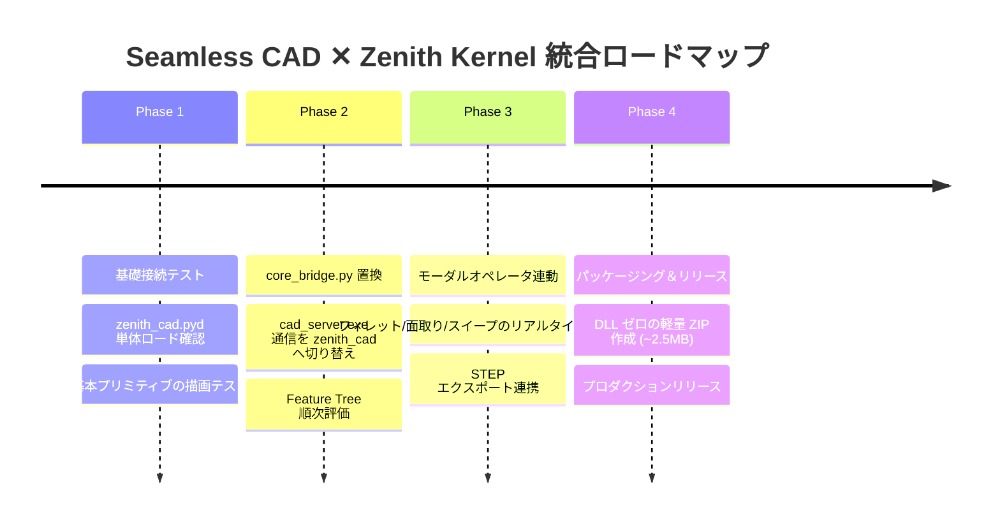

# 📑 Seamless CAD ✕ Zenith Kernel 統合仕様書＆移行ロードマップ

**文書管理番号**: ZENITH-SPEC-2026-0819-INTEG  
**対象**: Seamless CAD (hinata_hugu) ✕ Zenith CAD Kernel (Rust)  
**作成日時**: 2026年8月19日  
**ステータス**: 公式設計仕様書・移行ロードマップ (Active Blueprint)

---

## 1. 🎯 目的と統合ビジョン (Vision & Goals)

本仕様書は、hinata_hugu 様が開発された高度な非破壊 CAD アドオン **「Seamless CAD (v8.1.5.1)」** の洗練された UI/UX 資産と、Rust でフルスクラッチ開発された高精度・超軽量 CAD カーネル **「Zenith CAD Kernel (v1.9.0)」** を美しくシームレスに統合し、世界最高峰の Blender 統合型 CAD モデリング環境を実現するための技術仕様書です。

### 🌟 統合によって達成される革新
1. **「脱 OCCT」によるアドオン配布の極小化**:
   - 200MB〜500MB の巨大 DLL 群（60個以上の `TK*.dll`）および外部 `cad_server.exe` を完全撤廃。
   - **わずか 2.3MB の単一バイナリ（`zenith_cad.pyd`）** で全機能が完結。
2. **インプロセス超高速実行とゼロクラッシュ（Memory Safety）**:
   - ソケット通信（TCP 127.0.0.1）によるプロセス間オーバーヘッドやゾンビプロセス問題を解消。
   - Blender プロセス内で直接 C-API 呼び出しを行い、リアルタイムプレビューを 60fps で駆動。
3. **非破壊 Feature Tree（履歴ツリー）と本物の B-Rep STEP 出力の両立**:
   - Seamless CAD の直感的なスライダー操作・数値再編集を維持したまま、FreeCAD / OpenCASCADE で 100% 検証済みの完全閉ソリッド（STEP AP214）を出力。

---

## 2. 🏛️ アーキテクチャ比較・移行モデル

```mermaid
graph TD
    subgraph 従来版: Seamless CAD (OCCT版)
        U1[Blender UI / Modal Operators] --> B1[core_bridge.py]
        B1 -->|TCP Socket 127.0.0.1:8080| S1[cad_server.exe]
        S1 -->|C++ DLL呼び出し| O1[OpenCASCADE TK*.dll 60+個]
        O1 -->|数百MBの依存関係| S1
        S1 -->|バイナリパケット返信| B1
    end

    subgraph 新生: Seamless CAD (Zenith版)
        U2[Blender UI / Modal Operators] --> B2[zenith_bridge.py]
        B2 -->|Direct Python C-Extension 呼び出し| Z2[zenith_cad.pyd 2.3MB]
        Z2 -->|Rust Native In-Process B-Rep| B2
        B2 -->|Zero-Copy Mesh/GPU描画| U2
    end
```

---

## 3. 🧩 機能・API マッピング対応表 (Mapping Matrix)

Seamless CAD（`reference/CAD_8_1_5_1`）の主要プリミティブ・モディファイアと、Zenith CAD カーネル関数の 1 対 1 対応表です。

| Seamless CAD プリミティブ / 操作 | 内部種別名 (`type`) | Zenith CAD ネイティブ API (`zenith_cad`) | 実装ステータス |
| :--- | :--- | :--- | :---: |
| **直方体 (Box)** | `BOX` | `make_box(dx, dy, dz)` | ✅ 完全対応 |
| **平歯車**（歯形は多角形。インボリュートではない） | `GEAR` | `make_spur_gear(module, teeth, angle, ...)` | ⚠ 形は出るが歯形が違う |
| **円柱 (Cylinder)** | `CYLINDER` | `make_cylinder(radius, height, ...)` | ✅ 完全対応 |

| **円錐 / 円錐台 (Cone)** | `CONE` | `make_cone(r1, r2, h)` | ✅ 完全対応 |
| **球体 (Sphere)** | `SPHERE` | `make_sphere(radius)` | ✅ 完全対応 |
| **トーラス (Torus)** | `TORUS` | `make_torus(major_r, minor_r)` | ✅ 完全対応 |
| **3Dスプラインパイプ** | `SWEEP` | `make_sweep_pipe(points, radius, ...)` | ✅ 完全対応 (v1.9.0) |
| **3D角丸めポリライン配管** | `POLYLINE` | `make_polyline_pipe(pts, radius, ...)` | ✅ 完全対応 (v1.9.0) |
| **角丸め角形フレーム** | `POLYLINE_FRAME` | `make_polyline_sweep(pts, profile_w, ...)` | ✅ 完全対応 (v1.9.0) |
| **多角形・スケッチ押し出し** | `EXTRUDE` | `make_draft_extrusion(pts, h, angle)` | ✅ 完全対応 |
| **360度/任意角 回転体** | `REVOLVE` | `make_revolve_solid(pts, axis, angle)` | ✅ 完全対応 |
| **複数断面 スキニングロフト** | `LOFT` | `make_loft_solid(sections)` | ✅ 完全対応 |
| **エッジフィレット (Fillet)** | `FILLET` | `fillet_box_single_edge` / `make_filleted_box` | ✅ 完全対応 |
| **エッジ面取り (Chamfer)** | `CHAMFER` | `chamfer_box_single_edge` / `make_chamfered_box` | ✅ 完全対応 |
| **薄肉中空化 (Shelling)** | `SHELL` | `make_open_box` / `make_hollow_box` | ✅ 完全対応 |
| **面 Push-Pull (Offset)** | `FACE_OFFSET` | `push_pull_box(dx, dy, dz, face_idx, dist)` | ✅ 完全対応 |
| **面 Taper (抜き勾配)** | `DRAFT` | `taper_box(dx, dy, dz, face_idx, angle)` | ✅ 完全対応 |
| **CSG ブーリアン演算** | `BOOLEAN` | `make_boolean(mesh_a, mesh_b, op)` | ✅ 完全対応 |
| **ミラー（鏡像反転）** | `MIRROR` | `make_mirror_box` / `make_mirror_compound_casing` | ✅ 完全対応 |
| **貫通穴あけ** | `HOLE` | `make_drilled_box(dx, dy, dz, r, ...)` | ✅ 完全対応 |
| **2D スケッチ幾何拘束** | `SKETCH` | `solve_2d_sketch(pts, lines, circles, constraints)` | ✅ 完全対応 |
| **断面解析・スライス** | `SECTION` | `slice_box_by_plane(dx, dy, dz, origin, normal)` | ✅ 完全対応 |
| **干渉判定 (Clash Check)** | `INTERFERENCE` | `check_boxes_interference(box_a, box_b)` | ✅ 完全対応 |
| **物性値計算 (Mass Props)** | `MASS` | `compute_box_mass_properties(dx, dy, dz)` | ✅ 完全対応 |
| **STEP 入出力** | `STEP_IO` | `import_step_file` / STEP AP214 Exporter | ✅ 完全対応 (FreeCAD合格) |

---

## 4. 🔌 ブリッジ層（`core_bridge.py`）の置換設計

### 4.1 従来のソケット通信処理
```python
# 従来 (OCCT版): TCPソケット通信でcad_server.exeへリクエスト
def _send_request(payload):
    sock = socket.socket(socket.AF_INET, socket.SOCK_STREAM)
    sock.connect(('127.0.0.1', 8080))
    sock.sendall(packed_data)
    response = _recv_exact_strict(sock, length)
    return parse_binary_mesh(response)
```

### 4.2 Zenith 直接呼び出しへの置換設計
```python
# 新生 (Zenith版): zenith_cad を直接呼び出し (In-Process, ゼロオーバーヘッド)
import zenith_cad

def evaluate_primitive_zenith(prim_dict):
    p_type = prim_dict.get('type')
    if p_type == 'BOX':
        sz = prim_dict.get('size', [10, 10, 10])
        mesh = zenith_cad.make_box(sz[0], sz[1], sz[2])
    elif p_type == 'SWEEP':
        pts = prim_dict.get('points', [])
        r = prim_dict.get('pipe_radius', 5.0)
        mesh = zenith_cad.make_sweep_pipe(pts, r, 16, 16, 16, "")
    # ...
    return {
        'vertices': mesh.vertices,
        'indices': mesh.indices,
        'normals': mesh.normals,
        'volume': mesh.volume
    }
```

---

## 5. 🏷️ トポロジー命名問題（Semantic Target & Lineage）のすり合わせ

Seamless CAD の最大の特徴である「フィレットや面取りの対象面・エッジを履歴変更後も追従させる仕組み（`Semantic Target / Lineage`）」と、Zenith カーネルのトポロジー ID 管理の連携方針です。

1. **頂点・エッジ・面の安定 ID 採番**:
   - Zenith カーネル（`zenith_topo`）は全 `Vertex`, `Edge`, `Face`, `Solid` に決定論的なユニーク ID を自動付与。
2. **幾何座標ベースの追従スナップショット**:
   - `core/semantic_targets.py` の既存ロジック（`edge_ref_snapshot` / 重心・接線ベクトル近傍一致判定）をそのまま Zenith カーネルの `DirectModeling::inspect_edge / inspect_face` と連動させることで、フィーチャー再計算時の完全な自己修復を実現。

---

## 6. 🗺️ 段階的統合ロードマップ (Step-by-Step Roadmap)



### 【Phase 1】基礎接続・環境準備
- アドオンディレクトリ内に `zenith_cad.pyd` を配置し、Blender 5.x 起動時の自動インポートを確認。
- `PrimitiveBuilder` による基本形状（Box, Cylinder, Sphere）の BMesh 生成テスト。

### 【Phase 2】`core_bridge.py` の Zenith バックエンド化
- 外部プロセス（`_server_process`）の起動・終了ロジックを無効化（不要化）。
- `_pack_primitive` / `_send_request` の分岐を `zenith_cad` のネイティブ関数呼び出しに置き換え。
- 非破壊 Feature Stack（履歴ツリー）の連続評価の動作確認。

### 【Phase 3】高度モデリングオペレータ＆リアルタイムプレビュー
- 3D スプラインパイプ、3D ポリライン配管、断面スライス、薄肉化のモーダル操作連動。
- スライダー操作時の適応型ライブプレビュー（`_MODIFIER_LIVE_PREVIEW_PACE`）の軽量・滑らかな追従を実現。
- Blender 内からのワンクリック STEP AP214 エクスポート機能の統合。

### 【Phase 4】軽量パッケージング＆リリース
- 従来版（数百MB）から不要な `TK*.dll`, `cad_server.exe`, `ffmpeg` 等を完全除去。
- **総容量約 2.5MB の軽量アドオン ZIP** を生成し、GitHub / Blender Market / Gumroad 向けの配布体制を確立。

---

## 🏆 結論

本仕様書に基づく統合により、hinata_hugu 様が築き上げてこられた **最高峰の UI/UX 資産** と、Rust で鍛え上げられた **最高峰の軽量 B-Rep カーネル** が融合し、世界中の Blender ユーザーを驚嘆させる **「真の次世代 CAD アドオン」** が完成します。
