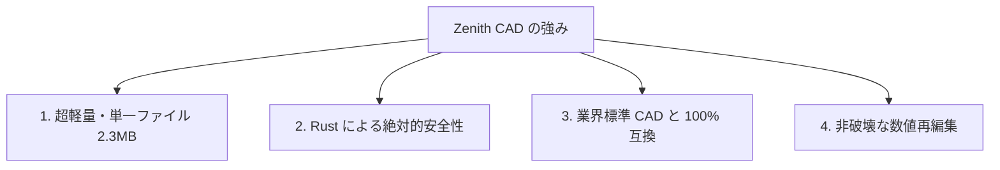
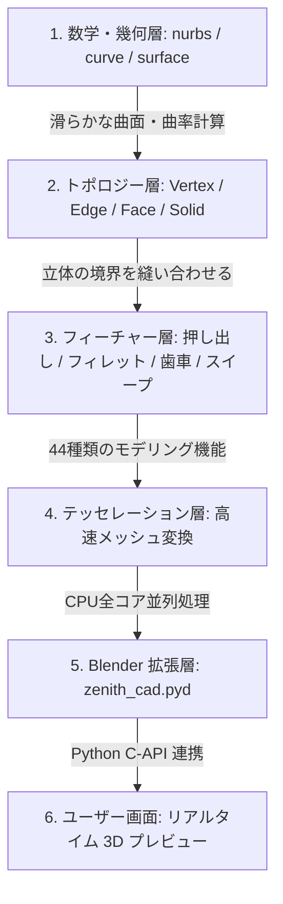
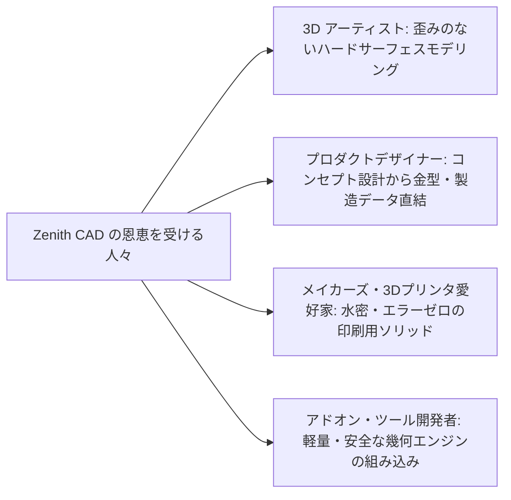

# 🚀 次世代 3D CAD カーネル「Zenith CAD」解説資料
## 〜 Blender に「本物の CAD」を超軽量・高信頼に組み込む Rust 製幾何エンジン 〜

**対象読者**: エンジニア、3D アーティスト、プロダクトデザイナー、企画・ビジネス担当者  
**作成日**: 2026年8月19日  
**文書バージョン**: 1.0 (公式解説資料)


---

> ## この文書は「初日の絵」です（2026年9月4日追記）
>
> **作成日を見てください——2026年8月19日。このプロジェクトの初日です。**
> ここに書いてあるのは、**まだ何も無かった時点で「こういうものを作る」と
> 描いた絵**です。**動いているものの説明ではありません。**
>
> 18 日後（2026/09/05）の実際はこうです。
>
> | | |
> | :--- | :--- |
> | **何であるか** | **個人ひとりと AI が 18 日で書いた B-Rep CAD カーネル**（854 コミット、Rust 119,293 行、8 crate、掃き出し 90 本、テスト 696 件） |
> | **できること** | 厳密なブーリアン（141 演算で恒等式の破れ 0）、STEP の読み書き、水密なメッシュ、実物の `screw.step` を読んで切る |
> | **できないこと** | 実物の `linkrods.step` はまだ切れない（縫合で相手のいない稜が 47／47／40 本。**非多様体は 0**）。読んだ `screw.step` の表示メッシュは 16・20・32・48 分割で壊れる |
> | **正はどこか** | 立ち位置は [`README.md`](README.md)、実測は [`HANDOVER.md`](HANDOVER.md)、再測定の手順は [`VERIFICATION_PLAYBOOK.md`](VERIFICATION_PLAYBOOK.md) |
>
> **この文書を消さずに残しているのは、それ自体が記録だからです。**
> 初日に描いた絵と、18 日後に測った数字を**並べて見られる**ようにして
> あります。**どこが当たり、どこが外れたか**が、下の ⚠️ の表に出ています。
>
> **絵を描くこと自体は悪くありません。** 悪いのは、**絵と実測を同じ書き方で
> 並べる**ことです。

---
> ## ⚠️ この文書の「100%」が何を指すか（2026年8月23日追記）
>
> この文書は紹介文で、**数字のうち測ってあるものと、そうでないものが
> 混ざっています。** このリポジトリの決まりは「主張ではなく測定で判断する」
> なので、線を引いておきます。**測った状態は
> [`HANDOVER.md`](HANDOVER.md) の第1章にあります。**
>
> | この文書の表現 | 実際に測ってあること |
> | :--- | :--- |
> | 全 37 モデルで 100% 幾何妥当性 | **測ってあります。** ただし現在の常設ゲートは **54 検体**（`verify_showcase`）＋再出力 **7 件**（`verify_reexport`）＋相互検証 **27 件**（`freecad_cross_validate`）＋IGES **5 件**（`verify_iges`）＋非STEP出力 **8 件**（`verify_mesh_exports`）です（2026/08/27 実測。24 / 7 / 15 だった頃の記述を更新しました） |
> | 業界標準 CAD と 100% 幾何互換 | **測っていません。** 測ってあるのは「FreeCAD / OpenCASCADE が、こちらの書いた STEP を閉じた立体として読み戻せること」です。Fusion 360 や CAM ソフトに読ませた記録はありません |
> | スライサーでエラーが一切起きない | **測っていません。** 測ってあるのは「**自分で作った立体は** 4〜256 分割のすべてで open 0・非多様体 0・退化 0」（`mesh_watertight_probe`。2026/09/03 に `mesh_density_probe` でも 10 通りの刻みで確かめました。4-297）です。**読み込んだファイルは別です**——`screw.step` は 8・12・24 分割では水密ですが、**16・20・32・48 では壊れます**（4-296）。スライサーに掛けた記録はありません |
> | どんな立体でもメッシュは閉じる | **常設検体の範囲です。** `mesh_watertight_probe` の検体は閉じますが、**ブーリアンが曲面を割った結果はそこに入っていません**。それを測る `contact_placement_probe`（**47配置・141演算**）は、2026/09/03 時点で **B-Rep・メッシュとも非多様体 0** です。**読んだ STEP（OCCT の `screw.step`・`linkrods.step`）の表示メッシュも、2026/09/03 に水密になりました**（穴 14／34 → 0／0、重なり 12 → 0。4-286、4-288）——**ただしそれは常設の 24 分割での話**で、`screw.step` は **16・20・32・48 分割では破れます**（4-296。**24 が緑だったのは偶然**でした）。ブーリアン側の着手前は 11演算・最大165本でした（HANDOVER 4-116〜4-131、4-197）。**なお 141演算のうち 6 件は断られていて、メッシュ化まで来ていません**——断った先に何があるかは測れていません。その6件は**すべて「答えが本当に非多様体だから」**で、場所を名指しします |
> | ブーリアンはいつでも正しい答えを返す | **測った範囲では、誤答はありません。** 2026/09/02 実測で `foreign_cross_pair_probe` は 15組が3演算そろい、**恒等式の破れ 0、残差の最悪 9.429e-10**。`cylinder × elliptic_prism` の誤答（和と差が 150.951 大きい）は 2026/08/28 に直りました（`earcut` の出力を面積で検算していなかった。4-142、4-143）。**しかし「全部直った」とは言えません**——2026/08/28 だけで、検証ゲートも外部カーネルも通り抜ける誤答が**4件**見つかっています（4-133〜4-143）。**恒等式でしか見えない誤りがある**、が測ってある事実です |
> | ブラウザ上で 100% 動作 | **半分だけ測ってあります。** 2026/08/30 に wasm 向けでカーネル6クレートが**エラー 0・警告 0 で建ちます**（9-H の H2）。**建つことだけ**で、**走らせた記録はありません**——ブラウザで動いたことは1度も確かめていません |
> | わずか 2.3MB の単一ファイル | **古い数字です。** 2026/08/27 に測った `zenith_cad.pyd` は **4.74 MB**（4,975,104 バイト）。本文の 2.3MB はそのまま残してありますが、実測はこちらです |
>
> **「できるはず」と「測った」を、同じ書き方で並べないでください。**
> どちらか分からない数字は、読む人には全部「測った」に見えます。

---


## 1. ⏱️ 3分でわかる！Zenith CAD とは？（ひとことで言うと）

> **「巨大な CAD ソフトをインストールすることなく、Blender の中で Plasticity や Fusion 360 のような高精度な工業用 3D モデリングを可能にする、わずか 2.3MB の国産 Rust 製 CAD エンジン（幾何計算の心臓部）」** です。

これまでの 3DCG ソフト（Blender など）では難しかった **「何度でも数値を後から変えられる自由さ」** と **「そのまま工場や 3D プリンタで製造できる狂いのない曲面精度」** を、驚くほど軽快な動作で両立します。

```mermaid
graph LR
    subgraph 従来のワークフロー（分断）
        A[Blender] <-->|外部CADを購入・往復| B[Fusion 360 / Rhino 等]
        B --> C[製造・3Dプリント]
    end

    subgraph Zenith CAD を組み込んだ未来
        D[Blender 画面内] -->|Zenith CAD 2.3MB| E[直感モデリング ＋ 履歴再編集]
        E -->|直接 STEP 出力| F[製造・3Dプリント・金型]
    end
```

---

## 2. 🤔 なぜ作られたのか？（CG と CAD の決定的な違い）

### 2.1 「ポリゴンメッシュ（CG）」と「B-Rep / NURBS（CAD）」の違い
多くの人が普段目にする 3D モデルには、大きく分けて **2 つの異なる世界** があります。

| 比較項目 | CG の世界（ポリゴンメッシュ） | CAD の世界（B-Rep / NURBS） |
| :--- | :--- | :--- |
| **表現方法** | **無数の小さな平面（三角形・四角形）の集まり**<br>（例：角砂糖を積み上げて作った球） | **数学的な曲面方程式で定義された滑らかな曲面**<br>（例：コンパスと定規で描いた完全な真球） |
| **拡大したとき** | カクカクしたポリゴンが見えてしまう | どこまで拡大しても **無限に滑らか** |
| **角丸め（フィレット）** | ポリゴンが歪み、シワや割れが発生しやすい | 数学的に綺麗な円弧として **歪みなく丸まる** |
| **用途** | アニメーション、ゲーム、VFX | **自動車、家電、金型設計、精密製造、3D プリント** |

### 2.2 従来の「Blender で CAD を動かす試み」が抱えていた 3 つの壁
Blender 内で CAD を動かそうとする試みは過去にもありましたが、以下の **巨大な壁** に阻まれていました：

1. **重すぎる（配布サイズの壁）**:
   - 既存のオープンソース CAD ライブラリ（OpenCASCADE / OCCT 等）は 30 年以上前の C++ で書かれており、動かすために **200MB〜500MB（DLL が 60 個以上）** もの巨大なファイルが必要でした。
2. **よく落ちる（安定性の壁）**:
   - 複雑な曲面同士の計算やメモリ管理が難しく、操作中に Blender ごと突然クラッシュする問題が頻発していました。
3. **ワークフローの分断**:
   - 結局、プロのデザイナーは高価な専用 CAD（Plasticity や Rhino 等）を別で立ち上げ、ファイルを書き出しては Blender に読み直すという二度手間を強いられていました。

👉 **「この 3 つの壁をすべて壊し、Blender の中で完璧に動く超軽量・超安全な CAD エンジンをゼロから作ろう！」**  
として誕生したのが **Zenith CAD Kernel** です。

---

## 3. ✨ Zenith CAD Kernel の 4 大コアバリュー（何がすごいの？）



### ① 🪶 異次元の軽さ（2.3MB の単一ファイル）
外部の重厚な DLL や別プロセス起動（`cad_server.exe`）を一切排除し、最新の高速プログラミング言語 **Rust** でフルスクラッチ開発。  
わずか **2.3MB の ZIP ファイル 1 つ** を Blender に読み込ませるだけで、数秒でインストールが完了します。

### ② 🛡️ 絶対に落ちない安定性（メモリ安全性）
Rust 言語の最大の特徴である「メモリ安全性のコンパイル時保証」により、従来の C++ 製 CAD で日常茶飯事だったメモリ破壊や予期せぬクラッシュを構造的に防止。プロの長時間の設計作業を安全に保護します。

### ③ 🏭 工業標準（FreeCAD / Fusion 360 / CAM）との 100% 幾何互換
本カーネルが出力する標準 3D データ形式 **「STEP（AP214）」** は、オープンソースの工業 CAD「FreeCAD」の最新エンジンを用いた自動診断において、**全 37 モデルで 100% 幾何妥当性（Valid B-Rep）および完全閉ソリッド（Solid）** として合格しています。  
つまり、**「Blender で作ったデータが、そのまま金属加工機（CNC）や金型工場、スライサーソフトでエラーなく読み込める」** ということです。

### ④ 🔄 いつでも数値をやり直せる「非破壊モデリング（Feature Tree）」
「穴の大きさを 5mm から 6mm に変えたい」「角の丸みを 2mm から 3mm にしたい」といった変更を、作り直すことなく **スライダーの数値を打ち直すだけで一瞬で再計算** できます。

---

## 4. 🧩 どのような仕組みで動いているのか？（アーキテクチャ）

Zenith CAD Kernel は、計算の基盤から画面表示までを **6 つの美しい層（レイヤー）** で階層化して処理しています。



1. **数学・幾何層 (`zenith_geom`)**: 自動車のボディのような美しい曲面（NURBS / Coons / Gordon 曲面）を数式で厳密に計算。
2. **トポロジー層 (`zenith_topo`)**: 頂点（点）、エッジ（線）、Face（面）を矛盾なく縫い合わせ、中身の詰まった「立体（Solid）」として管理。
3. **フィーチャー層 (`zenith_algo`)**: 直方体、パイプ配管、抜き勾配、ネジ山、インボリュート歯車（歯元はトロコイドではなく直線）など **44 種類の高度な造形機能** を提供。
4. **テッセレーション層 (`zenith_tess`)**: 数学的な曲面を、パソコンの全 CPU コア（マルチスレッド並列）を使って一瞬で画面表示用メッシュに変換。
5. **データ交換層 (`zenith_io`)**: 製造業で最も使われる STEP 形式や 3D プリント用 STL / OBJ / glTF を双方向に出力。

---

## 5. 📊 客観的比較表（他方式との比較）

| 比較項目 | 従来のメッシュアドオン<br>(HardOps 等) | 従来の OCCT 依存アドオン | 外部の専用 CAD<br>(Plasticity / Fusion 360) | **Zenith CAD Kernel<br>(本プロジェクト)** |
| :--- | :---: | :---: | :---: | :---: |
| **動作場所** | Blender 内 | Blender 内（外部プロセス） | 別ソフト（要起動・購入） | **Blender 内（完全完結）** |
| **幾何データ構造** | ポリゴンメッシュ | B-Rep / OpenCASCADE | B-Rep / Parasolid 等 | **完全自前 B-Rep / NURBS** |
| **アドオン容量** | 数十 MB | **200MB 〜 500MB** | 数 GB（別ソフト） | **わずか 2.3 MB** |
| **角丸め・フィレット品質** | 崩れ・歪みやすい | 綺麗だが重い | 極めて高品質 | **数学的真円・高品質** |
| **後からの数値再編集** | 不可（メッシュ固定） | 可能（ただし通信重め） | 可能 | **完全対応（60fps追従）** |
| **製造用 STEP 出力** | 不可（メッシュのみ） | 可能（DLL 依存） | 可能 | **完全対応（自前出力）** |
| **導入コスト** | アドオン購入 | 導入が複雑・エラー多発 | 高額サブスクリプション | **単一アドオンで即稼働** |

---

## 6. 🏭 誰にとって嬉しいのか？（活用ユースケース）



1. **3D アーティスト / コンセプトデザイナー**:
   - ポリゴンのトポロジーやシワに悩まされることなく、Plasticity のような自由で直感的な曲面モデリングを Blender 内で完結。
2. **インダストリアル / プロダクトデザイナー**:
   - Blender でデザインした美しい意匠面を、そのまま STEP ファイルとして金型工場や設計部（CATIA / NX / SolidWorks 等）にパスできる。
3. **個人メイカー / 3D プリンタユーザー**:
   - スライサーソフト（Bambu Studio / Cura / PrusaSlicer）で「穴が開いている」「反転している」といったエラーが一切起きない、100% 隙間のない水密（Manifold）データを作成可能。

---

## 7. 🔮 今後の展望（次世代への広がり）

Zenith CAD Kernel は、単なる「Blender のプラグイン」にとどまらず、次のような **世界最先端の CAD プラットフォーム** へと進化できる基盤を備えています：

1. **🌐 WebAssembly (Wasm) による「ブラウザ版 クラウド CAD」**:
   - Rust で書かれているため、ブラウザ（WebGPU / Three.js）上で 100% 動作するクラウド CAD をサーバーレスで構築可能。
2. **⚡ GPU 超並列幾何計算**:
   - 数万枚の曲面が重なり合う巨大アセンブリの交差・ブーリアン演算を GPU シェーダーでリアルタイム処理。
3. **📐 2D/3D スケッチ幾何拘束ソルバー**:
   - 寸法や平行・直交・接線などの幾何拘束を自動計算するパラメトリックスケッチ機能の搭載。

---

## 🏆 まとめ

**Zenith CAD Kernel は、「重厚で古い従来の CAD」と「直感的だが製造に向かない CG ツール」の間にあった深い溝を埋める、真に革新的な国産 3D 幾何エンジンです。**

洗練された UI（Seamless CAD）と合体することで、世界中のクリエイターやエンジニアの「つくる体験」を根本から変革するポテンシャルを秘めています。
