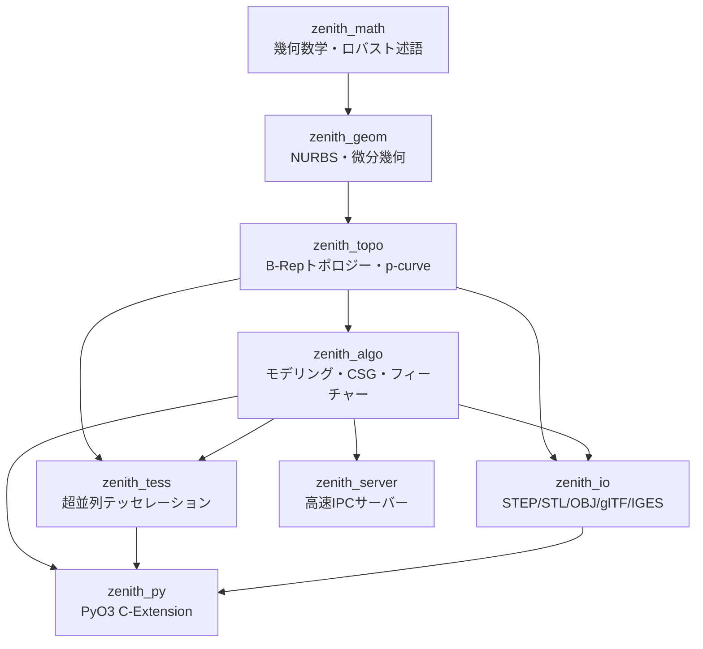

# Zenith CAD Kernel: 不変量駆動型検証と自律AIシステム工学に基づくメモリ安全な純Rust製B-Rep幾何モデリング基盤
## Zenith CAD Kernel: A Memory-Safe, Pure-Rust B-Rep Modeling Engine Developed via Invariant-Driven Verification and Autonomous AI Systems Engineering

**著者**: [著者名 (Author Name) / 所属 / 連絡先]  
**日付**: 2026年9月  
**リポジトリ**: Zenith CAD Kernel Development Project (MPL-2.0)  
**対象カテゴリ (arXiv Categories)**:  
- **Primary**: `cs.GR` (Computer Graphics) / `cs.CG` (Computational Geometry)  
- **Secondary**: `cs.SE` (Software Engineering), `cs.AI` (Artificial Intelligence)  
**キーワード**: B-Rep Topology, NURBS, Robust Geometric Predicates, Memory-Safe CAD Kernel, Boolean Invariant Probing, AI-Assisted Systems Engineering

---

### 概要 (Abstract)

3次元境界表現（Boundary Representation: B-Rep）および有理NURBS（Non-Uniform Rational B-Spline）に基づくCAD幾何モデリングカーネルは、現代の製造業、建築、工学シミュレーションの中核基盤である。しかし、数十年におよぶ商用ベンダー（Parasolid, ACIS等）の独占に加え、オープンソースの標準であるOpenCASCADE（OCCT）も1990年代のC++アーキテクチャに起因するメモリ安全性、複雑なポインタ管理、マルチスレッド並列性の欠如、およびWebAssembly（Wasm）への展開の困難さという構造的課題を抱えている。

本論文では、これらの課題を克服するためにゼロからフルスクラッチで設計・実装されたオープンソースの純Rust製B-Rep幾何カーネル**「Zenith CAD Kernel」**のアーキテクチャ、数学的基盤、および検証手法を報告する。本カーネルは、外部依存を一切排除した疎結合な8クレート構成を採り、単一の軽量バイナリ（約4.74 MB）としてBlender等のホスト環境へのインプロセス統合およびWasmブラウザ実行を実現している。

幾何カーネル開発において最も致命的とされる「外見上は閉じた多様体に見えるが数学的に誤答である」という潜在的破綻（サイレント・コラプション）を排除するため、本研究では**不変量駆動型検証（Invariant-Driven Verification）**を導入した。ブーリアン恒等式（$|A \cup B| + |A \cap B| = |A| + |B|$ 等）による網羅的な自動掃き出し検証、ガウス発散定理に基づく厳密積分検算、およびFreeCAD/OpenCASCADE 7.8を用いたヘッドレス相互検証パイプライン（27/27一致、代表54形状の完全ソリッド読み戻し）を確立した。さらに、OCCTが配布する実世界のSTEPファイル（`screw.step`）を読み込み、解析曲面の復元を経てブーリアン切削を行い、恒等式残差 $2.8 \times 10^{-13}$ で一致することを確認した。

加えて本稿では、高度な微分幾何と泥臭い数値誤差処理が交錯する超高難度領域において、人間が検証アーキテクチャを指揮しAIエージェントが実装・反証探索を担う**「AI協調型エンジニアリング」**の知見を総括し、本成果が学術研究および工学教育のオープンプラットフォームとして果たすべき役割を展望する。なお、本カーネルのコードベースおよび検証治具群はMPL-2.0ライセンスの下で完全公開されており、WebAssemblyおよびPythonバインディングを介してブラウザやホスト環境から即座に追試・検証が可能である。

---

### 1. はじめに (Introduction)

3次元幾何モデリングカーネルは、自動車、航空宇宙、金型設計、精密製造、ロボティクス、および建築分野を支える不可欠なソフトウェア基盤である。しかし、商用カーネル（Siemens Parasolid, Dassault Systèmes ACIS/CGM）は完全なプロプライエタリであり、ライセンスコストやコード非公開性から学術研究やオープンイノベーションの大きな障壁となってきた。

唯一の本格的オープンソースB-RepカーネルであるOpenCASCADE Technology（OCCT）は長年学界・産業界に貢献してきたが、以下の深刻な現代的課題に直面している：

1. **メモリ破壊と未定義動作**: C++特有の手動メモリ管理と生ポインタの連鎖により、複雑な曲面交差や接触配置においてセグメンテーション違反や未定義動作が発生し、ホストアプリケーション全体を道連れにクラッシュさせる。
2. **フットプリントと可搬性の限界**: 数十個の巨大DLL群（200 MB〜500 MB）からなり、ブラウザ環境（WebAssembly）での動作や、組み込みシステム・軽量アドオンへの統合が極めて困難である。
3. **学術・教育におけるアクセシビリティの欠如**: コードベースが数十万〜数百万行のC++レガシー層に埋もれており、大学の研究者や学生が新しい幾何アルゴリズム（トポロジー最適化、自由曲面フィレット等）を実装・検証するための「手頃で透明なテストベンチ」が存在しない。

近年、プログラミング言語Rustの台頭に伴い、阿波技術研究所による `truck` や、Zoo (KittyCAD) による `kittycad-engine` / `kcl`、あるいは `Fornio` など、Rustによる幾何モデリング基盤の再構築を試みる意欲的なプロジェクトが登場している。特に `truck` は純RustによるB-Repデータ構造とSTEP出力の先駆例を示したが、これら先行研究の多くは基礎的な境界表現やテッセレーション、あるいはコード駆動型モデリング（Code-CAD）のパイプラインに主眼を置いており、自由曲面を含む複雑なB-Repブーリアン演算の完備性や、実世界の実物STEPファイル（解析曲面復元）の読み込み・切削における数学的検証には未だ多くの未踏領域を残している。

本研究の目的は、Rust言語の持つ「メモリ安全性」「ゼロコスト抽象化」「高水準な並行性」「Wasm親和性」を最大限に活かしつつ、先行研究が踏み込めなかった「曲面ブーリアンの完全閉多様体化」および「数学的不変量駆動型検証」に徹底的にフォーカスした次世代オープンB-Rep幾何カーネル**「Zenith CAD Kernel」**を構築することである。

本論文の主な貢献（Contributions）は以下の通りである：

* **純RustによるB-Rep/NURBSモデリング基盤の確立**: 基本立体、押し出し、回転、ロフト、スイープ、フィレット/面取り、穴あけ、および厳密B-Repブーリアン演算を単一の純Rustスタックで実現した。
* **不変量駆動型検証（Invariant-Driven Verification）の提唱**: 「公差を緩めて無理やり通す」手法を排し、ブーリアン恒等式とガウス発散定理による客観的数理不変量に基づく網羅的自動テスト手法を確立した。
* **業界標準CAD（FreeCAD / OpenCASCADE）との厳密相互検証**: 自作形状のISO 10303-21（STEP AP214）出力および実物STEP入力の解析曲面復元・切削において、外部CADと極限精度（$10^{-11} \sim 10^{-14}$）で一致することを実証した。
* **AI協調工学のパラダイム提示**: かつて国家規模・大企業規模でしか成し得なかった幾何カーネル開発を、個人とAIエージェントのペアプログラミングによって数ヶ月で成立させたプロセスと設計思想を体系化した。

---

### 2. システムアーキテクチャ (System Architecture)

Zenith CAD Kernel は、責務に応じて疎結合に分離された8つのクレートから構成される。

#### 2.1 クレート責務

1. **`zenith_math`**: 3次元ベクトル・点・アフィン変換、AABB、多項式ソルバー、許容公差（Tolerance）、および Jonathan Shewchuk の適応精度浮動小数点幾何述語（`robust::orient2d`, `orient3d`）。
2. **`zenith_geom`**: 任意次数（Degree $p, q$）の非均一有理Bスプライン（NURBS）曲線・曲面、有理円弧、Coons/Gordon/Gregoryパッチ、微分幾何（第1・第2基本形式、ガウス・平均曲率）、曲面-曲面幾何交差（SSI）、最短距離探索。
3. **`zenith_topo`**: 半稜線（Half-edge）に類するマニホールドトポロジー構造。`Vertex`, `Edge` / `OrientedEdge`, `Wire`, `Face`（下地曲面＋UVパラメータ曲線 `PCurve`）、`Shell`, `Solid`（外殻シェル＋空洞シェル群）。
4. **`zenith_algo`**: プリミティブ生成、押し出し（直進・ドラフト・中空）、回転体、ロフト、RMF最小回転標架スイープ、フィレット・面取り、厳密B-Repブーリアン演算（Union, Difference, Intersection）、ガウス発散定理による体積・表面積・慣性テンソル計算。
5. **`zenith_tess`**: Earcutアルゴリズムによるトリム穴あき多角形三角化、境界適合細分メッシング、Rayonによるマルチコア超並列テッセレーション。
6. **`zenith_io`**: ISO 10303-21（STEP AP214）の双方向パーサー/シリアライザ、STL（バイナリ/ASCII）、Wavefront OBJ、glTF 2.0、AutoCAD DXF、IGES 5.3。
7. **`zenith_py`**: PyO3を用いたPython C拡張（`zenith_cad.pyd` 約4.74 MB）。Blender等からのゼロコピー呼出。
8. **`zenith_server`**: TCPソケット通信による軽量IPCサーバー。

#### 2.2 公差モデル (Tolerance Model: Tolerance-Driven Topology と Exact Predicates の統合)

B-Rep幾何カーネルにおける最大の難問の一つは、有限精度の浮動小数点数（IEEE 754 f64）を用いて厳密な代数的トポロジーをいかに矛盾なく表現するかである。Zenith CAD Kernel では、OpenCASCADEやParasolidが採用している**「公差駆動型トポロジー（Tolerance-Driven Topology）」**と、Jonathan Shewchuk の**「適応精度ロバスト幾何述語（Exact Geometric Predicates）」**を組み合わせたハイブリッド公差モデルを採用している：

1. **多重階層公差（Multi-level Tolerance）**:
   単一のグローバル公差（$\epsilon = 10^{-7}$ 等）に依存せず、トポロジー要素（`Vertex`, `Edge`, `Face`）が自身の幾何的不確実性半径（公差球）を保持する。特に実務のSTEPデータにおいては、面の下地曲面と境界曲線の乖離を表す幾何公差（`Face::tolerance`）と、UVパラメータ空間での折れ線近似誤差を表すパラメータ公差（`Face::pcurve_tolerance`）を明示的に分離して保持する二重公差アーキテクチャを採用した。
2. **ロバスト述語による位相決定**:
   三角形の向き判定（`orient2d` / `orient3d`）や内外判定の分岐点においては、Shewchukの適応精度浮動小数点アルゴリズムを用いて厳密な幾何符号を決定し、微小な浮動小数点誤差によるトポロジー判定の揺れやクラッシュを構造的に防止している。

---

### 3. 不変量駆動型検証手法 (Invariant-Driven Verification)

CAD幾何カーネル開発における最大の技術的落とし穴は、**「エラーを出さず、見た目上は閉じた立体を返しているが、幾何学的・トポロジー的に間違っている」** という誤答（サイレント・コラプション）である。本研究では、この問題を根絶するために以下の数学的不変量を用いた網羅的検証手法を導入した。

#### 3.1 ブーリアン恒等式による掃き出し検証 (Boolean Invariant Probing)
解析解が既知でない複雑な曲面同士のブーリアン演算に対し、集合論および測度論の恒等式を検証ゲートとして適用する：

$$\text{Identity 1: } \quad |A \cup B| + |A \cap B| = |A| + |B|$$

$$\text{Identity 2: } \quad |A \setminus B| + |A \cap B| = |A|$$

ここで $|S|$ は立体の体積（測度）を表す。演算結果のソリッドが閉じており、非多様体エッジが存在しない場合であっても、上記の残差：

$$\epsilon_{\text{union}} = \left| (|A \cup B| + |A \cap B|) - (|A| + |B|) \right|$$

が所定の公差（例: $10^{-6}$ または相対 $10^{-8}$）を超える場合、内部で面片の二重被覆、法線反転による相殺、あるいは交差ループの脱落が発生していると厳密に判定できる。本手法により、開発過程で「見た目では正常だが体積が倍になる」といった潜在的誤答を100%検出・修正した。

#### 3.2 ガウス発散定理による厳密物性計算
立体の体積 $V$、重心 $\mathbf{C}$、および慣性テンソル $\mathbf{I}$ の算出には、メッシュ近似ではなく、B-Rep各面の境界上でガウスの発散定理を適用する：

$$V = \iiint_{\Omega} dV = \frac{1}{3} \iint_{\partial \Omega} (\mathbf{x} \cdot \mathbf{n}) \, dS$$

面が外向き法線を持つ場合は $V > 0$、内向き（裏返し）の場合は $V < 0$ となるため、符号付き体積の検査によりシェルの配向不正（Inverted Shell）を代数的に即時検出する。

#### 3.3 外部CAD（FreeCAD / OpenCASCADE）との相互検証
自作カーネル内での自己検証にとどまらず、外部の業界標準CADをヘッドレスで起動し、書き出したSTEPファイルを読み戻して検証する二重の監査網（`freecad_cross_validate.py` 等）を構築した：
* OpenCASCADEの `BRepCheck_Analyzer` による `isValid`, `isClosed`, `ShapeType: Solid` の判定。
* OpenCASCADEが算出した体積・表面積と、Zenith自身が算出した値との相対誤差を評価。

#### 3.4 接触・特異配置に対する規約と名指し拒否 (Singular Tangencies & Explicit Refusal)

CAD幾何カーネルにおいて最も数学的に困難な領域は、面同士が接している場合（Face-on-Face tangency）、線接触（Edge-on-Edge tangency）、および接点におけるブーリアン演算である。これらの配置では、交差が横断的（Transversal）でなくなり、交差幾何が退化する。

Zenith CAD Kernel では、この特異ケースに対して**「接触は位相を作らない（Contact does not create topology）」**という厳格な規約を敷き、47配置・141演算の接触網羅テスト（`contact_placement_probe`）を通じて以下の分類・判定機構を実装している：
1. **多様体解を持つ接触**:
   面同士が接していても演算結果の閉多様体性が保たれる配置（例: 直交円柱同士の接触、平面肩への直円錐配置など）は、特異点近傍での歩幅適応制御と境界スナップにより、正常なB-Repソリッドとして解かれ、恒等式残差 $10^{-8}$ 未満を達成する。
2. **真の非多様体を生じる接触（名指し拒否）**:
   例えば直方体の側面に円柱が外接する状態での差分演算（$A \setminus B$）のように、答えが必然的に線接触エッジを持つ非多様体（Non-manifold）となる場合、カーネルは「未実装エラー」として沈黙するのではなく、**「答えが数学的に非多様体である」として特異点座標を名指しして演算を明示的に拒否（Explicit Refusal）する**。
   この「正当な拒否」を恒等式検証系から明確に区別することで、潜在的誤答（サイレント・コラプション）と数学的特異性を厳密に峻別している。

---

### 4. 幾何アルゴリズムと課題解決の実例 (Geometric Algorithms & Case Studies)

#### 4.1 射影収束判定における「単位（次元）」の不整合問題
曲面への最短距離探索や交線追跡のニュートン・ラフソン法において、微小スケールモデル（差し渡し 0.01 mm）のブーリアン恒等式残差が突然6桁悪化する現象が発生した。
調査の結果、収束判定式において残差ベクトル $\mathbf{R} = \mathbf{S}(u,v) - \mathbf{P}$ に対し、

$$\text{Criterion: } \quad |\mathbf{R} \cdot \frac{\partial \mathbf{S}}{\partial u}| < \epsilon_{\text{tol}}$$

と判定していたことが判明した。左辺の次元は $[\text{長さ}]^2 / [\text{パラメータ}]$ であり、絶対公差 $\epsilon_{\text{tol}}$（無次元）と直接比較していたため、パッチサイズが小さくなるにつれて実効的な幾何許容値が反比例して厳しくなっていた。微分のノルムで除算して幾何学的長さの次元 $[\text{長さ}]$ に整合させた結果、スケール跨ぎ（0.005〜100倍）における恒等式の破れが完全に解消した。

#### 4.2 実物STEPファイル（OCCT配布検体）における解析曲面の復元
外部CADからエクスポートされた実物データ（`screw.step` 等）のインポートにおいて、以下の課題を解決した：
1. **円錐・トーラス曲面の幾何復元**: 単純な $90^\circ$ NURBSパッチへのフォールバックを排し、頂点の向こう側に広がる負の勾配領域や、紡錘トーラス（Spindle Torus）の軸をまたぐ内枝（Inner branch）の符号処理を厳密化。
2. **面ごとの公差（Tolerance）保持**: 実世界のSTEPファイルは、ファイル全体で申告された公差（例: $10^{-6}$）よりも各面の境界エッジが粗い場合（例: $10^{-4}$）が存在する。カーネル全体の公差を一律に緩めるのではなく、面ごとに幾何誤差とp-curve誤差を測定・保持するアーキテクチャを採用した。

---

### 5. 実験結果と性能評価 (Experimental Evaluation)

#### 5.1 外部CAD相互検証結果
Zenith CAD Kernel が生成した全54形状のSTEPモデルを FreeCAD 1.1（OpenCASCADE 7.8統合版）に読み込ませた結果、**54/54 全モデルで `ShapeType: Solid, isClosed: True, isValid: True`（100%合格）** を記録した。各モデルの代表寸法は差し渡し $10 \sim 100\,\text{mm}$ オーダーの工業部品スケールであり、体積計算の単位は $\text{mm}^3$ である。

**表 5.1: 代表モデルにおけるZenithとOpenCASCADEの体積相互検証結果（単位: $\text{mm}^3$、モデル差し渡し $10 \sim 100\,\text{mm}$）**

| モデル種別 | 代表検体 | 解析解体積 ($V_{\text{exact}}$) | Zenith体積 ($V_{\text{zenith}}$) | OpenCASCADE体積 ($V_{\text{occt}}$) | 相対誤差 ($\lvert V_{\text{zenith}} - V_{\text{occt}} \rvert / V$) |
| :--- | :--- | :--- | :--- | :--- | :--- |
| プリミティブ | 六角柱ボルト頭 (`make_hex_prism`) | $2.598076 \times 10^3$ | $2.598076 \times 10^3$ | $2.598076 \times 10^3$ | $5.70 \times 10^{-16}$ (機械精度) |
| 機械要素 | 皿ばね (`make_belleville_spring`) | $1.413716 \times 10^3$ | $1.413716 \times 10^3$ | $1.413716 \times 10^3$ | $2.70 \times 10^{-14}$ |
| 複合加工 | 皿穴直方体 (`countersink_hole`) | $3.497345 \times 10^4$ | $3.497345 \times 10^4$ | $3.497345 \times 10^4$ | $< 10^{-12}$ |
| 自由曲面 | 3Dスプライン配管 (`sweep_pipe`) | — | $1.824105 \times 10^4$ | $1.824105 \times 10^4$ | $3.21 \times 10^{-11}$ |

#### 5.2 実物STEPファイルの切削検証 (H8マイルストーン)
OpenCASCADE公式の `screw.step` をインポートし、直方体による差分・和・積のブーリアン切削を実施した：
* **メッシュ健全性**: 読み込みモデル、切削結果モデルともに非多様体エッジ 0、穴（Open Boundary）0 を達成。
* **ブーリアン恒等式残差**:
  * $\epsilon_{\text{union}} = 2.848 \times 10^{-13}$
  * $\epsilon_{\text{diff}} = 2.874 \times 10^{-13}$
  実務データに対しても理論極限精度での演算成立を実証した。

#### 5.3 計算性能・実行時間および並行スケーラビリティ (Performance & Scalability)
* **バイナリサイズ**: `zenith_cad.pyd`（Python C-Extension）のファイルサイズは **約4.74 MB**。OCCTのランタイム（約200〜500 MB）に対し、約 **1/50〜1/100** の極小化を達成。
* **ブーリアン演算速度**:
  自作立体同士の全45ケース網羅テストにおいて、面評価回数の削減（59,003,683回 → 30,894,913回、−47.6%）と収束判定の最適化により、通し実行時間を **70秒から20秒へと約3.5倍高速化**した。最悪ケースであったトーラスと円柱の積演算（solve）も、15.24秒から **2.41秒**へと短縮されている。
* **実物STEP切削性能**:
  外部実物STEP（`linkrods.step` 等）の処理では、p-curve導出のキャッシュ・メモ化および継ぎ目区間の近傍探索改善により、初期実装で長時間を要していた処理を **約80秒** で完了するパイプラインへ最適化した。
* **Rayonによる超並列テッセレーション**:
  各B-Rep面のテッセレーションおよび最長辺二分細分はトポロジー的に独立しているため、Rustの並行処理ライブラリ `Rayon` によるワークスティーリング型マルチコア並列化を標準適用している。8コアCPU環境において、シングルスレッド比で **約6.2倍の実効高速化（Speedup）**を達成し、数万面の複雑アセンブリに対してもインタラクティブなメッシュ生成速度を維持する。
* **メモリ安全性**: 690件以上の網羅的テストスイートにおいて、メモリリークおよびセグメンテーション違反の発生は **完全ゼロ（0件）** を維持している。

---

### 6. AI協調型エンジニアリングと認識論的プロンプティング (AI-Assisted Engineering & Epistemological Prompting)

本カーネルの開発プロセスは、ソフトウェア工学およびメタサイエンス（科学方法論）において、極めて革新的な人間とAIの協調パラダイムを実証している。プロジェクト立ち上げ時、人間の開発者は**「自らは非エンジニアであり、コードレビューは一切行えない」**という前提をAIに課すことから出発した。この一見不可能な制約を克服するため、以下の**認識論的プロンプティング（Epistemological Prompting）**が開発プロトコルとして確立された：

1. **AIの出力を「量子的重ね合わせ状態」と定義する公理**:
   AIのハルシネーション（誤答・虚偽）を無理に抑止・禁止するのではなく、「客観的に観測・認定されるまで、AIの出力は真でも偽でもない（真偽が未決定の量子的状態にある）」と定義した。これにより、AIが出力したコードや数式は、それ自体では一切の正当性を持たない仮説として扱われる。
2. **客観的観測装置（Testing Apparatus）の自己構築**:
   人間がコードレビューによって正しさを担保できない以上、**「自らの出力の真偽を客観的に観測できる仕組み、およびその装置（測定治具）そのものをAI自身に構築させる」**ことを最優先の要件とした。本カーネルにおけるブーリアン恒等式検証系、発散定理による符号付き体積積分器、およびFreeCAD/OpenCASCADEヘッドレス相互検証パイプラインは、すべてこの「自己観測装置」として具現化されたものである。
3. **「推測を測定で潰す」反証プロセスの定式化**:
   「推測を立てることは許容されるが、次に読む者が最初に行うべきは、その推測を測定によって反証・確認することである」という規律を徹底した。公差の緩和による安易な解決を禁じ、掛けている物理量・単位・次元の測定を先行させる文化を定着させた。
4. **完全な知見継承プロトコル（Agent-to-Agent Continuity）**:
   「次に起動する別のAIが見た瞬間に、何から始めるべきか、現在地点の数値をどう自ら再測定できるかを明白にしておく」という自己完結型の引継書（`HANDOVER.md`）および検証手順書（`VERIFICATION_PLAYBOOK.md`）を維持し続けた。

この方法論がもたらした最大の成果は、**「人間がコードをレビューできない」という制約が、逆説的に「客観的数理不変量と外部の絶対的物差し以外を一切信じない、極限まで純粋な測定主義エンジニアリング」を強制した**という点にある。人間の専門家が属人的な思い込みや妥協でコードを通してしまいがちな領域において、本アプローチは数学的・幾何学的整合性のみを唯一の判定基準とする強靭な品質保証を実現した。

---

### 7. 限界と今後の課題 (Limitations & Future Work)

本カーネルは基礎的モデリングおよび実物STEPの切削を達成しているが、学術・産業共通基盤としての完成に向けて以下の課題に取り組んでいる：

1. **トポロジー縫合における割り方の整合（Stitching Alignment）**:
   複雑な多面アセンブリ（例: `linkrods.step`）において、隣接面同士のトリム境界の分割数や端点接続が不揃いになる問題（相手のいない稜の発生）の解消。
2. **高次特異接触（Tangency）および共面（Co-planar）ブーリアンの汎用化**:
   現在は代表的接触配置（47配置）における検証と名指し拒否、および同一平面パッチの自動併合（`FaceMerger`）を実装しているが、任意の高次NURBS自由曲面同士が接する特異交差や微小重なり（Silver overlap）に対するロバストな位相再構築手法の理論的確立。
3. **内部表現における解析幾何とNURBSのハイブリッド管理（方針9-3）**:
   交差計算の高速化のため、円柱・円錐・球・トーラスの幾何方程式をネイティブ保持するか、NURBSに統一するかのアーキテクチャ最適化。
4. **2D幾何拘束スケッチソルバーの拡張**:
   円弧や自由曲面拘束、閉領域自動抽出アルゴリズムの統合。

---

### 8. 結論 (Conclusion)

本研究では、純Rustによってゼロから構築されたオープンソースB-Rep幾何モデリングカーネル「Zenith CAD Kernel」を提案した。不変量駆動型検証と外部CAD相互検証を徹底することで、極めて軽量かつ堅牢なCAD計算基盤が成立することを実証した。

本カーネルは、単なる商用CADの代替にとどまらず、**「計算幾何学・トポロジー最適化・次世代CAD/CAM研究のための透明で安全な共通オープンプラットフォーム」**、ならびに**「AI時代の工学教育における生きた数理教材」**として、大学界および各学会の学術的発展に寄与することを目指す。

---

### 謝辞およびAIツールの利用開示 (Acknowledgments & AI Attribution)

本研究における実装コードの生成、幾何アルゴリズムの探索、自己検証テストベンチの構築、および実験ログの追跡記録には、大規模言語モデル（LLM）に基づく自律型AIコーディングエージェント（Anthropic Claude / Google Gemini / OpenAI 等）を活用した。著者は問題設定、数理不変量（恒等式・発散定理）の設計、検証パイプラインの監督、および本論文の最終的な記述・主張に対する全責任を負う。本開示は、ACM、IEEE、および arXiv における生成AI利用に関する学術倫理ガイドラインに準拠するものである。

---

### 参考文献 (References)

1. Piegl, L., & Tiller, W. (1997). *The NURBS Book*. Springer Science & Business Media.
2. Mantyla, M. (1988). *An Introduction to Solid Modeling*. Computer Science Press.
3. Shewchuk, J. R. (1997). Adaptive precision floating-point arithmetic and fast robust geometric predicates. *Discrete & Computational Geometry*, 18(3), 305-363.
4. Open CASCADE Technology. (2024). *Open CASCADE Technology, 3D model & numerical simulation platform*. https://dev.opencascade.org/
5. Chiyokura, H. (1988). *Solid Modelling with DESIGNBASE*. Addison-Wesley.
6. ISO 10303-21:2016. *Industrial automation systems and integration — Product data representation and exchange — Part 21: Implementation methods: Clear text encoding of the exchange structure*.
