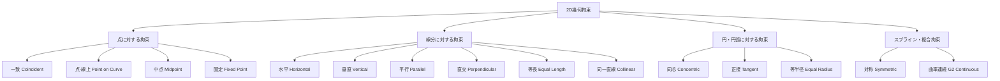
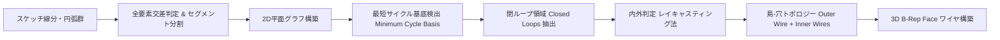
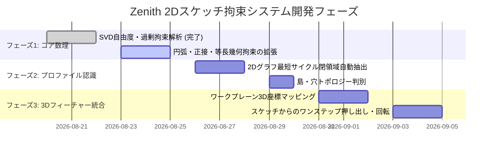

# Zenith CAD Kernel: 2Dスケッチ・幾何拘束ソルバー（GCS）包括的技術仕様・設計書
**文書バージョン**: 1.0.0  
**作成日**: 2026-08-22  
**対象**: Zenith CAD 幾何拘束ソルバー（`SketchSolver`）およびスケッチモデリングシステム

---

## 1. エグゼクティブサマリー

CADシステムにおけるモデリングの原点は、2次元スケッチ（2D Sketch）に幾何学的・寸法的なルール（拘束: Constraints）を与え、それを3次元空間へ押し出し・回転・掃引することです。

Zenith CADカーネルでは、**非線形最小二乗最適化（Levenberg-Marquardt法）**と**ヤコビアンSVD階数解析**を融合した純Rust製の超高速2D幾何拘束ソルバー（GCS: Geometric Constraint Solver）を自前実装しています。
本ドキュメントでは、スケッチシステムにおいて考慮すべきすべての事柄（幾何要素、拘束種別、ソルバー数理、トポロジー閉領域認識、3Dフィーチャー連携、DXF入出力）を網羅的に整理・体系化します。

---

## 2. スケッチ幾何要素（Geometric Primitives）

| 要素種別 | パラメータ定義 | 内部自由度 (DOF) | 用途・備考 |
| :--- | :--- | :---: | :--- |
| **点 (Point)** | 座標 $(x, y)$ | 2 | すべての幾何要素の端点・中心点・制御点 |
| **線分 (Line Segment)** | 始点 $P_1(x_1, y_1)$, 終点 $P_2(x_2, y_2)$ | 4 | 外形線、軸線、補助線 |
| **円 (Circle)** | 中心 $P_c(x_c, y_c)$, 半径 $r$ | 3 | 穴、ボス、円形外形 |
| **円弧 (Circular Arc)** | 中心 $P_c$, 半径 $r$, 始角 $\theta_s$, 終角 $\theta_e$（または始終点+中点） | 5 | フィレット、コーナーR、カム形状 |
| **楕円 / 楕円弧 (Ellipse / Arc)** | 中心 $P_c$, 長半径 $a$, 短半径 $b$, 回転角 $\phi$ | 5 (楕円) / 7 (楕円弧) | 流線型断面、斜め断面投影 |
| **B-Spline / NURBS スプライン** | 次数 $p$, 制御点列 $\{P_i\}$, ノット列 $\{u_j\}$ | $2 \times N$ | 自由曲線プロファイル、翼型、意匠曲面 |
| **構築線 (Construction Geometry)** | 各要素のプロパティフラグ `is_construction = true` | 0 (変化なし) | 3D化の対象外となる寸法基準線・対称軸 |

---

## 3. 幾何拘束 & 寸法拘束の完全分類

### 3.1 幾何学的拘束（Geometric Constraints）

1. **一致 (Coincident)**: 点 $P_1$ と点 $P_2$ の距離をゼロにする（残差: $x_1 - x_2 = 0, y_1 - y_2 = 0$）。
2. **点-線上 (Point on Curve)**: 点 $P$ が線分または円弧の上に乗る。
3. **中点 (Midpoint)**: 点 $P_m$ が線分 $P_1 P_2$ の中央に位置する（$P_m = \frac{P_1 + P_2}{2}$）。
4. **水平 / 垂直 (Horizontal / Vertical)**: 2点の $Y$ 座標差または $X$ 座標差をゼロにする。
5. **平行 (Parallel)**: 2本の線分の方向ベクトルの外積（2Dクロス積）をゼロにする。
6. **直交 (Perpendicular)**: 2本の線分の方向ベクトルの内積（ドット積）をゼロにする。
7. **同芯 (Concentric)**: 2つの円・円弧の中心点を一致させる。
8. **正接 (Tangent)**:
   - 線分と円: 中心から直線への符号付き距離が半径 $r$ に一致。
   - 円と円: 中心間距離が $r_1 + r_2$（外接）または $|r_1 - r_2|$（内接）に一致。
   - スプラインと直線/円弧: 接続点での接線ベクトルが同方向。
9. **対称 (Symmetric)**: 指定した対称軸（中心線）に対して2点・2線分が線対称。

### 3.2 寸法拘束（Dimensional Constraints）

1. **距離 (Distance)**: $\sqrt{(x_2 - x_1)^2 + (y_2 - y_1)^2} = d$
2. **水平 / 垂直距離 (Horizontal / Vertical Distance)**: $|x_2 - x_1| = d_x$, $|y_2 - y_1| = d_y$
3. **角度 (Angle)**: 2本の線分のなす角 $\theta = \arccos(\hat{v}_1 \cdot \hat{v}_2)$
4. **半径 / 直径 (Radius / Diameter)**: $r = R$ または $2r = D$
5. **円弧長 (Arc Length)**: $r (\theta_e - \theta_s) = L$

---

## 4. ソルバー数理 & 拘束診断アーキテクチャ

### 4.1 数値解法（Levenberg-Marquardt 法）
未知数ベクトル $\mathbf{x} \in \mathbb{R}^n$（全自由点座標・半径等）、拘束方程式ベクトル $\mathbf{F}(\mathbf{x}) \in \mathbb{R}^m$ に対し、残差二乗和を最小化：
$$\min_{\mathbf{x}} \frac{1}{2} \|\mathbf{F}(\mathbf{x})\|^2$$
更新ステップ $\Delta \mathbf{x}$ は減衰正規方程式を解く：
$$(\mathbf{J}^T \mathbf{J} + \lambda \mathbf{I}) \Delta \mathbf{x} = -\mathbf{J}^T \mathbf{F}(\mathbf{x})$$
ここで $\mathbf{J} = \frac{\partial \mathbf{F}}{\partial \mathbf{x}}$ はヤコビアン行列。

### 4.2 SVD（特異値分解）による自由度（DOF）および拘束状態の厳密判定
収束後のヤコビアン $\mathbf{J}$ を特異値分解：
$$\mathbf{J} = \mathbf{U} \mathbf{\Sigma} \mathbf{V}^T$$
- **有効階数（Rank）**: 閾値 $\epsilon_{\text{tol}}$ より大きい特異値の個数 $r$。
- **自由度（Degrees of Freedom）**:
  $$\text{DOF} = n_{\text{free\_vars}} - r$$
- **拘束状態の判定**:
  - **不足拘束 (Under-Constrained, $\text{DOF} > 0$)**: まだ自由に動かせる要素が存在（UI上で青色表示）。
  - **完全拘束 (Fully-Constrained, $\text{DOF} = 0$)**: すべての形状・位置が一意に確定（UI上で緑/黒色表示）。
  - **過剰拘束 (Over-Constrained / Redundant)**: $\text{rank}(\mathbf{J}) < m$ かつ幾何的矛盾がない（冗長拘束が存在、UI上で黄色表示）。
  - **矛盾拘束 (Conflict / Inconsistent)**: 幾何学的に解が存在せず残差がゼロに収束しない（UI上で赤色エラー表示）。

### 4.3 インタラクティブ・ドラッグ追従（Interactive Manipulation）
ユーザーが画面上で特定の点 $P_k$ をマウスで $(x_{\text{target}}, y_{\text{target}})$ にドラッグした際：
$$\min_{\mathbf{x}} \left( \|\mathbf{F}(\mathbf{x})\|^2 + w_{\text{drag}} \|P_k(\mathbf{x}) - P_{\text{target}}\|^2 + w_{\text{reg}} \|\mathbf{x} - \mathbf{x}_{\text{current}}\|^2 \right)$$
幾何拘束を破ることなく、最小の変形で滑らかに追従するドラッグソルブを実現。

---

## 5. プロファイル認識 & 閉領域トポロジー抽出

スケッチ線分・円弧群から3D押し出し用の断面を自動検出するパイプライン：

1. **セグメント分割**: 自己交差する線分同士を交点で分割。
2. **閉サイクル検出**: グラフ理論に基づき、重複のない独立した閉じた領域（Profile Regions）を全抽出。
3. **島・穴（Island-Hole）トポロジー判別**: 外周ループ（Outer Wire）の中に含まれるループを内周穴ワイヤ（Inner Holes）として自動グルーピング。

---

## 6. スケッチから3Dフィーチャーへの連携パイプライン

### 6.1 ワークプレーン（スケッチ平面）の定義
任意の3次元空間内にスケッチ平面 $\mathcal{W}$ を配置：
- 原点 $\mathbf{O} \in \mathbb{R}^3$
- $U$ 軸単位ベクトル $\mathbf{u}$
- $V$ 軸単位ベクトル $\mathbf{v}$
- 法線ベクトル $\mathbf{n} = \mathbf{u} \times \mathbf{v}$

2Dスケッチ座標 $(u, v)$ から 3Dワールド座標 $\mathbf{P}$ への変換：
$$\mathbf{P}(u, v) = \mathbf{O} + u \mathbf{u} + v \mathbf{v}$$

### 6.2 3Dモデリング操作との接続
- **スケッチ押し出し (Extrude)**: プロファイルワイヤを法線方向（または任意ベクトル）に平行移動し、側面ルールドサーフェスを張って完全閉ソリッド化。
- **スケッチ回転 (Revolve)**: スケッチ内の回転軸（中心線）まわりにプロファイルを回転し、軸対称ソリッドを生成。
- **スケッチスイープ (Sweep)**: プロファイルを3Dスプライン軌道に沿って移動（Frenet枠 / Bishop枠）。
- **スケッチロフト (Loft)**: 異なるワークプレーン上の複数スケッチ断面間を有理B-splineで補間。
- **ポケット / 穴あけ (Pocket / Cut)**: 既存ソリッドの平坦面にスケッチを描き、ブーリアン差演算でポケットを掘削。

---

## 7. スケッチCAD入出力（DXF / SVG / STEP）

1. **DXFインポート & 自動拘束推定（Auto-Constrain）**:
   - 2D CAD（AutoCAD, Jw_cad等）のDXFファイルから線分・円弧・ポリラインを読み込み。
   - 許容誤差 $\epsilon$ 内の近接端点を自動で「一致拘束（Coincident）」化。
   - 水平・垂直に近い線を自動で「水平/垂直拘束」化。
2. **DXF / SVG エクスポート**:
   - スケッチプロファイルを寸法線・中心線・レイヤー情報付きでDXF/SVG出力。

---

## 8. スケッチシステム実装ロードマップ

---

## 9. 結論

Zenith CADカーネルの2Dスケッチ拘束システムは、**「数学的厳密性（SVD/LM最適化）」「閉領域トポロジー自動抽出」「3D B-Repフィーチャーとのシームレス接続」**の3本柱によって設計されています。
このアーキテクチャにより、産業用CAD（SolidWorks, Fusion 360, PTC Creo）と同等以上の強力かつ破綻のないパラメトリック・スケッチング体験を、単一の超軽量カーネル内で完全に提供することが可能です。
