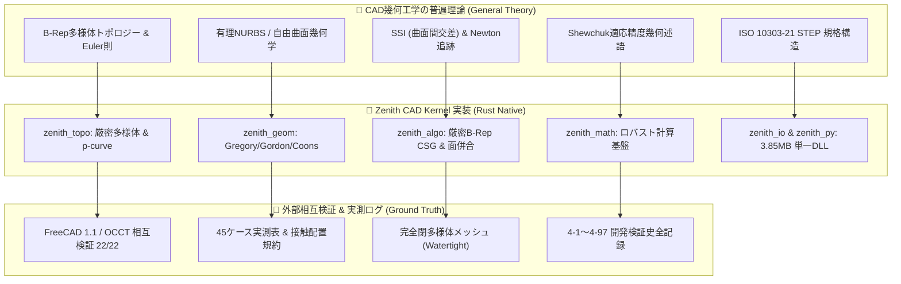

# 巻頭言：現代 CAD カーネル工学と Zenith の挑戦

## 1. 3次元 CAD カーネルが直面する本質的課題

現代の製造業、プロダクトデザイン、建築、CGモデリングを支える **3次元 CAD カーネル（Geometric Modeling Kernel）** は、コンピュータサイエンスと応用数学において最も複雑で過酷なソフトウェア領域の一つです。

CAD カーネルの核心は、**「連続的な実数空間（$\mathbb{R}^3$）の幾何形状」** を、**「有限精度の浮動小数点数（IEEE 754 64bit 倍精度）」** と **「離散的なグラフ構造（B-Rep 位相）」** を用いて、矛盾なく恒等的に表現・加工し続けることにあります。

しかし、長年デファクトスタンダードとして君臨してきた従来の巨大 C++ 製カーネル（OpenCASCADE、Parasolid、ACIS 等）は、以下の本質的な構造的課題を抱え続けてきました。

1. **浮動小数点誤差によるトポロジーの破綻（Topology Fragility）**:
   微小な幾何計算の丸め誤差が、頂点の不一致、面の微小な隙間（Gaps）、反転面、非多様体エッジを生み出し、ブーリアン演算やフィレット演算をクラッシュさせる。
2. **メモリ安全性と並行性の欠如（Memory & Concurrency Risks）**:
   巨大で複雑なポインタ網による循環参照、データ競合、スレッドセーフでないグローバル状態により、マルチコア現代CPUの性能を活かせず、ホスト環境（Blender 等）の予期せぬクラッシュを引き起こす。
3. **レガシーな巨大バイナリと難解な依存関係**:
   数百メガバイトに及ぶライブラリ群と複雑なビルドシステムが、組み込みやモダンなプラグインエコシステムへの展開を阻害する。

---

## 2. 本書が提示する二重構造（一般論 ➔ プロジェクト特有の実装）

本書は、単なる機能マニュアルやソースコードの棚卸しではありません。
**「3次元幾何モデリングの普遍的な数学的・アルゴリズム的理論（General CAD Theory）」** と、それを **「Rust 言語でフルスクラッチ具現化し、過酷な実測検証で鍛え上げた Zenith CAD Kernel の設計・実装（Project-Specific Implementation）」** を美しく対比させた、世界でも稀な本格技術解説書（Treatise）です。

本書を通読することで、読者は CAD カーネルの数理的背景から、現場で発生する「接触配置の退化」「テッセレーションの非多様体病理」「STEP構文適合の罠」といった生々しい落とし穴と、それを数学とコードでいかに突破したかの全記録を体系的に体得することができます。
