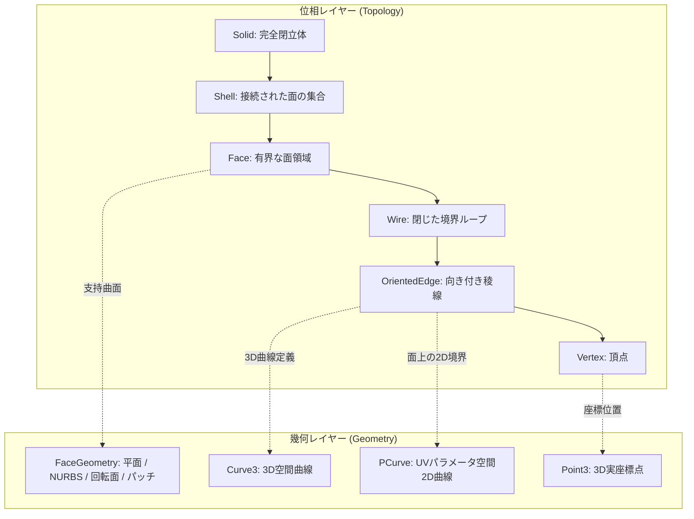

## 📐 基礎理論：境界表現（B-Rep）と NURBS 幾何学の数学的体系

### 1. B-Rep（Boundary Representation）の二重構造：位相と幾何

3次元 CAD において立体（Solid）を表現する標準的な手法が **境界表現（B-Rep）** です。B-Rep は、形状を **「位相（Topology: 接続関係）」** と **「幾何（Geometry: 空間的位置・曲面方程式）」** の2つの独立したレイヤーに分離して管理します。

#### Euler-Poincaré（オイラー・ポアンカレ）の多面体定理
閉じた 2-Manifold（2次元多様体）ソリッドが位相的に健全であるための不変条件は、オイラー・ポアンカレの公式によって規定されます。
$$V - E + F = 2(S - G) + H$$
- $V$: 頂点数 (Vertices), $E$: エッジ数 (Edges), $F$: 面数 (Faces)
- $S$: 独立した閉殻数 (Shells), $G$: 立体を貫通する穴（種数 / Genus）
- $H$: 面の内部にある穴（Inner Loops / Holes）

### 2. 有理非均一 B-スプライン（NURBS: Non-Uniform Rational B-Splines）

自由曲面および解析幾何（円、円柱、球、円錐、トーラス）を統一的に厳密表現するための標準数学基盤が NURBS です。

次数 $p$ の NURBS 曲線 $\mathbf{C}(u)$ は、制御点 $\mathbf{P}_i \in \mathbb{R}^3$、重み $w_i \in \mathbb{R}$、およびノットベクトル $U = \{u_0, u_1, \dots, u_m\}$ から次のように定義されます。
$$\mathbf{C}(u) = \frac{\sum_{i=0}^{n} N_{i,p}(u) w_i \mathbf{P}_i}{\sum_{i=0}^{n} N_{i,p}(u) w_i}$$

ここで基底関数 $N_{i,p}(u)$ は **Cox-de Boor 漸化式** によって計算されます。
$$N_{i,0}(u) = \begin{cases} 1 & \text{if } u_i \le u < u_{i+1} \\ 0 & \text{otherwise} \end{cases}$$
$$N_{i,p}(u) = \frac{u - u_i}{u_{i+p} - u_i} N_{i,p-1}(u) + \frac{u_{i+p+1} - u}{u_{i+p+1} - u_{i+1}} N_{i+1,p-1}(u)$$

> **有理重みによる真円の厳密表現**:
> 90度円弧は、次数 $p=2$ の3つの制御点で表現され、中央の制御点重みを $w_1 = \cos(45^\circ) = \frac{1}{\sqrt{2}} \approx 0.70710678$ と置くことで、多角形近似ではない **幾何学的に厳密な真円（半径誤差 0.0）** を実現します。

### 3. ロバスト幾何述語（Shewchuk Predicates）

幾何計算において「点が直線の左にあるか右にあるか（Orient2D）」「点が平面の上にあるか下にあるか（Orient3D）」を判定する際、単純な倍精度行列式計算を行うと桁落ちにより符号反転が起き、B-Rep トポロジーが破壊されます。
Jonathan Shewchuk による **適応精度浮動小数点述語（Adaptive Precision Floating-Point Arithmetic）** は、必要に応じて多倍長演算へ自動拡張することで、幾何学的判定の矛盾（Inconsistency）を完全に排除します。

---
