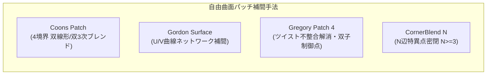

## 📐 基礎理論：高度自由曲面パッチ理論と幾何拘束力学

### 1. 多境界自由曲面パッチ補間理論

CAD で複雑な製品外観や有機的フィレットを構成する際、四角形の単純な NURBS だけでは「3本の境界」「5本の境界」「特異点（Singularity）」を滑らかに埋めることができません。

#### Coons（クーンズ）パッチとツイスト不整合
4本の境界曲線 $\mathbf{C}_0(u), \mathbf{C}_1(u), \mathbf{D}_0(v), \mathbf{D}_1(v)$ を補間する双線形 Coons パッチは次式で与えられます。
$$\mathbf{S}(u,v) = \mathbf{S}_c(u,v) + \mathbf{S}_d(u,v) - \mathbf{S}_{cd}(u,v)$$
ここで $\mathbf{S}_{cd}(u,v)$ は4隅の補正項です。しかし、境界の導関数が隅で一致しない場合（**ツイスト不整合: $\frac{\partial^2 \mathbf{S}}{\partial u \partial v} \neq \frac{\partial^2 \mathbf{S}}{\partial v \partial u}$**）、パッチ内部に歪みやシワが発生します。

#### 4辺 Gregory パッチの数理
Gregory パッチは、双3次ベジエの内部4点の制御点を **2つの双子制御点（Rational Twins）** に分割し、パラメータ $(u,v)$ に応じて有理的にブレンドすることで、ツイスト不整合を解消し、4辺すべてで指定したクロス接線ベクトル（$G^1$ 連続）を完全に満たします。
$$\mathbf{P}_{1,1}(u,v) = \frac{u \mathbf{P}_{1,1}^{(u)} + v \mathbf{P}_{1,1}^{(v)}}{u + v}$$

### 2. 2D 幾何スケッチ拘束ソルバー（Geometric Constraint Solver）

パラメトリック CAD の根幹であるスケッチ機能は、幾何要素（点、線、円弧）の位置関係を連立非線形方程式 $\mathbf{F}(\mathbf{X}) = \mathbf{0}$ として定式化します。

- **Levenberg-Marquardt（LM）法**: ニュートン法と勾配降下法を滑らかに補間する減衰付き非線形最小二乗法により、特異点近傍でも安定に収束解を探索。
- **特異値分解（SVD: Singular Value Decomposition）**: ヤコビ行列 $\mathbf{J} = \frac{\partial \mathbf{F}}{\partial \mathbf{X}}$ を $\mathbf{U} \mathbf{\Sigma} \mathbf{V}^T$ に分解し、自由度（Degrees of Freedom: DOF）の厳密解析と「過剰拘束（Redundant）」「矛盾拘束（Conflicting）」の分離判定を行います。

---
