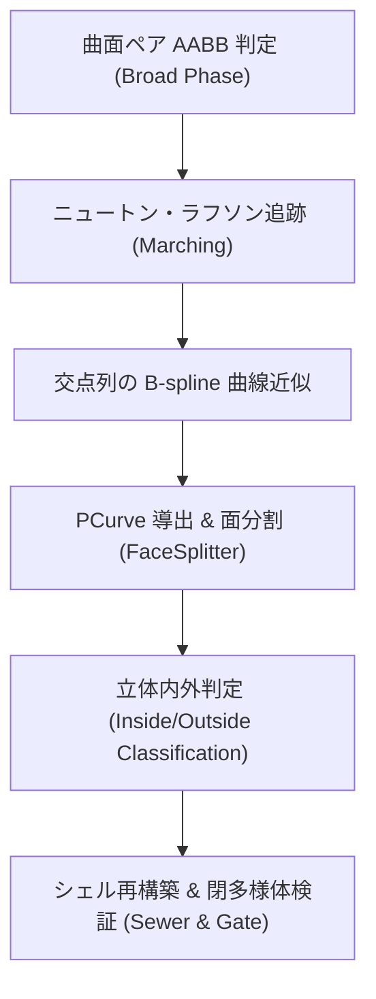

## 📐 基礎理論：厳密 B-Rep ブーリアンと自由曲面交差（SSI）

### 1. 自由曲面間交差（Surface-Surface Intersection: SSI）の数理

2つの有理 NURBS 曲面 $\mathbf{S}_A(u_A, v_A)$ と $\mathbf{S}_B(u_B, v_B)$ の交差線は、3次元空間で一致する点の軌跡として 4変数3方程式で表されます。
$$\mathbf{R}(u_A, v_A, u_B, v_B) = \mathbf{S}_A(u_A, v_A) - \mathbf{S}_B(u_B, v_B) = \mathbf{0}$$

1. **Marching 法（追跡法）**:
   粗いサンプリングで開始交点を見つけ、接線方向に微小ステップ進んだ後、4式4未知数（接平面直交拘束を付加）の **Newton-Raphson 法** により曲面上の真の交点へ射影収束。
2. **PCurve（パラメータ曲線）の導出**:
   得られた 3D 交差曲線を、両曲面のパラメータ空間 $(u_A, v_A)$ および $(u_B, v_B)$ 上の 2D スプライン曲線へ高精度フィッティング。

### 2. 接触配置（Tangency）における多様体判定規約

2つの立体が「面でぴったり接する」「線や点で触れ合っている」接触配置において、従来の多くのカーネルは無限ループや非多様体エラーに陥ります。

- **横断交差（Transversal Intersection）**: 材料を明確に二分するため、交線を作成して位相を再構築。
- **接触配置（Tangency / Non-transversal）**: 触れているだけの境界には交線を作成しない。
  - 和・差の結果が真の閉多様体立体になる場合は正常に出力。
  - 材料厚みがゼロになるなど「真に非多様体」となる場合は、**もっともらしい壊れた立体を返さず、場所を名指しして明示的に拒絶（Reject）** するのが健全な CAD カーネルの鉄則。

---
