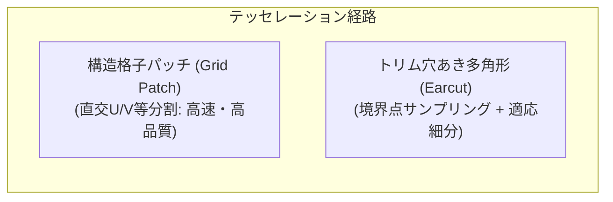

## 📐 基礎理論：完全閉多様体テッセレーションと質量特性解析

### 1. トリム曲面のテッセレーション（Tessellation）病理

B-Rep の Face を 3D メッシュ（STL/OBJ/glTF/GPU表示用）へ変換するテッセレーションは、CAD における最頻出のバグの温床です。

- **境界クラック（Edge Cracks）**: 隣接する面同士で境界エッジの細分点数が異なると、メッシュ上にナノメートルの隙間（Open Edges）が生じ、スライサーや 3D プリンタで致命的なエラーとなる。
- **完全閉多様体メッシュ（Watertight Manifold）**: 全てのエッジが「ちょうど2枚の三角形」で共有され、孤立頂点や退化三角形（面積0）が一切存在しない状態。

### 2. ガウス発散定理による体積・重心・慣性モーメントの厳密求積

メッシュの三角形を足し合わせる近似積分ではなく、B-Rep の曲面および境界ワイヤから **ガウスの発散定理（Divergence Theorem）** を用いて直接体積積分を行うことで、解析解と $10^{-13}$ レベルで一致する質量特性を算出します。
$$\iiint_V (\nabla \cdot \mathbf{F}) \, dV = \iint_{\partial V} (\mathbf{F} \cdot \mathbf{n}) \, dS$$
- 体積: $\mathbf{F} = (x, 0, 0) \implies V = \iint_{\partial V} x \, n_x \, dS$
- 重心: $\mathbf{F} = (x^2/2, 0, 0) \implies M_x = \frac{1}{2} \iint_{\partial V} x^2 \, n_x \, dS$
- 慣性モーメント: 発散定理をパラメータ空間 $(u,v)$ 上の線積分へ重積分変換して厳密計算。

---
