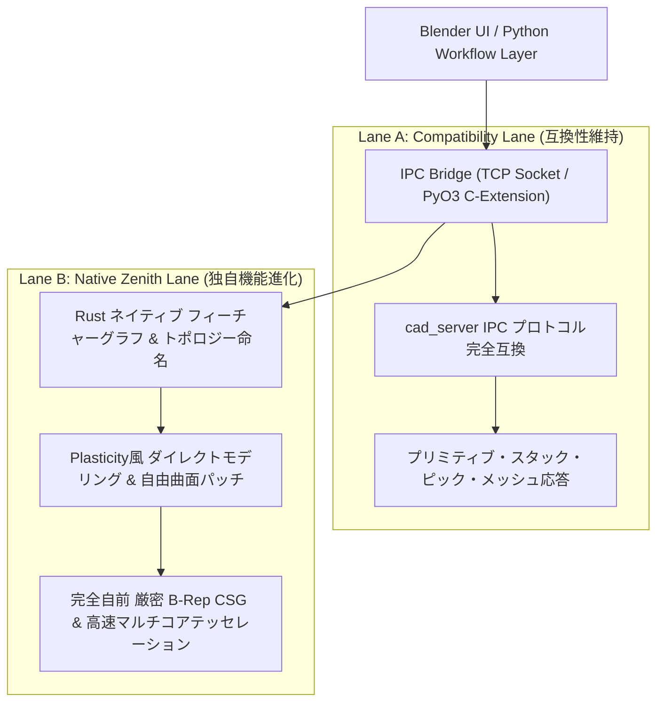

## 📐 基礎理論：CAD カーネル置換と Two-Lane 移行アーキテクチャ

### 1. レガシー CAD エンジン置換における二大リスク

長年運用された C++ CAD エンジン（OpenCASCADE 等）を最新言語（Rust）の独自カーネルに置換する際、以下の2つの罠に直面します。

1. **既存エコシステムとの断絶（Broken Compatibility）**:
   ホストアプリケーション（Blender, FreeCAD, Webビューア）の UI や通信プロトコルを一気に書き換えると、既存の膨大なアセットやワークフローが即座に破壊される。
2. **「OCCTの小型クローン」化の罠（Lack of Differentiation）**:
   OCCT の複雑で古いデータ構造や制約をそのまま Rust に移植するだけでは、開発コストに見合う革新性（直感性、速度、自由曲面性能）が得られない。

### 2. Two-Lane アーキテクチャの基本設計

- **Lane A（互換性確保）**: 既存の `cad_server.exe` バイナリプロトコルを Rust でエミュレートし、Blender 側を 1 行も変えずに即座に描画・操作可能にする。
- **Lane B（ネイティブ進化）**: 幾何モデルの信頼性が確立された後、Rust ネイティブの高度な自由曲面パッチやダイレクトモデリングをホスト環境へ順次解禁する。

---
