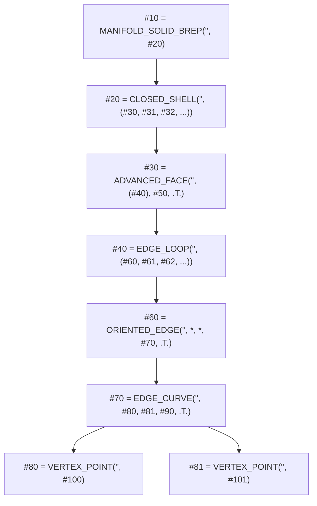

## 📐 基礎理論：ISO 10303 STEP 規格体系と外部相互検証の原則

### 1. ISO 10303-21（STEP AP214 / AP242）の B-Rep エンティティ構造

CAD 業界標準の STEP ファイルにおいて、完全な B-Rep ソリッド（`MANIFOLD_SOLID_BREP`）を成立させるためには、厳格なエンティティ階層と **トポロジー共有（Topology Sharing）** が要求されます。

> **致命的な落とし穴：エッジと頂点の非共有**:
> 面ごとに別々の `EDGE_CURVE` や `VERTEX_POINT` を生成して STEP に出力すると、たとえ各面が正しくても、外部 CAD（OpenCASCADE 等）は隣接面を縫合できず、**「開いたシェル（Open Shell）」や「ばらばらの複合体（Compound）」** として誤解釈し、体積が $10^{98}$ といった天文学的数値に破綻します。

### 2. 外部相互検証の原則：「主張ではなく測定で判断する」

自前カーネル内で計算した値同士を比較していても、潜在的な構文違反や幾何誤差は見えません。
業界標準の外部実装（FreeCAD / OpenCASCADE 7.x）をヘッドレス自動起動し、**カーネルが書き出した STEP を外部 CAD に読ませて体積・表面積・慣性・断面積をナノメートル精度で突き合わせる（Cross Validation）** ことによってのみ、真の品質が証明されます。

---
